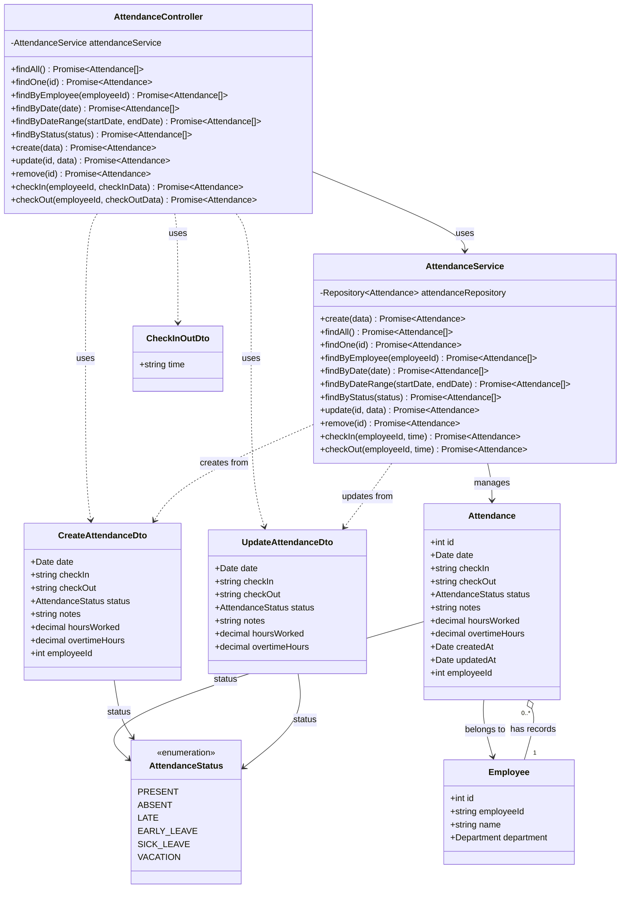

# Diagrama de Clases - Módulo de Asistencia

## Descripción

Este diagrama muestra la arquitectura completa del módulo de asistencia:

### Controllers
- **AttendanceController**: Maneja las peticiones HTTP para gestión de registros de asistencia, check-in/check-out

### Services
- **AttendanceService**: Lógica de negocio para CRUD de asistencia, filtrado por empleado/fecha/estado, y cálculo de horas trabajadas

### Entities
- **Attendance**: Registro de asistencia de un empleado
  - Fecha y horas de entrada/salida
  - Estado de asistencia
  - Horas trabajadas y extras
  - Notas adicionales
- **Employee**: Empleado asociado al registro

### DTOs
- **CreateAttendanceDto**: Datos para crear un registro de asistencia
- **UpdateAttendanceDto**: Datos para actualizar un registro de asistencia
- **CheckInOutDto**: Datos para check-in/check-out (solo hora)

### Enumerations
- **AttendanceStatus**: Estados de asistencia
  - PRESENT: Presente
  - ABSENT: Ausente
  - LATE: Llegada tarde
  - EARLY_LEAVE: Salida temprana
  - SICK_LEAVE: Licencia por enfermedad
  - VACATION: Vacaciones

### Funcionalidades Principales
- Registro de asistencia diaria
- Check-in y check-out de empleados
- Cálculo automático de horas trabajadas
- Filtrado por empleado, fecha y estado
- Registro de horas extras
- Notas y observaciones
