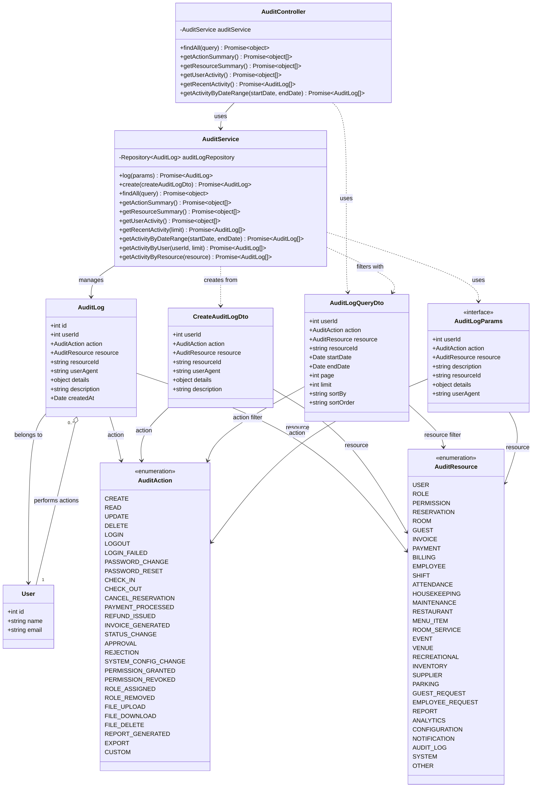

# Diagrama de Clases - Módulo de Auditoría

## Descripción

Este diagrama muestra la arquitectura completa del módulo de auditoría:

### Controllers
- **AuditController**: Maneja las peticiones HTTP para consulta de logs de auditoría y estadísticas

### Services
- **AuditService**: Lógica de negocio para registro y consulta de logs de auditoría, generación de resúmenes

### Entities
- **AuditLog**: Registro de auditoría de acciones del sistema
  - Usuario que realizó la acción
  - Tipo de acción y recurso afectado
  - Detalles adicionales en JSON
  - User agent y metadatos
- **User**: Usuario que realizó la acción

### DTOs
- **CreateAuditLogDto**: Datos para crear un log de auditoría
- **AuditLogQueryDto**: Filtros y paginación para consultas
- **AuditLogParams**: Interface para parámetros de logging

### Enumerations
- **AuditAction**: Acciones auditadas (CRUD, autenticación, pagos, etc.)
- **AuditResource**: Recursos del sistema que se auditan

### Funcionalidades Principales
- Registro automático de acciones del sistema
- Consulta de logs con múltiples filtros
- Resúmenes de actividad por acción/recurso/usuario
- Análisis de actividad por rangos de fechas
- Seguimiento de cambios en recursos
- Auditoría de autenticación y seguridad
