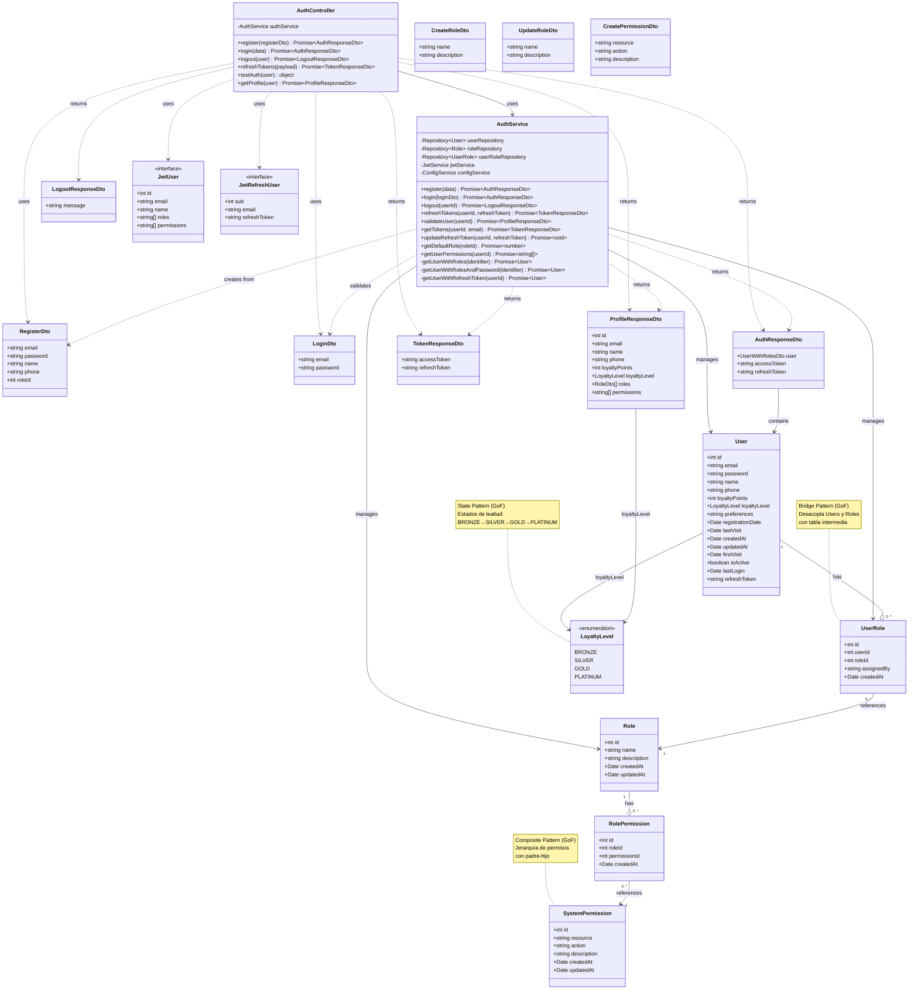

# Diagrama de Clases - Módulo de Autenticación

## Descripción

Este diagrama muestra la arquitectura completa del módulo de autenticación:

### Controllers
- **AuthController**: Maneja las peticiones HTTP para registro, login, logout, refresh tokens y perfil

### Services
- **AuthService**: Lógica de negocio para autenticación JWT, gestión de tokens, roles y permisos

### Entities
- **User**: Usuario del sistema con credenciales y perfil
- **Role**: Roles del sistema (admin, cliente, etc.)
- **UserRole**: Relación Many-to-Many entre usuarios y roles
- **SystemPermission**: Permisos disponibles en el sistema
- **RolePermission**: Relación Many-to-Many entre roles y permisos

### DTOs
- **RegisterDto**: Datos para registro de usuario
- **LoginDto**: Credenciales de login
- **AuthResponseDto**: Respuesta con usuario y tokens
- **TokenResponseDto**: Par de tokens (access y refresh)
- **LogoutResponseDto**: Confirmación de logout
- **ProfileResponseDto**: Perfil completo del usuario
- **CreateRoleDto**: Datos para crear rol
- **UpdateRoleDto**: Datos para actualizar rol
- **CreatePermissionDto**: Datos para crear permiso

### Enumerations
- **LoyaltyLevel**: Niveles de lealtad (BRONZE, SILVER, GOLD, PLATINUM)

### Interfaces
- **JwtUser**: Datos del usuario en JWT
- **JwtRefreshUser**: Datos para refresh token

### Funcionalidades Principales
- Registro de usuarios con asignación de roles
- Login con JWT (access y refresh tokens)
- Logout e invalidación de tokens
- Refresh de tokens
- Validación de usuarios
- Gestión de permisos basada en roles
- Sistema de lealtad integrado
