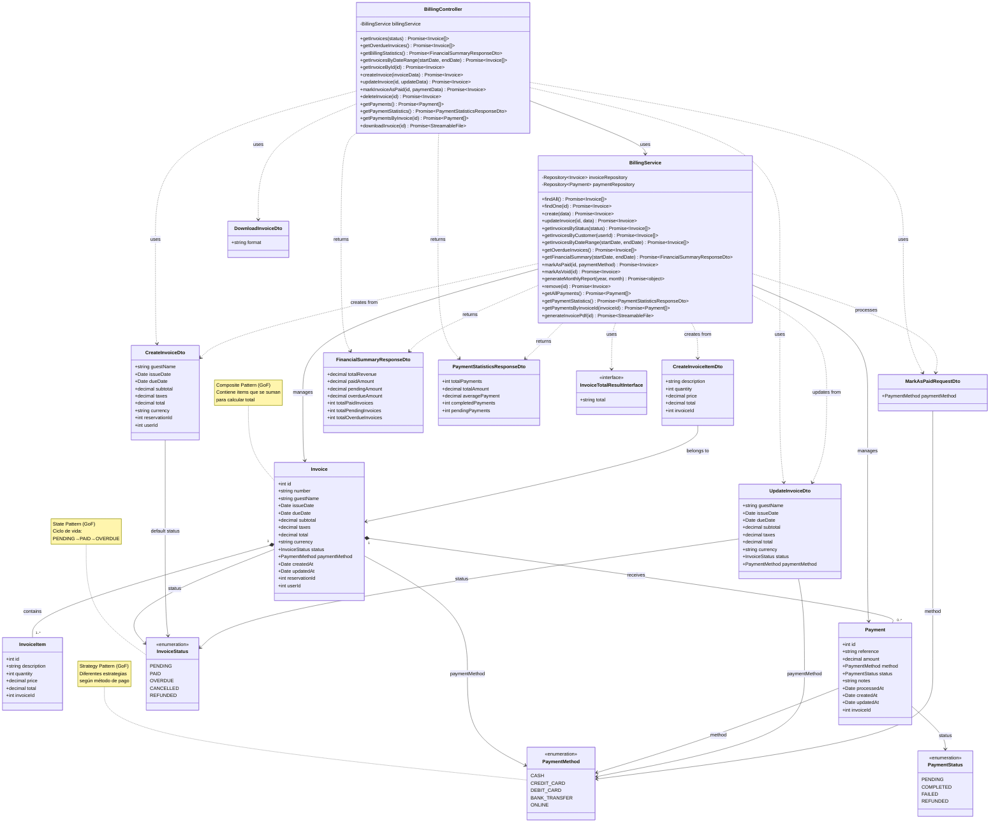

# Diagrama de Clases - Módulo de Facturación

## Descripción

Este diagrama muestra la arquitectura completa del módulo de facturación:

### Controllers
- **BillingController**: Maneja las peticiones HTTP para facturas, pagos y reportes financieros

### Services
- **BillingService**: Lógica de negocio para gestión de facturas, pagos, estadísticas y generación de PDFs

### Entities
- **Invoice**: Factura principal con totales, impuestos y estado
- **InvoiceItem**: Líneas de detalle de la factura (servicios, productos, etc.)
- **Payment**: Pagos asociados a una factura con método y estado

### DTOs
- **CreateInvoiceDto**: Datos para crear una nueva factura
- **UpdateInvoiceDto**: Datos para actualizar una factura
- **CreateInvoiceItemDto**: Datos para crear un ítem de factura
- **MarkAsPaidRequestDto**: Datos para marcar factura como pagada
- **FinancialSummaryResponseDto**: Resumen financiero con ingresos, pagos y vencidos
- **PaymentStatisticsResponseDto**: Estadísticas de pagos
- **DownloadInvoiceDto**: Configuración para descarga de factura

### Enumerations
- **InvoiceStatus**: Estados de factura (PENDING, PAID, OVERDUE, CANCELLED, REFUNDED)
- **PaymentMethod**: Métodos de pago (CASH, CREDIT_CARD, DEBIT_CARD, BANK_TRANSFER, ONLINE)
- **PaymentStatus**: Estados de pago (PENDING, COMPLETED, FAILED, REFUNDED)

### Interfaces
- **InvoiceTotalResultInterface**: Interface para resultados de totales de facturas

## Patrones de Diseño GoF Implementados

### 1. Composite Pattern (Estructural)
**Aplicación**: `Invoice` con `InvoiceItem[]`
- **Beneficio**: Trata objetos individuales y composiciones de manera uniforme
- **Estructura**: Invoice actúa como composite que contiene múltiples InvoiceItems
- **Implementación**: El total de la factura se calcula sumando todos los items

### 2. State Pattern (Comportamiento)
**Aplicación**: `InvoiceStatus` enum
- **Beneficio**: Gestión clara del ciclo de vida de la factura
- **Estados**: PENDING → PAID, OVERDUE, CANCELLED, REFUNDED
- **Implementación**: Transiciones controladas mediante métodos del servicio

### 3. Strategy Pattern (Comportamiento)
**Aplicación**: `PaymentMethod` enum
- **Beneficio**: Diferentes algoritmos de procesamiento según método de pago
- **Estrategias**: CASH, CREDIT_CARD, DEBIT_CARD, BANK_TRANSFER, ONLINE
- **Implementación**: Permite variar el procesamiento de pagos dinámicamente
