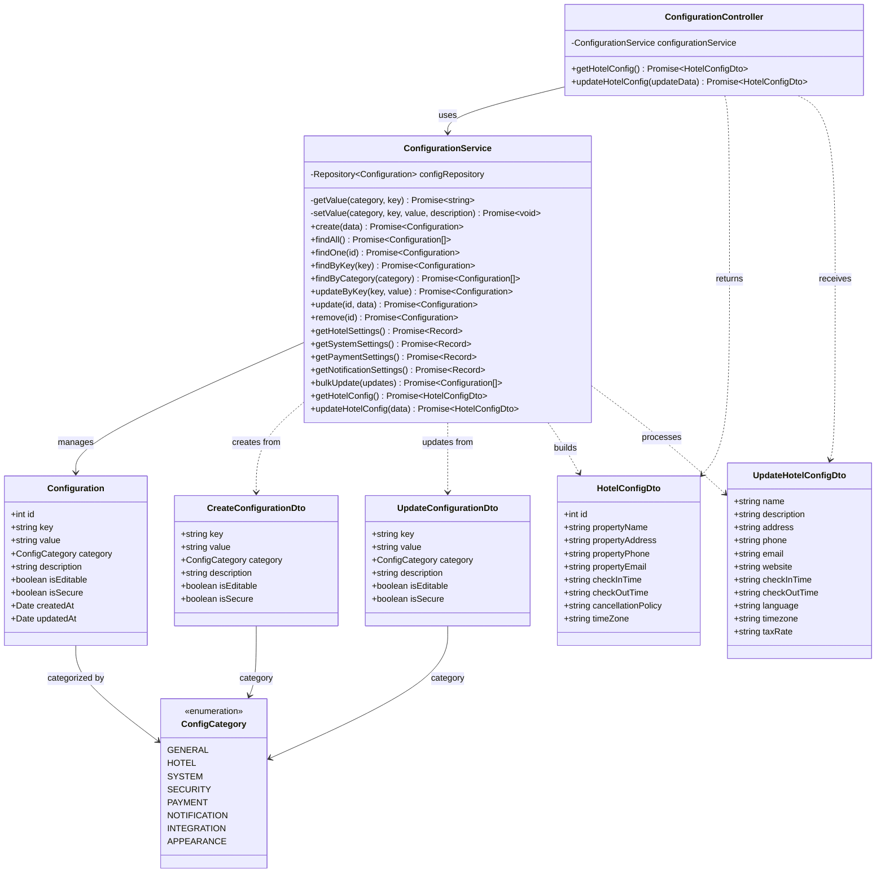

# Diagrama de Clases - Módulo de Configuración

## Descripción

Este diagrama muestra la arquitectura completa del módulo de configuración:

### Controllers
- **ConfigurationController**: Maneja las peticiones HTTP para configuración del hotel

### Services
- **ConfigurationService**: Lógica de negocio para gestión de configuraciones
  - Operaciones CRUD genéricas
  - Métodos especializados por categoría
  - Gestión específica de configuración hotelera
  - Actualización masiva de configuraciones

### Entities
- **Configuration**: Configuración key-value del sistema
  - Clave única y valor
  - Categorización por tipo
  - Flags de editabilidad y seguridad
  - Descripción para documentación

### DTOs
- **CreateConfigurationDto**: Datos para crear una configuración
- **UpdateConfigurationDto**: Datos para actualizar una configuración
- **HotelConfigDto**: Configuración específica del hotel (respuesta)
- **UpdateHotelConfigDto**: Actualización de configuración del hotel

### Enumerations
- **ConfigCategory**: Categorías de configuración
  - GENERAL: Configuraciones generales
  - HOTEL: Información y políticas del hotel
  - SYSTEM: Configuraciones del sistema
  - SECURITY: Configuraciones de seguridad
  - PAYMENT: Configuraciones de pagos
  - NOTIFICATION: Configuraciones de notificaciones
  - INTEGRATION: Configuraciones de integraciones
  - APPEARANCE: Configuraciones de apariencia

### Funcionalidades Principales
- Gestión centralizada de configuraciones del sistema
- Configuraciones agrupadas por categoría
- Configuraciones editables vs. solo lectura
- Configuraciones seguras (sensibles)
- API específica para configuración del hotel
- Actualización masiva de múltiples configuraciones
- Consultas por categoría para diferentes áreas del sistema
