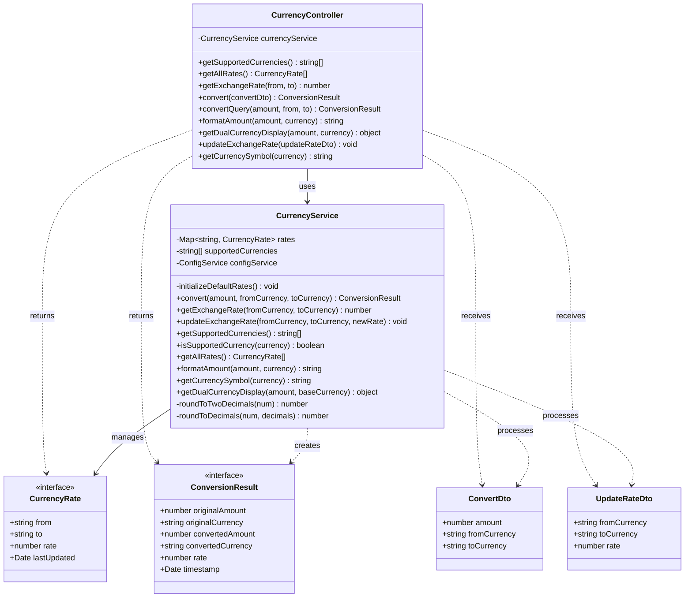

# Diagrama de Clases - Módulo de Moneda (Currency)

## Descripción

Este diagrama muestra la arquitectura completa del módulo de moneda:

### Controllers
- **CurrencyController**: Maneja las peticiones HTTP para conversión de moneda y tasas de cambio

### Services
- **CurrencyService**: Lógica de negocio para conversión de monedas
  - Gestión de tasas de cambio en memoria
  - Conversión entre COP y USD
  - Formateo según estándares locales
  - Display dual en ambas monedas
  - Actualización de tasas (admin)

### DTOs
- **ConvertDto**: Datos para conversión de moneda
  - Cantidad a convertir
  - Moneda origen (código ISO 3 letras)
  - Moneda destino (código ISO 3 letras)
- **UpdateRateDto**: Datos para actualizar tasa de cambio
  - Moneda origen
  - Moneda destino
  - Nueva tasa de cambio

### Interfaces
- **CurrencyRate**: Tasa de cambio entre dos monedas
  - Moneda origen y destino
  - Tasa de cambio numérica
  - Fecha de última actualización
- **ConversionResult**: Resultado de una conversión
  - Cantidad original y moneda
  - Cantidad convertida y moneda
  - Tasa utilizada
  - Timestamp de la conversión

### Funcionalidades Principales
- Conversión de moneda COP ↔ USD
- Tasas de cambio configurables
- Formateo localizado de cantidades monetarias:
  - COP: Sin decimales (formato colombiano)
  - USD: 2 decimales (formato estadounidense)
- Display dual para mostrar precios en ambas monedas simultáneamente
- Obtención de símbolos de moneda
- API de consulta de tasas de cambio
- Actualización administrativa de tasas
- Validación de monedas soportadas
- Redondeo automático de cantidades

### Notas de Implementación
- Tasas de cambio almacenadas en memoria (Map)
- Tasas por defecto: 1 USD = 4200 COP (aproximado)
- Actualización bidireccional automática de tasas inversas
- En producción, las tasas deberían obtenerse de una API externa
