# Diagrama de Clases - Módulo de Dashboard

```mermaid
classDiagram
    %% Controllers
    class DashboardController {
        -DashboardService dashboardService
        +getDashboardStats(user) Promise~DashboardStatsDto~
        +getRecentActivities(user) Promise~RecentActivityDto[]~
        +getRevenueData(user) Promise~RevenueDataDto[]~
    }

    %% Services
    class DashboardService {
        -Repository~DashboardWidget~ widgetRepository
        -Repository~Room~ roomRepository
        -Repository~Reservation~ reservationRepository
        -Repository~Employee~ employeeRepository
        -Repository~Invoice~ invoiceRepository
        -Repository~GuestRequest~ guestRequestRepository
        -Repository~CleaningAssignment~ cleaningAssignmentRepository
        -AuthService authService
        +createWidget(data) Promise~DashboardWidget~
        +findAllWidgets() Promise~DashboardWidget[]~
        +findWidget(id) Promise~DashboardWidget~
        +updateWidget(id, data) Promise~DashboardWidget~
        +removeWidget(id) Promise~DashboardWidget~
        +getDashboardStats(userId) Promise~DashboardStatsDto~
        +getOccupancyData() Promise~OccupancyDataDto[]~
        +getRevenueData(userId) Promise~RevenueDataDto[]~
        +getTopPerformingRooms() Promise~TopPerformingRoomDto[]~
        +getRecentActivities(userId) Promise~RecentActivityDto[]~
    }

    %% Entities
    class DashboardWidget {
        +int id
        +string title
        +string type
        +object configuration
        +object data
        +int position
        +boolean visible
        +int userId
        +Date createdAt
        +Date updatedAt
    }

    class Room {
        +int id
        +string number
        +boolean isAvailable
    }

    class Reservation {
        +int id
        +int roomId
        +string guestName
        +Date checkInDate
        +Date checkOutDate
        +number totalAmount
        +int nights
        +Date createdAt
    }

    class Employee {
        +int id
        +StaffStatus status
    }

    class Invoice {
        +int id
        +string number
        +number total
        +Date createdAt
    }

    class GuestRequest {
        +int id
        +string type
        +string room
        +RequestStatus status
        +Date createdAt
    }

    class CleaningAssignment {
        +int id
        +Date assignedDate
        +Date completedAt
    }

    %% DTOs
    class DashboardStatsDto {
        +int totalRooms
        +int occupiedRooms
        +int availableRooms
        +number totalRevenue
        +int todayCheckIns
        +int todayCheckOuts
        +int pendingRequests
        +int activeStaff
    }

    class RecentActivityDto {
        +string type
        +string description
        +Date timestamp
    }

    class RevenueDataDto {
        +string date
        +number revenue
    }

    class OccupancyDataDto {
        +string date
        +int occupancy
    }

    class TopPerformingRoomDto {
        +string room
        +number revenue
        +int occupancy
    }

    class CreateDashboardWidgetDto {
        +string title
        +string type
        +object configuration
        +object data
        +int position
        +boolean visible
        +int userId
    }

    class UpdateDashboardWidgetDto {
        +string title
        +string type
        +object configuration
        +object data
        +int position
        +boolean visible
    }

    %% Relationships
    DashboardController --> DashboardService : uses
    DashboardController ..> DashboardStatsDto : returns
    DashboardController ..> RecentActivityDto : returns
    DashboardController ..> RevenueDataDto : returns
    
    DashboardService --> DashboardWidget : manages
    DashboardService --> Room : queries
    DashboardService --> Reservation : queries
    DashboardService --> Employee : queries
    DashboardService --> Invoice : queries
    DashboardService --> GuestRequest : queries
    DashboardService --> CleaningAssignment : queries
    DashboardService ..> CreateDashboardWidgetDto : creates from
    DashboardService ..> UpdateDashboardWidgetDto : updates from
    DashboardService ..> DashboardStatsDto : builds
    DashboardService ..> RecentActivityDto : builds
    DashboardService ..> RevenueDataDto : builds
    DashboardService ..> OccupancyDataDto : builds
    DashboardService ..> TopPerformingRoomDto : builds
```

## Descripción

Este diagrama muestra la arquitectura completa del módulo de dashboard:

### Controllers
- **DashboardController**: Maneja las peticiones HTTP para obtener estadísticas y datos del dashboard

### Services
- **DashboardService**: Lógica de negocio para agregación de datos de múltiples módulos
  - Gestión de widgets personalizables del dashboard
  - Cálculo de estadísticas clave del hotel
  - Generación de datos para gráficas (ingresos, ocupación)
  - Obtención de actividad reciente del sistema
  - Análisis de habitaciones con mejor rendimiento

### Entities
- **DashboardWidget**: Widget configurable del dashboard
  - Título y tipo de widget
  - Configuración y datos personalizables
  - Posición y visibilidad
  - Propiedad por usuario
- **Room**: Habitación del hotel
- **Reservation**: Reservación
- **Employee**: Empleado
- **Invoice**: Factura
- **GuestRequest**: Solicitud de huésped
- **CleaningAssignment**: Asignación de limpieza

### DTOs
- **DashboardStatsDto**: Estadísticas principales del dashboard
  - Total de habitaciones y ocupación
  - Ingresos totales
  - Check-ins/check-outs del día
  - Solicitudes pendientes y personal activo
- **RecentActivityDto**: Actividad reciente del sistema
- **RevenueDataDto**: Datos de ingresos por día
- **OccupancyDataDto**: Datos de ocupación por día
- **TopPerformingRoomDto**: Habitaciones con mejor rendimiento
- **CreateDashboardWidgetDto**: Datos para crear widget
- **UpdateDashboardWidgetDto**: Datos para actualizar widget

### Funcionalidades Principales
- Dashboard centralizado con métricas clave del hotel
- Widgets personalizables por usuario
- Estadísticas en tiempo real de ocupación y disponibilidad
- Análisis de ingresos (últimos 30 días y tendencias diarias)
- Seguimiento de actividad reciente (reservaciones, pagos, mantenimiento, solicitudes)
- Datos para gráficas de ocupación (últimos 7 días)
- Análisis de habitaciones top por ingresos
- Integración con múltiples módulos del sistema (rooms, reservations, billing, housekeeping, etc.)
