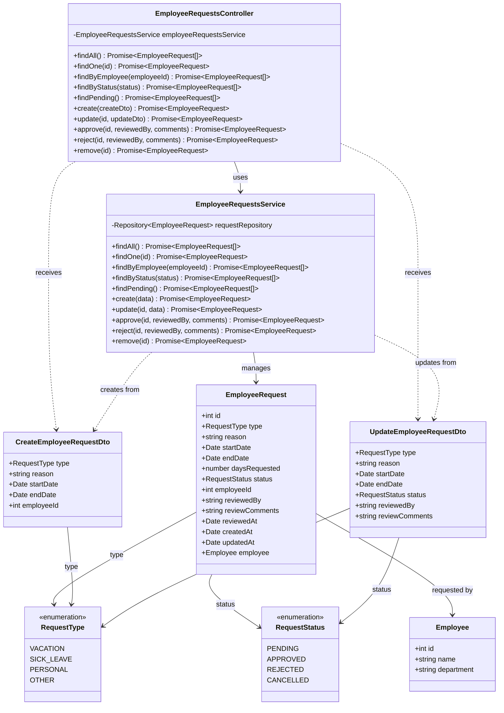

# Diagrama de Clases - Módulo de Solicitudes de Empleados

## Descripción

Este diagrama muestra la arquitectura completa del módulo de solicitudes de empleados:

### Controllers
- **EmployeeRequestsController**: Maneja peticiones HTTP para gestión de solicitudes de permisos de empleados

### Services
- **EmployeeRequestsService**: Lógica de negocio para solicitudes de empleados
  - Operaciones CRUD de solicitudes
  - Filtrado por empleado y estado
  - Aprobación y rechazo de solicitudes
  - Obtención de solicitudes pendientes

### Entities
- **EmployeeRequest**: Solicitud de permiso de empleado
  - Tipo de solicitud (vacaciones, enfermedad, personal, otro)
  - Razón y fechas
  - Días solicitados calculados
  - Estado de la solicitud
  - Empleado solicitante
  - Información de revisión (quién, comentarios, fecha)
- **Employee**: Empleado que realiza la solicitud

### DTOs
- **CreateEmployeeRequestDto**: Datos para crear solicitud
- **UpdateEmployeeRequestDto**: Datos para actualizar solicitud

### Enumerations
- **RequestType**: Tipos de solicitud
  - VACATION: Vacaciones
  - SICK_LEAVE: Licencia médica
  - PERSONAL: Personal
  - OTHER: Otro
- **RequestStatus**: Estados de solicitud
  - PENDING: Pendiente
  - APPROVED: Aprobada
  - REJECTED: Rechazada
  - CANCELLED: Cancelada

### Funcionalidades Principales
- Gestión de solicitudes de permisos de empleados
- Múltiples tipos de solicitudes (vacaciones, enfermedad, personal)
- Workflow de aprobación/rechazo
- Tracking de quién revisó y comentarios
- Cálculo automático de días solicitados
- Filtrado por estado y empleado
- Historial completo de solicitudes
