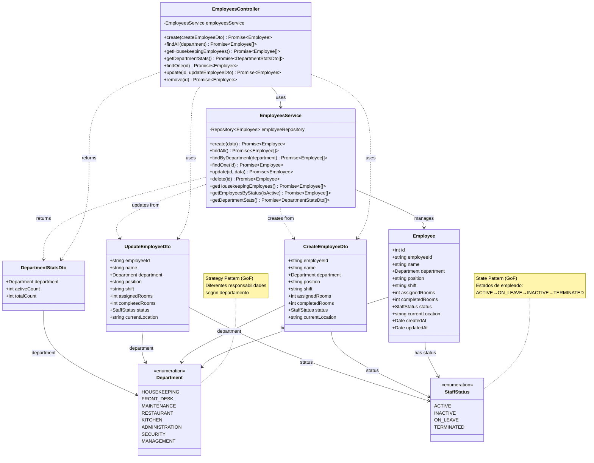

# Diagrama de Clases - Módulo de Personal

## Descripción

Este diagrama muestra la arquitectura completa del módulo de personal:

### Controllers
- **EmployeesController**: Maneja las peticiones HTTP para empleados y estadísticas departamentales

### Services
- **EmployeesService**: Lógica de negocio para gestión de empleados, filtrado por departamento y estadísticas

### Entities
- **Employee**: Empleados operativos con seguimiento de tareas (habitaciones asignadas/completadas)

### DTOs
- **CreateEmployeeDto**: Datos para crear un nuevo empleado operativo
- **UpdateEmployeeDto**: Datos para actualizar un empleado operativo
- **DepartmentStatsDto**: Estadísticas de empleados por departamento

### Enumerations
- **Department**: Departamentos del hotel (HOUSEKEEPING, FRONT_DESK, MAINTENANCE, RESTAURANT, KITCHEN, ADMINISTRATION, SECURITY, MANAGEMENT)
- **StaffStatus**: Estados del personal (ACTIVE, INACTIVE, ON_LEAVE, TERMINATED)

## Patrones de Diseño GoF Implementados

### 1. State Pattern (Comportamiento)
**Aplicación**: `StaffStatus` enum
- **Beneficio**: Gestión clara del estado laboral del empleado
- **Estados**: ACTIVE → ON_LEAVE → INACTIVE → TERMINATED
- **Implementación**: Transiciones controladas según políticas de recursos humanos

### 2. Strategy Pattern (Comportamiento)
**Aplicación**: `Department` enum
- **Beneficio**: Diferentes comportamientos y responsabilidades según departamento
- **Estrategias**: HOUSEKEEPING, FRONT_DESK, MAINTENANCE, RESTAURANT, etc.
- **Implementación**: Permite aplicar reglas específicas por departamento
