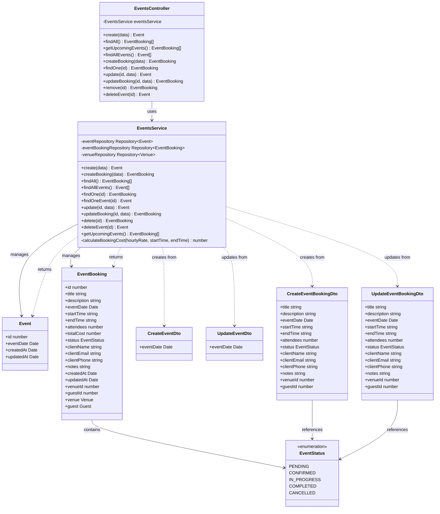

# Events Module - Class Diagram

```mermaid
classDiagram
    %% Controllers
    class EventsController {
        -EventsService eventsService
        +create(data) Event
        +findAll() EventBooking[]
        +getUpcomingEvents() EventBooking[]
        +findAllEvents() Event[]
        +createBooking(data) EventBooking
        +findOne(id) EventBooking
        +update(id, data) Event
        +updateBooking(id, data) EventBooking
        +remove(id) EventBooking
        +deleteEvent(id) Event
    }

    %% Services
    class EventsService {
        -eventRepository Repository~Event~
        -eventBookingRepository Repository~EventBooking~
        -venueRepository Repository~Venue~
        +create(data) Event
        +createBooking(data) EventBooking
        +findAll() EventBooking[]
        +findAllEvents() Event[]
        +findOne(id) EventBooking
        +findOneEvent(id) Event
        +update(id, data) Event
        +updateBooking(id, data) EventBooking
        +delete(id) EventBooking
        +deleteEvent(id) Event
        +getUpcomingEvents() EventBooking[]
        -calculateBookingCost(hourlyRate, startTime, endTime) number
    }

    %% Entities
    class Event {
        +id number
        +eventDate Date
        +createdAt Date
        +updatedAt Date
    }

    class EventBooking {
        +id number
        +title string
        +description string
        +eventDate Date
        +startTime string
        +endTime string
        +attendees number
        +totalCost number
        +status EventStatus
        +clientName string
        +clientEmail string
        +clientPhone string
        +notes string
        +createdAt Date
        +updatedAt Date
        +venueId number
        +guestId number
        +venue Venue
        +guest Guest
    }

    %% DTOs
    class CreateEventDto {
        +eventDate Date
    }

    class UpdateEventDto {
        +eventDate Date
    }

    class CreateEventBookingDto {
        +title string
        +description string
        +eventDate Date
        +startTime string
        +endTime string
        +attendees number
        +status EventStatus
        +clientName string
        +clientEmail string
        +clientPhone string
        +notes string
        +venueId number
        +guestId number
    }

    class UpdateEventBookingDto {
        +title string
        +description string
        +eventDate Date
        +startTime string
        +endTime string
        +attendees number
        +status EventStatus
        +clientName string
        +clientEmail string
        +clientPhone string
        +notes string
        +venueId number
        +guestId number
    }

    %% Enums
    class EventStatus {
        <<enumeration>>
        PENDING
        CONFIRMED
        IN_PROGRESS
        COMPLETED
        CANCELLED
    }

    %% Relationships
    EventsController --> EventsService : uses
    EventsService --> Event : manages
    EventsService --> EventBooking : manages
    EventsService ..> CreateEventDto : creates from
    EventsService ..> UpdateEventDto : updates from
    EventsService ..> CreateEventBookingDto : creates from
    EventsService ..> UpdateEventBookingDto : updates from
    EventsService ..> Event : returns
    EventsService ..> EventBooking : returns
    
    EventBooking --> EventStatus : contains
    CreateEventBookingDto --> EventStatus : references
    UpdateEventBookingDto --> EventStatus : references
```
