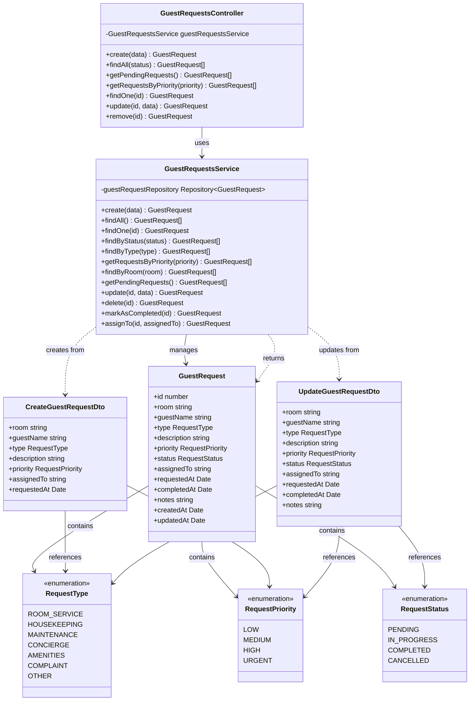

# Guest Requests Module - Class Diagram

```mermaid
classDiagram
    %% Controllers
    class GuestRequestsController {
        -GuestRequestsService guestRequestsService
        +create(data) GuestRequest
        +findAll(status) GuestRequest[]
        +getPendingRequests() GuestRequest[]
        +getRequestsByPriority(priority) GuestRequest[]
        +findOne(id) GuestRequest
        +update(id, data) GuestRequest
        +remove(id) GuestRequest
    }

    %% Services
    class GuestRequestsService {
        -guestRequestRepository Repository~GuestRequest~
        +create(data) GuestRequest
        +findAll() GuestRequest[]
        +findOne(id) GuestRequest
        +findByStatus(status) GuestRequest[]
        +findByType(type) GuestRequest[]
        +getRequestsByPriority(priority) GuestRequest[]
        +findByRoom(room) GuestRequest[]
        +getPendingRequests() GuestRequest[]
        +update(id, data) GuestRequest
        +delete(id) GuestRequest
        +markAsCompleted(id) GuestRequest
        +assignTo(id, assignedTo) GuestRequest
    }

    %% Entities
    class GuestRequest {
        +id number
        +room string
        +guestName string
        +type RequestType
        +description string
        +priority RequestPriority
        +status RequestStatus
        +assignedTo string
        +requestedAt Date
        +completedAt Date
        +notes string
        +createdAt Date
        +updatedAt Date
    }

    %% DTOs
    class CreateGuestRequestDto {
        +room string
        +guestName string
        +type RequestType
        +description string
        +priority RequestPriority
        +assignedTo string
        +requestedAt Date
    }

    class UpdateGuestRequestDto {
        +room string
        +guestName string
        +type RequestType
        +description string
        +priority RequestPriority
        +status RequestStatus
        +assignedTo string
        +requestedAt Date
        +completedAt Date
        +notes string
    }

    %% Enums
    class RequestType {
        <<enumeration>>
        ROOM_SERVICE
        HOUSEKEEPING
        MAINTENANCE
        CONCIERGE
        AMENITIES
        COMPLAINT
        OTHER
    }

    class RequestPriority {
        <<enumeration>>
        LOW
        MEDIUM
        HIGH
        URGENT
    }

    class RequestStatus {
        <<enumeration>>
        PENDING
        IN_PROGRESS
        COMPLETED
        CANCELLED
    }

    %% Relationships
    GuestRequestsController --> GuestRequestsService : uses
    GuestRequestsService --> GuestRequest : manages
    GuestRequestsService ..> CreateGuestRequestDto : creates from
    GuestRequestsService ..> UpdateGuestRequestDto : updates from
    GuestRequestsService ..> GuestRequest : returns
    
    GuestRequest --> RequestType : contains
    GuestRequest --> RequestPriority : contains
    GuestRequest --> RequestStatus : contains
    
    CreateGuestRequestDto --> RequestType : references
    CreateGuestRequestDto --> RequestPriority : references
    UpdateGuestRequestDto --> RequestType : references
    UpdateGuestRequestDto --> RequestPriority : references
    UpdateGuestRequestDto --> RequestStatus : references
```
