# Housekeeping Module - Class Diagram

```mermaid
classDiagram
    %% Controllers
    class HousekeepingController {
        -HousekeepingService housekeepingService
        +getAllMaintenanceReports() MaintenanceReport[]
        +getMaintenanceReportById(id) MaintenanceReport
        +createMaintenanceReport(data) MaintenanceReport
        +updateMaintenanceReport(id, data) MaintenanceReport
        +deleteMaintenanceReport(id) MaintenanceReport
        +getAllCleaningAssignments() CleaningAssignment[]
        +getTodaysCleaningAssignments() CleaningAssignment[]
        +getCleaningAssignmentsByStatus(status) CleaningAssignment[]
        +getCleaningAssignmentsByEmployee(employeeId) CleaningAssignment[]
        +getCleaningAssignmentsByRoom(roomId) CleaningAssignment[]
        +getCleaningAssignmentById(id) CleaningAssignment
        +createCleaningAssignment(data) CleaningAssignment
        +updateCleaningAssignment(id, data) CleaningAssignment
        +startCleaningWork(id) CleaningAssignment
        +completeCleaningWork(id, qualityScore, notes) CleaningAssignment
        +deleteCleaningAssignment(id) CleaningAssignment
        +getHousekeepingStatistics() HousekeepingStatisticsDto
        +getMaintenanceCostsByDateRange(startDate, endDate) MaintenanceCostsSummaryDto
    }

    %% Services
    class HousekeepingService {
        -maintenanceReportRepository Repository~MaintenanceReport~
        -cleaningAssignmentRepository Repository~CleaningAssignment~
        -cleaningTaskRepository Repository~CleaningTask~
        -maintenanceRequestRepository Repository~MaintenanceRequest~
        -roomRepository Repository~Room~
        -notificationsService NotificationsService
        +getAllMaintenanceReports() MaintenanceReport[]
        +getMaintenanceReportById(id) MaintenanceReport
        +createMaintenanceReport(data) MaintenanceReport
        +updateMaintenanceReport(id, data) MaintenanceReport
        +startMaintenanceWork(id) MaintenanceReport
        +completeMaintenanceWork(id, cost, notes) MaintenanceReport
        +deleteMaintenanceReport(id) MaintenanceReport
        +getAllCleaningAssignments() CleaningAssignment[]
        +getCleaningAssignmentById(id) CleaningAssignment
        +getCleaningAssignmentsByEmployee(employeeId) CleaningAssignment[]
        +getCleaningAssignmentsByRoom(roomId) CleaningAssignment[]
        +getCleaningAssignmentsByStatus(status) CleaningAssignment[]
        +getTodaysCleaningAssignments() CleaningAssignment[]
        +createCleaningAssignment(data) CleaningAssignment
        +updateCleaningAssignment(id, data) CleaningAssignment
        +startCleaningWork(id) CleaningAssignment
        +completeCleaningWork(id, qualityScore, notes) CleaningAssignment
        +deleteCleaningAssignment(id) CleaningAssignment
        +getHousekeepingStatistics() HousekeepingStatisticsDto
        +getMaintenanceCostsByDateRange(startDate, endDate) MaintenanceCostsSummaryDto
    }

    %% Entities
    class MaintenanceReport {
        +id number
        +roomId number
        +reportedBy string
        +type MaintenanceType
        +description string
        +priority TaskPriority
        +status MaintenanceStatus
        +assignedTo string
        +cost number
        +notes string
        +startedAt Date
        +completedAt Date
        +createdAt Date
        +updatedAt Date
        +room Room
    }

    class CleaningAssignment {
        +id number
        +roomId number
        +employeeId number
        +assignedDate Date
        +status CleaningStatus
        +notes string
        +startedAt Date
        +completedAt Date
        +qualityScore number
        +createdAt Date
        +updatedAt Date
        +room Room
        +employee User
    }

    class CleaningTask {
        +id number
        +roomNumber string
        +status CleaningStatus
        +assignedEmployee string
        +notes string
        +priority TaskPriority
        +createdAt Date
        +updatedAt Date
    }

    class MaintenanceRequest {
        +id number
        +roomId number
        +type MaintenanceType
        +description string
        +priority TaskPriority
        +status MaintenanceStatus
        +requestedBy string
        +createdAt Date
        +updatedAt Date
    }

    %% DTOs
    class CreateMaintenanceReportDto {
        +roomId number
        +reportedBy string
        +type MaintenanceType
        +description string
        +priority TaskPriority
        +assignedTo string
    }

    class UpdateMaintenanceReportDto {
        +roomId number
        +reportedBy string
        +type MaintenanceType
        +description string
        +priority TaskPriority
        +status MaintenanceStatus
        +assignedTo string
        +cost number
        +notes string
        +startedAt Date
        +completedAt Date
    }

    class CreateCleaningAssignmentDto {
        +roomId number
        +employeeId number
        +notes string
    }

    class UpdateCleaningAssignmentDto {
        +roomId number
        +employeeId number
        +status CleaningStatus
        +notes string
        +startedAt Date
        +completedAt Date
        +qualityScore number
    }

    class CreateCleaningTaskDto {
        +roomNumber string
        +assignedEmployee string
        +notes string
        +priority TaskPriority
    }

    class UpdateCleaningTaskDto {
        +roomNumber string
        +status CleaningStatus
        +assignedEmployee string
        +notes string
        +priority TaskPriority
    }

    class CreateMaintenanceRequestDto {
        +roomId number
        +type MaintenanceType
        +description string
        +priority TaskPriority
        +requestedBy string
    }

    class UpdateMaintenanceRequestDto {
        +roomId number
        +type MaintenanceType
        +description string
        +priority TaskPriority
        +status MaintenanceStatus
        +requestedBy string
    }

    class CreateIncidentReportDto {
        +roomId number
        +description string
        +reportedBy string
        +priority TaskPriority
    }

    class HousekeepingStatisticsDto {
        +totalMaintenanceReports number
        +pendingMaintenanceReports number
        +totalCleaningAssignments number
        +pendingCleaningAssignments number
        +completedToday MaintenanceReport[]
        +cleaningAssignmentsToday CleaningAssignment[]
    }

    class MaintenanceCostsSummaryDto {
        +totalCost number
        +reportCount number
        +averageCost number
        +costsByType MaintenanceCostByTypeDto[]
    }

    class MaintenanceCostByTypeDto {
        +type string
        +totalCost number
        +count number
    }

    class CleaningPerformanceDto {
        +employeeId number
        +employeeName string
        +completedAssignments number
        +averageQualityScore number
    }

    class AssignTechnicianResponseDto {
        +success boolean
        +message string
    }

    class QualityScoreResponseDto {
        +assignmentId number
        +qualityScore number
    }

    class UpdateCostResponseDto {
        +reportId number
        +cost number
    }

    class EmployeePerformanceDto {
        +employeeId number
        +employeeName string
        +tasksCompleted number
        +averageCompletionTime number
    }

    %% Enums
    class CleaningStatus {
        <<enumeration>>
        PENDING
        IN_PROGRESS
        COMPLETED
        CANCELLED
    }

    class MaintenanceStatus {
        <<enumeration>>
        PENDING
        IN_PROGRESS
        COMPLETED
        CANCELLED
    }

    class MaintenanceType {
        <<enumeration>>
        PLUMBING
        ELECTRICAL
        HVAC
        CARPENTRY
        PAINTING
        GENERAL
        EMERGENCY
    }

    class TaskPriority {
        <<enumeration>>
        LOW
        MEDIUM
        HIGH
        URGENT
    }

    %% Relationships
    HousekeepingController --> HousekeepingService : uses
    HousekeepingService --> MaintenanceReport : manages
    HousekeepingService --> CleaningAssignment : manages
    HousekeepingService --> CleaningTask : manages
    HousekeepingService --> MaintenanceRequest : manages
    
    HousekeepingService ..> CreateMaintenanceReportDto : creates from
    HousekeepingService ..> UpdateMaintenanceReportDto : updates from
    HousekeepingService ..> CreateCleaningAssignmentDto : creates from
    HousekeepingService ..> UpdateCleaningAssignmentDto : updates from
    HousekeepingService ..> CreateCleaningTaskDto : creates from
    HousekeepingService ..> UpdateCleaningTaskDto : updates from
    HousekeepingService ..> CreateMaintenanceRequestDto : creates from
    HousekeepingService ..> UpdateMaintenanceRequestDto : updates from
    HousekeepingService ..> HousekeepingStatisticsDto : returns
    HousekeepingService ..> MaintenanceCostsSummaryDto : returns
    
    MaintenanceReport --> MaintenanceType : contains
    MaintenanceReport --> MaintenanceStatus : contains
    MaintenanceReport --> TaskPriority : contains
    CleaningAssignment --> CleaningStatus : contains
    CleaningTask --> CleaningStatus : contains
    CleaningTask --> TaskPriority : contains
    MaintenanceRequest --> MaintenanceType : contains
    MaintenanceRequest --> MaintenanceStatus : contains
    MaintenanceRequest --> TaskPriority : contains
    
    CreateMaintenanceReportDto --> MaintenanceType : references
    CreateMaintenanceReportDto --> TaskPriority : references
    UpdateMaintenanceReportDto --> MaintenanceType : references
    UpdateMaintenanceReportDto --> MaintenanceStatus : references
    UpdateMaintenanceReportDto --> TaskPriority : references
    UpdateCleaningAssignmentDto --> CleaningStatus : references
    CreateCleaningTaskDto --> TaskPriority : references
    UpdateCleaningTaskDto --> CleaningStatus : references
    UpdateCleaningTaskDto --> TaskPriority : references
    CreateMaintenanceRequestDto --> MaintenanceType : references
    CreateMaintenanceRequestDto --> TaskPriority : references
    UpdateMaintenanceRequestDto --> MaintenanceType : references
    UpdateMaintenanceRequestDto --> MaintenanceStatus : references
    UpdateMaintenanceRequestDto --> TaskPriority : references
    CreateIncidentReportDto --> TaskPriority : references
    
    HousekeepingStatisticsDto *-- MaintenanceReport : contains
    HousekeepingStatisticsDto *-- CleaningAssignment : contains
    MaintenanceCostsSummaryDto *-- MaintenanceCostByTypeDto : contains
    
    %% Notas de Patrones GoF
    note for CleaningStatus "State Pattern (GoF)<br/>Ciclo de vida de limpieza:<br/>PENDING→IN_PROGRESS→COMPLETED"
    note for MaintenanceStatus "State Pattern (GoF)<br/>Ciclo de vida de mantenimiento:<br/>PENDING→IN_PROGRESS→COMPLETED"
    note for MaintenanceType "Strategy Pattern (GoF)<br/>Diferentes estrategias según tipo:<br/>PLUMBING, ELECTRICAL, HVAC, etc."
    note for HousekeepingService "Facade Pattern (GoF)<br/>Unifica gestión de limpieza<br/>y mantenimiento"
```

## Patrones de Diseño GoF Implementados

### 1. State Pattern (Comportamiento)
**Aplicación**: `CleaningStatus` y `MaintenanceStatus` enums
- **Beneficio**: Gestión clara del ciclo de vida de tareas
- **Estados de Limpieza**: PENDING → IN_PROGRESS → COMPLETED (también CANCELLED)
- **Estados de Mantenimiento**: PENDING → IN_PROGRESS → COMPLETED (también CANCELLED)
- **Implementación**: Transiciones controladas por el servicio

### 2. Strategy Pattern (Comportamiento)
**Aplicación**: `MaintenanceType` enum
- **Beneficio**: Diferentes estrategias según tipo de mantenimiento
- **Estrategias**: PLUMBING, ELECTRICAL, HVAC, CARPENTRY, PAINTING, GENERAL, EMERGENCY
- **Implementación**: Cada tipo puede tener procesos y costos específicos

### 3. Facade Pattern (Estructural)
**Aplicación**: `HousekeepingService`
- **Beneficio**: Simplifica interfaz compleja de limpieza y mantenimiento
- **Subsistemas**: CleaningAssignments, MaintenanceReports, CleaningTasks, MaintenanceRequests
- **Implementación**: Unifica operaciones complejas en métodos simples
