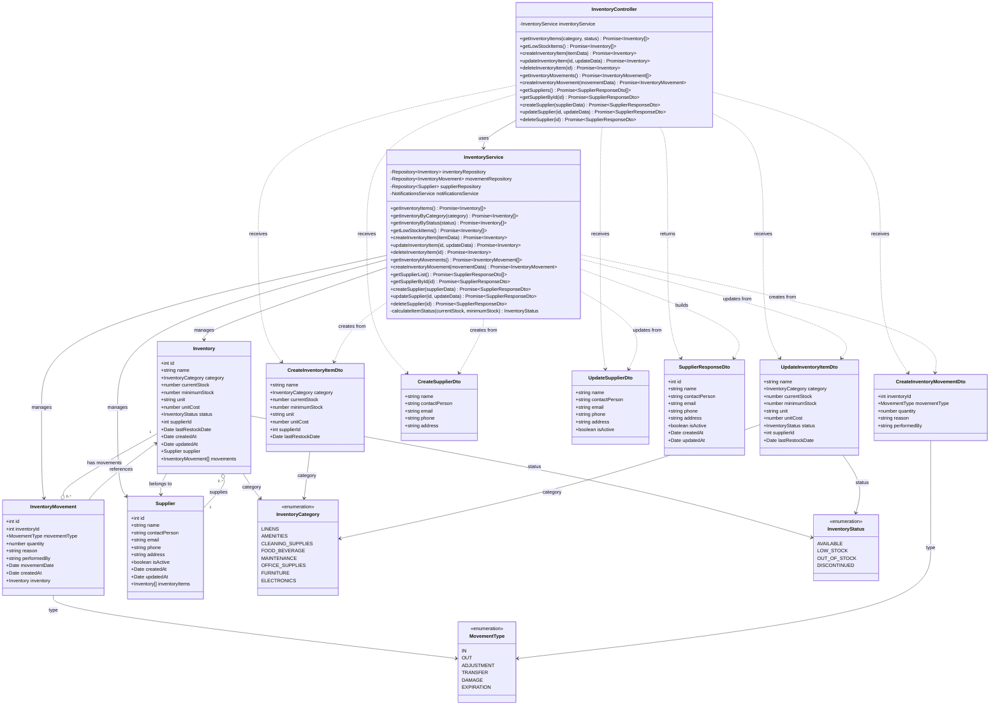

# Diagrama de Clases - Módulo de Inventario

## Descripción

Este diagrama muestra la arquitectura completa del módulo de inventario:

### Controllers
- **InventoryController**: Maneja peticiones HTTP para gestión de inventario, movimientos y proveedores

### Services
- **InventoryService**: Lógica de negocio para inventario
  - Gestión de items de inventario
  - Tracking de movimientos (entradas/salidas/ajustes)
  - Gestión de proveedores
  - Alertas automáticas de stock bajo
  - Cálculo de estado de inventario

### Entities
- **Inventory**: Item de inventario del hotel
  - Nombre y categoría
  - Stock actual y mínimo
  - Costo unitario
  - Estado (disponible, bajo stock, agotado)
  - Proveedor asociado
  - Fecha de último reabastecimiento
- **InventoryMovement**: Movimiento de inventario
  - Tipo de movimiento (IN, OUT, ADJUSTMENT, etc.)
  - Cantidad y razón
  - Quién realizó el movimiento
  - Fecha del movimiento
- **Supplier**: Proveedor de inventario
  - Información de contacto completa
  - Estado activo/inactivo
  - Relación con items suministrados

### DTOs
- **CreateInventoryItemDto**: Datos para crear item de inventario
- **UpdateInventoryItemDto**: Datos para actualizar item
- **CreateInventoryMovementDto**: Datos para registrar movimiento
- **CreateSupplierDto**: Datos para crear proveedor
- **UpdateSupplierDto**: Datos para actualizar proveedor
- **SupplierResponseDto**: Respuesta con datos de proveedor

### Enumerations
- **InventoryCategory**: Categorías de inventario
  - LINENS: Ropa de cama y toallas
  - AMENITIES: Amenidades para huéspedes
  - CLEANING_SUPPLIES: Suministros de limpieza
  - FOOD_BEVERAGE: Alimentos y bebidas
  - MAINTENANCE: Mantenimiento
  - OFFICE_SUPPLIES: Suministros de oficina
  - FURNITURE: Muebles
  - ELECTRONICS: Electrónicos
- **InventoryStatus**: Estados de inventario
  - AVAILABLE: Disponible
  - LOW_STOCK: Stock bajo
  - OUT_OF_STOCK: Agotado
  - DISCONTINUED: Descontinuado
- **MovementType**: Tipos de movimiento
  - IN: Entrada (compra, recepción)
  - OUT: Salida (uso, venta)
  - ADJUSTMENT: Ajuste de inventario
  - TRANSFER: Transferencia
  - DAMAGE: Daño/pérdida
  - EXPIRATION: Expiración

### Funcionalidades Principales
- Gestión completa de inventario del hotel
- Tracking en tiempo real de stock
- Alertas automáticas de stock bajo/agotado (integración con notificaciones)
- Historial de movimientos de inventario
- Gestión de proveedores
- Filtrado por categoría y estado
- Cálculo automático de estado basado en stock actual vs. mínimo
- Control de última fecha de reabastecimiento
- Múltiples tipos de movimientos para tracking detallado
