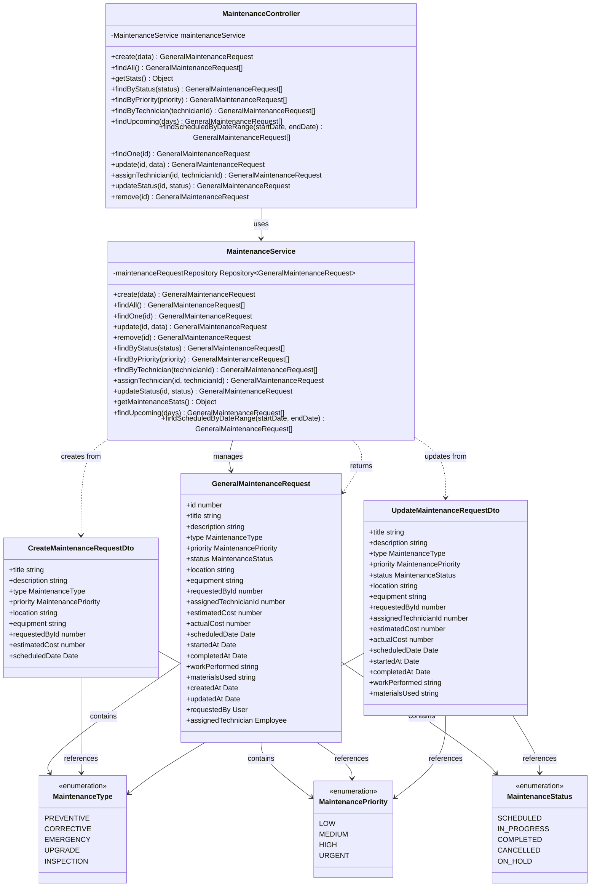

# Maintenance Module - Class Diagram

```mermaid
classDiagram
    %% Controllers
    class MaintenanceController {
        -MaintenanceService maintenanceService
        +create(data) GeneralMaintenanceRequest
        +findAll() GeneralMaintenanceRequest[]
        +getStats() Object
        +findByStatus(status) GeneralMaintenanceRequest[]
        +findByPriority(priority) GeneralMaintenanceRequest[]
        +findByTechnician(technicianId) GeneralMaintenanceRequest[]
        +findUpcoming(days) GeneralMaintenanceRequest[]
        +findScheduledByDateRange(startDate, endDate) GeneralMaintenanceRequest[]
        +findOne(id) GeneralMaintenanceRequest
        +update(id, data) GeneralMaintenanceRequest
        +assignTechnician(id, technicianId) GeneralMaintenanceRequest
        +updateStatus(id, status) GeneralMaintenanceRequest
        +remove(id) GeneralMaintenanceRequest
    }

    %% Services
    class MaintenanceService {
        -maintenanceRequestRepository Repository~GeneralMaintenanceRequest~
        +create(data) GeneralMaintenanceRequest
        +findAll() GeneralMaintenanceRequest[]
        +findOne(id) GeneralMaintenanceRequest
        +update(id, data) GeneralMaintenanceRequest
        +remove(id) GeneralMaintenanceRequest
        +findByStatus(status) GeneralMaintenanceRequest[]
        +findByPriority(priority) GeneralMaintenanceRequest[]
        +findByTechnician(technicianId) GeneralMaintenanceRequest[]
        +assignTechnician(id, technicianId) GeneralMaintenanceRequest
        +updateStatus(id, status) GeneralMaintenanceRequest
        +getMaintenanceStats() Object
        +findUpcoming(days) GeneralMaintenanceRequest[]
        +findScheduledByDateRange(startDate, endDate) GeneralMaintenanceRequest[]
    }

    %% Entities
    class GeneralMaintenanceRequest {
        +id number
        +title string
        +description string
        +type MaintenanceType
        +priority MaintenancePriority
        +status MaintenanceStatus
        +location string
        +equipment string
        +requestedById number
        +assignedTechnicianId number
        +estimatedCost number
        +actualCost number
        +scheduledDate Date
        +startedAt Date
        +completedAt Date
        +workPerformed string
        +materialsUsed string
        +createdAt Date
        +updatedAt Date
        +requestedBy User
        +assignedTechnician Employee
    }

    %% DTOs
    class CreateMaintenanceRequestDto {
        +title string
        +description string
        +type MaintenanceType
        +priority MaintenancePriority
        +location string
        +equipment string
        +requestedById number
        +estimatedCost number
        +scheduledDate Date
    }

    class UpdateMaintenanceRequestDto {
        +title string
        +description string
        +type MaintenanceType
        +priority MaintenancePriority
        +status MaintenanceStatus
        +location string
        +equipment string
        +requestedById number
        +assignedTechnicianId number
        +estimatedCost number
        +actualCost number
        +scheduledDate Date
        +startedAt Date
        +completedAt Date
        +workPerformed string
        +materialsUsed string
    }

    %% Enums
    class MaintenanceType {
        <<enumeration>>
        PREVENTIVE
        CORRECTIVE
        EMERGENCY
        UPGRADE
        INSPECTION
    }

    class MaintenancePriority {
        <<enumeration>>
        LOW
        MEDIUM
        HIGH
        URGENT
    }

    class MaintenanceStatus {
        <<enumeration>>
        SCHEDULED
        IN_PROGRESS
        COMPLETED
        CANCELLED
        ON_HOLD
    }

    %% Relationships
    MaintenanceController --> MaintenanceService : uses
    MaintenanceService --> GeneralMaintenanceRequest : manages
    MaintenanceService ..> CreateMaintenanceRequestDto : creates from
    MaintenanceService ..> UpdateMaintenanceRequestDto : updates from
    MaintenanceService ..> GeneralMaintenanceRequest : returns
    
    GeneralMaintenanceRequest --> MaintenanceType : contains
    GeneralMaintenanceRequest --> MaintenancePriority : contains
    GeneralMaintenanceRequest --> MaintenanceStatus : contains
    
    CreateMaintenanceRequestDto --> MaintenanceType : references
    CreateMaintenanceRequestDto --> MaintenancePriority : references
    UpdateMaintenanceRequestDto --> MaintenanceType : references
    UpdateMaintenanceRequestDto --> MaintenancePriority : references
    UpdateMaintenanceRequestDto --> MaintenanceStatus : references
```
