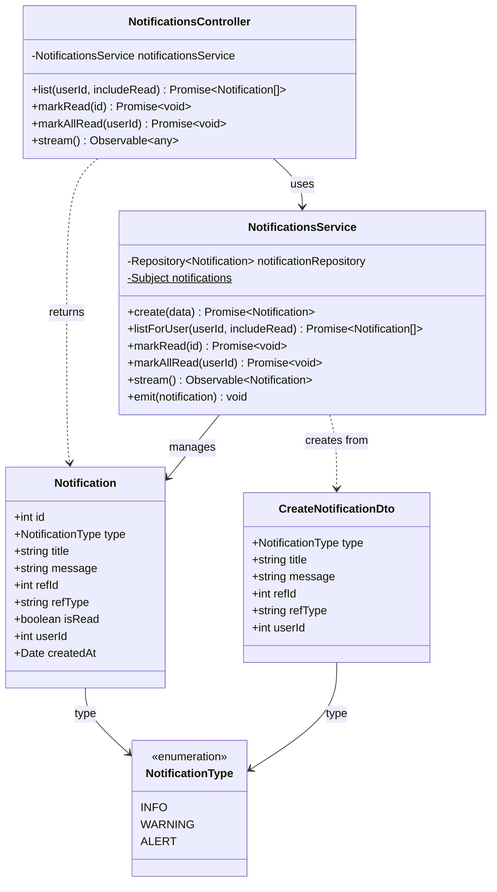

# Diagrama de Clases - Módulo de Notificaciones

## Descripción

Este diagrama muestra la arquitectura completa del módulo de notificaciones:

### Controllers
- **NotificationsController**: Maneja peticiones HTTP para notificaciones y streaming SSE

### Services
- **NotificationsService**: Lógica de negocio para notificaciones
  - Creación de notificaciones
  - Listado con filtros (leídas/no leídas, por usuario)
  - Marcar como leídas (individual o todas)
  - Streaming en tiempo real (Server-Sent Events)

### Entities
- **Notification**: Notificación del sistema
  - Tipo (INFO, WARNING, ALERT)
  - Título y mensaje
  - Referencia opcional a recurso
  - Estado de lectura
  - Usuario destinatario (null = broadcast)
  - Timestamp de creación

### DTOs
- **CreateNotificationDto**: Datos para crear notificación

### Enumerations
- **NotificationType**: Tipos de notificación
  - INFO: Información general
  - WARNING: Advertencia
  - ALERT: Alerta importante

### Funcionalidades Principales
- Sistema de notificaciones en tiempo real
- Notificaciones por usuario o broadcast
- Marcado de leído/no leído
- Streaming SSE para actualizaciones en tiempo real
- Referencias a recursos externos (ej: items de inventario)
- Filtrado por estado de lectura
