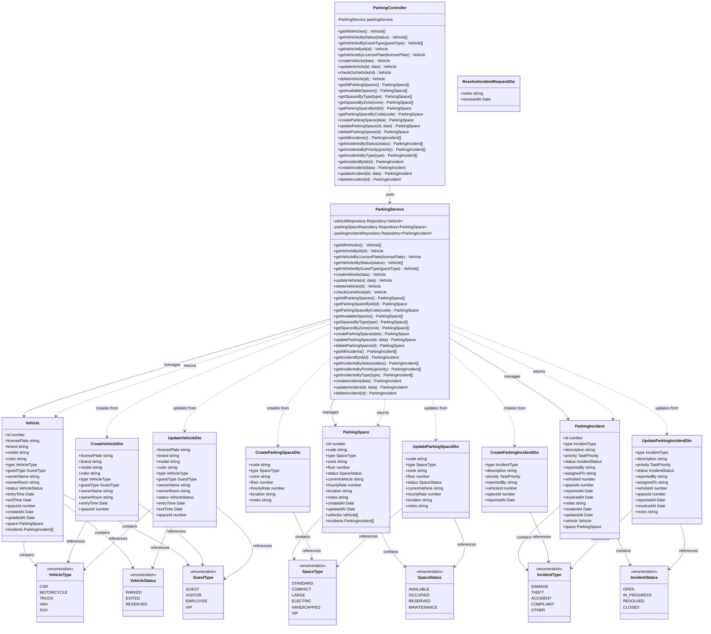

# Parking Module - Class Diagram

```mermaid
classDiagram
    %% Controllers
    class ParkingController {
        -ParkingService parkingService
        +getAllVehicles() Vehicle[]
        +getVehiclesByStatus(status) Vehicle[]
        +getVehiclesByGuestType(guestType) Vehicle[]
        +getVehicleById(id) Vehicle
        +getVehicleByLicensePlate(licensePlate) Vehicle
        +createVehicle(data) Vehicle
        +updateVehicle(id, data) Vehicle
        +checkOutVehicle(id) Vehicle
        +deleteVehicle(id) Vehicle
        +getAllParkingSpaces() ParkingSpace[]
        +getAvailableSpaces() ParkingSpace[]
        +getSpacesByType(type) ParkingSpace[]
        +getSpacesByZone(zone) ParkingSpace[]
        +getParkingSpaceById(id) ParkingSpace
        +getParkingSpaceByCode(code) ParkingSpace
        +createParkingSpace(data) ParkingSpace
        +updateParkingSpace(id, data) ParkingSpace
        +deleteParkingSpace(id) ParkingSpace
        +getAllIncidents() ParkingIncident[]
        +getIncidentsByStatus(status) ParkingIncident[]
        +getIncidentsByPriority(priority) ParkingIncident[]
        +getIncidentsByType(type) ParkingIncident[]
        +getIncidentById(id) ParkingIncident
        +createIncident(data) ParkingIncident
        +updateIncident(id, data) ParkingIncident
        +deleteIncident(id) ParkingIncident
    }

    %% Services
    class ParkingService {
        -vehicleRepository Repository~Vehicle~
        -parkingSpaceRepository Repository~ParkingSpace~
        -parkingIncidentRepository Repository~ParkingIncident~
        +getAllVehicles() Vehicle[]
        +getVehicleById(id) Vehicle
        +getVehicleByLicensePlate(licensePlate) Vehicle
        +getVehiclesByStatus(status) Vehicle[]
        +getVehiclesByGuestType(guestType) Vehicle[]
        +createVehicle(data) Vehicle
        +updateVehicle(id, data) Vehicle
        +deleteVehicle(id) Vehicle
        +checkOutVehicle(id) Vehicle
        +getAllParkingSpaces() ParkingSpace[]
        +getParkingSpaceById(id) ParkingSpace
        +getParkingSpaceByCode(code) ParkingSpace
        +getAvailableSpaces() ParkingSpace[]
        +getSpacesByType(type) ParkingSpace[]
        +getSpacesByZone(zone) ParkingSpace[]
        +createParkingSpace(data) ParkingSpace
        +updateParkingSpace(id, data) ParkingSpace
        +deleteParkingSpace(id) ParkingSpace
        +getAllIncidents() ParkingIncident[]
        +getIncidentById(id) ParkingIncident
        +getIncidentsByStatus(status) ParkingIncident[]
        +getIncidentsByPriority(priority) ParkingIncident[]
        +getIncidentsByType(type) ParkingIncident[]
        +createIncident(data) ParkingIncident
        +updateIncident(id, data) ParkingIncident
        +deleteIncident(id) ParkingIncident
    }

    %% Entities
    class Vehicle {
        +id number
        +licensePlate string
        +brand string
        +model string
        +color string
        +type VehicleType
        +guestType GuestType
        +ownerName string
        +ownerRoom string
        +status VehicleStatus
        +entryTime Date
        +exitTime Date
        +spaceId number
        +createdAt Date
        +updatedAt Date
        +space ParkingSpace
        +incidents ParkingIncident[]
    }

    class ParkingSpace {
        +id number
        +code string
        +type SpaceType
        +zone string
        +floor number
        +status SpaceStatus
        +currentVehicle string
        +hourlyRate number
        +location string
        +notes string
        +createdAt Date
        +updatedAt Date
        +vehicles Vehicle[]
        +incidents ParkingIncident[]
    }

    class ParkingIncident {
        +id number
        +type IncidentType
        +description string
        +priority TaskPriority
        +status IncidentStatus
        +reportedBy string
        +assignedTo string
        +vehicleId number
        +spaceId number
        +reportedAt Date
        +resolvedAt Date
        +notes string
        +createdAt Date
        +updatedAt Date
        +vehicle Vehicle
        +space ParkingSpace
    }

    %% DTOs
    class CreateVehicleDto {
        +licensePlate string
        +brand string
        +model string
        +color string
        +type VehicleType
        +guestType GuestType
        +ownerName string
        +ownerRoom string
        +entryTime Date
        +spaceId number
    }

    class UpdateVehicleDto {
        +licensePlate string
        +brand string
        +model string
        +color string
        +type VehicleType
        +guestType GuestType
        +ownerName string
        +ownerRoom string
        +status VehicleStatus
        +entryTime Date
        +exitTime Date
        +spaceId number
    }

    class CreateParkingSpaceDto {
        +code string
        +type SpaceType
        +zone string
        +floor number
        +hourlyRate number
        +location string
        +notes string
    }

    class UpdateParkingSpaceDto {
        +code string
        +type SpaceType
        +zone string
        +floor number
        +status SpaceStatus
        +currentVehicle string
        +hourlyRate number
        +location string
        +notes string
    }

    class CreateParkingIncidentDto {
        +type IncidentType
        +description string
        +priority TaskPriority
        +reportedBy string
        +vehicleId number
        +spaceId number
        +reportedAt Date
    }

    class UpdateParkingIncidentDto {
        +type IncidentType
        +description string
        +priority TaskPriority
        +status IncidentStatus
        +reportedBy string
        +assignedTo string
        +vehicleId number
        +spaceId number
        +reportedAt Date
        +resolvedAt Date
        +notes string
    }

    class ResolveIncidentRequestDto {
        +notes string
        +resolvedAt Date
    }

    %% Enums
    class VehicleType {
        <<enumeration>>
        CAR
        MOTORCYCLE
        TRUCK
        VAN
        SUV
    }

    class VehicleStatus {
        <<enumeration>>
        PARKED
        EXITED
        RESERVED
    }

    class GuestType {
        <<enumeration>>
        GUEST
        VISITOR
        EMPLOYEE
        VIP
    }

    class SpaceType {
        <<enumeration>>
        STANDARD
        COMPACT
        LARGE
        ELECTRIC
        HANDICAPPED
        VIP
    }

    class SpaceStatus {
        <<enumeration>>
        AVAILABLE
        OCCUPIED
        RESERVED
        MAINTENANCE
    }

    class IncidentType {
        <<enumeration>>
        DAMAGE
        THEFT
        ACCIDENT
        COMPLAINT
        OTHER
    }

    class IncidentStatus {
        <<enumeration>>
        OPEN
        IN_PROGRESS
        RESOLVED
        CLOSED
    }

    %% Relationships
    ParkingController --> ParkingService : uses
    ParkingService --> Vehicle : manages
    ParkingService --> ParkingSpace : manages
    ParkingService --> ParkingIncident : manages
    
    ParkingService ..> CreateVehicleDto : creates from
    ParkingService ..> UpdateVehicleDto : updates from
    ParkingService ..> CreateParkingSpaceDto : creates from
    ParkingService ..> UpdateParkingSpaceDto : updates from
    ParkingService ..> CreateParkingIncidentDto : creates from
    ParkingService ..> UpdateParkingIncidentDto : updates from
    ParkingService ..> Vehicle : returns
    ParkingService ..> ParkingSpace : returns
    ParkingService ..> ParkingIncident : returns
    
    Vehicle --> VehicleType : contains
    Vehicle --> VehicleStatus : contains
    Vehicle --> GuestType : contains
    ParkingSpace --> SpaceType : contains
    ParkingSpace --> SpaceStatus : contains
    ParkingIncident --> IncidentType : contains
    ParkingIncident --> IncidentStatus : contains
    
    CreateVehicleDto --> VehicleType : references
    CreateVehicleDto --> GuestType : references
    UpdateVehicleDto --> VehicleType : references
    UpdateVehicleDto --> VehicleStatus : references
    UpdateVehicleDto --> GuestType : references
    CreateParkingSpaceDto --> SpaceType : references
    UpdateParkingSpaceDto --> SpaceType : references
    UpdateParkingSpaceDto --> SpaceStatus : references
    CreateParkingIncidentDto --> IncidentType : references
    UpdateParkingIncidentDto --> IncidentType : references
    UpdateParkingIncidentDto --> IncidentStatus : references
```
