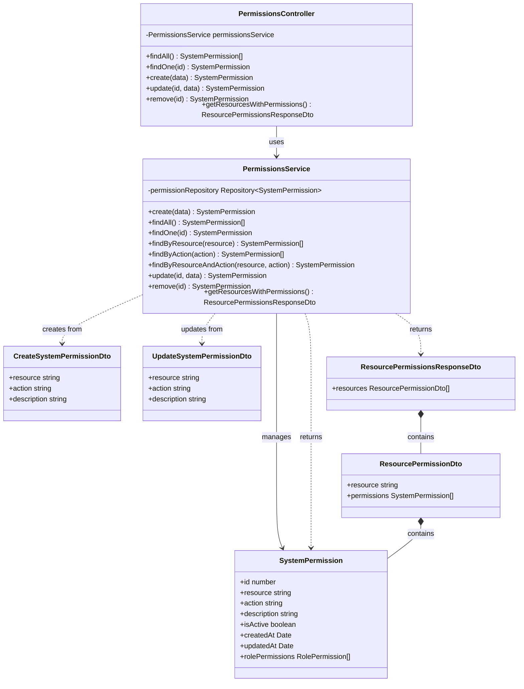

# Permissions Module - Class Diagram

```mermaid
classDiagram
    %% Controllers
    class PermissionsController {
        -PermissionsService permissionsService
        +findAll() SystemPermission[]
        +findOne(id) SystemPermission
        +create(data) SystemPermission
        +update(id, data) SystemPermission
        +remove(id) SystemPermission
        +getResourcesWithPermissions() ResourcePermissionsResponseDto
    }

    %% Services
    class PermissionsService {
        -permissionRepository Repository~SystemPermission~
        +create(data) SystemPermission
        +findAll() SystemPermission[]
        +findOne(id) SystemPermission
        +findByResource(resource) SystemPermission[]
        +findByAction(action) SystemPermission[]
        +findByResourceAndAction(resource, action) SystemPermission
        +update(id, data) SystemPermission
        +remove(id) SystemPermission
        +getResourcesWithPermissions() ResourcePermissionsResponseDto
    }

    %% Entities (from auth module)
    class SystemPermission {
        +id number
        +resource string
        +action string
        +description string
        +isActive boolean
        +createdAt Date
        +updatedAt Date
        +rolePermissions RolePermission[]
    }

    %% DTOs
    class CreateSystemPermissionDto {
        +resource string
        +action string
        +description string
    }

    class UpdateSystemPermissionDto {
        +resource string
        +action string
        +description string
    }

    class ResourcePermissionsResponseDto {
        +resources ResourcePermissionDto[]
    }

    class ResourcePermissionDto {
        +resource string
        +permissions SystemPermission[]
    }

    %% Relationships
    PermissionsController --> PermissionsService : uses
    PermissionsService --> SystemPermission : manages
    PermissionsService ..> CreateSystemPermissionDto : creates from
    PermissionsService ..> UpdateSystemPermissionDto : updates from
    PermissionsService ..> SystemPermission : returns
    PermissionsService ..> ResourcePermissionsResponseDto : returns
    
    ResourcePermissionsResponseDto *-- ResourcePermissionDto : contains
    ResourcePermissionDto *-- SystemPermission : contains
```
