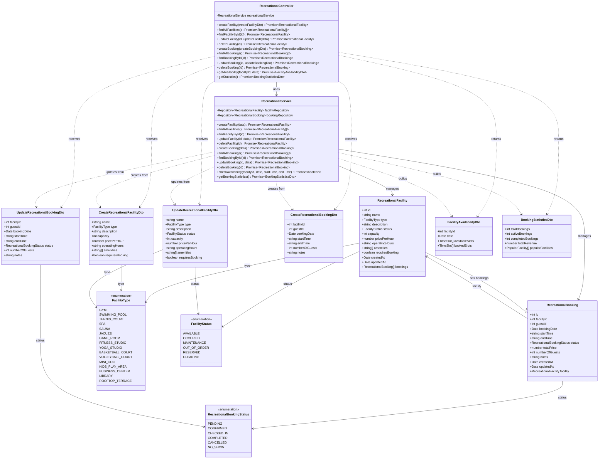

# Diagrama de Clases - Módulo Recreacional

## Descripción

Este diagrama muestra la arquitectura completa del módulo recreacional:

### Controllers
- **RecreationalController**: Maneja peticiones HTTP para gestión de instalaciones recreacionales y reservas

### Services
- **RecreationalService**: Lógica de negocio para instalaciones recreacionales
  - Gestión de instalaciones (CRUD)
  - Gestión de reservas (CRUD)
  - Verificación de disponibilidad
  - Estadísticas de uso

### Entities
- **RecreationalFacility**: Instalación recreacional
  - Nombre y tipo (gimnasio, piscina, spa, etc.)
  - Estado y capacidad
  - Precio por hora
  - Horarios de operación
  - Amenidades incluidas
  - Requiere reserva o no
- **RecreationalBooking**: Reserva de instalación recreacional
  - Instalación asociada
  - Huésped que reserva
  - Fecha y horario (inicio/fin)
  - Estado de la reserva
  - Precio total
  - Número de huéspedes

### DTOs
- **CreateRecreationalFacilityDto**: Datos para crear instalación
- **UpdateRecreationalFacilityDto**: Datos para actualizar instalación
- **CreateRecreationalBookingDto**: Datos para crear reserva
- **UpdateRecreationalBookingDto**: Datos para actualizar reserva
- **FacilityAvailabilityDto**: Disponibilidad de instalación
- **BookingStatisticsDto**: Estadísticas de reservas

### Enumerations
- **FacilityType**: Tipos de instalaciones (16 tipos diferentes)
- **FacilityStatus**: Estados de instalación
  - AVAILABLE: Disponible
  - OCCUPIED: Ocupada
  - MAINTENANCE: En mantenimiento
  - OUT_OF_ORDER: Fuera de servicio
  - RESERVED: Reservada
  - CLEANING: En limpieza
- **RecreationalBookingStatus**: Estados de reserva
  - PENDING: Pendiente
  - CONFIRMED: Confirmada
  - CHECKED_IN: Check-in realizado
  - COMPLETED: Completada
  - CANCELLED: Cancelada
  - NO_SHOW: No se presentó

### Funcionalidades Principales
- Gestión de instalaciones recreacionales del hotel
- Sistema de reservas para instalaciones
- Control de disponibilidad por horario
- Pricing por hora
- Capacidad máxima por instalación
- Tracking de amenidades incluidas
- Estadísticas de uso y popularidad
- Gestión de múltiples estados de instalaciones
- Horarios de operación configurables
