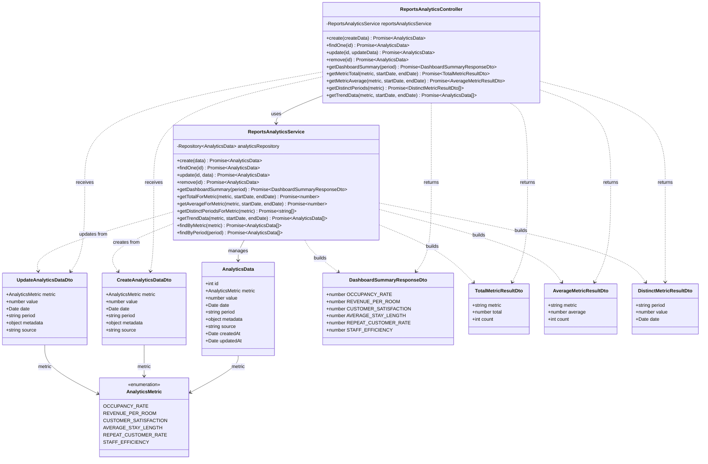

# Diagrama de Clases - Módulo de Reportes y Analítica

## Descripción

Este diagrama muestra la arquitectura completa del módulo de reportes y analítica:

### Controllers
- **ReportsAnalyticsController**: Maneja peticiones HTTP para datos analíticos y métricas del hotel

### Services
- **ReportsAnalyticsService**: Lógica de negocio para analítica
  - Gestión de datos analíticos (CRUD)
  - Resumen de dashboard con métricas clave
  - Cálculos de totales y promedios por métrica
  - Datos de tendencias por período
  - Filtrado por métrica y período

### Entities
- **AnalyticsData**: Punto de dato analítico
  - Tipo de métrica
  - Valor numérico
  - Fecha y período
  - Metadata adicional (JSON)
  - Fuente del dato

### DTOs
- **CreateAnalyticsDataDto**: Datos para crear registro analítico
- **UpdateAnalyticsDataDto**: Datos para actualizar registro analítico
- **DashboardSummaryResponseDto**: Resumen de métricas para dashboard
  - Tasa de ocupación
  - Ingresos por habitación
  - Satisfacción del cliente
  - Duración promedio de estadía
  - Tasa de clientes recurrentes
  - Eficiencia del personal
- **TotalMetricResultDto**: Resultado de total de métrica
- **AverageMetricResultDto**: Resultado de promedio de métrica
- **DistinctMetricResultDto**: Resultado de períodos distintos

### Enumerations
- **AnalyticsMetric**: Métricas analíticas
  - OCCUPANCY_RATE: Tasa de ocupación
  - REVENUE_PER_ROOM: Ingresos por habitación
  - CUSTOMER_SATISFACTION: Satisfacción del cliente
  - AVERAGE_STAY_LENGTH: Duración promedio de estadía
  - REPEAT_CUSTOMER_RATE: Tasa de clientes recurrentes
  - STAFF_EFFICIENCY: Eficiencia del personal

### Funcionalidades Principales
- Sistema de analítica y KPIs del hotel
- Tracking de métricas clave de desempeño
- Resumen de dashboard con métricas principales
- Cálculos estadísticos (totales, promedios)
- Análisis de tendencias temporales
- Agrupación por períodos (diario, semanal, mensual, trimestral)
- Metadata flexible para contexto adicional
- Tracking de fuente de datos
- Reportes históricos y comparativos
