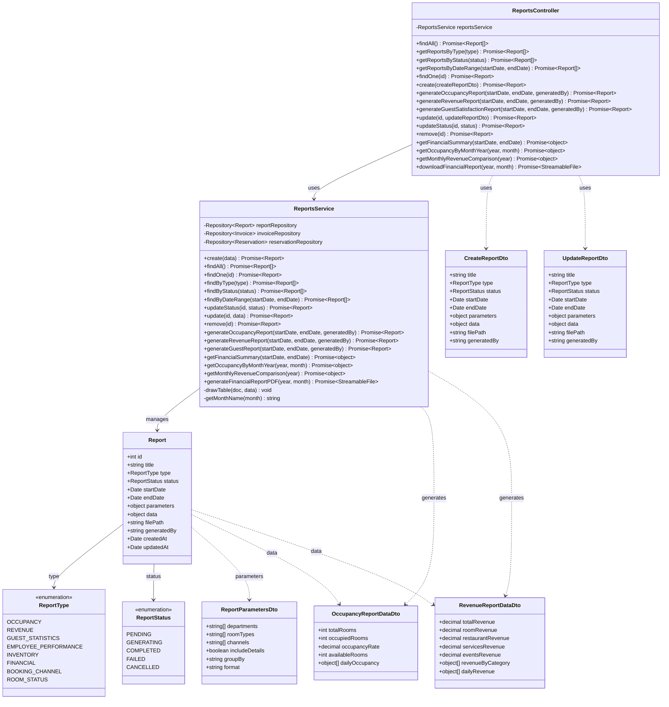

# Diagrama de Clases - Módulo de Reportes

## Descripción

Este diagrama muestra la arquitectura completa del módulo de reportes:

### Controllers
- **ReportsController**: Maneja las peticiones HTTP para gestión de reportes, generación de reportes específicos y análisis financieros

### Services
- **ReportsService**: Lógica de negocio para creación de reportes, análisis de ocupación, ingresos y generación de PDFs

### Entities
- **Report**: Entidad principal que representa un reporte generado o en proceso
  - Almacena datos en formato JSON
  - Guarda la ruta del archivo generado
  - Rastrea quién generó el reporte

### DTOs
- **CreateReportDto**: Datos para crear un nuevo reporte
- **UpdateReportDto**: Datos para actualizar un reporte existente
- **ReportParametersDto**: Parámetros configurables para personalizar los reportes
- **OccupancyReportDataDto**: Datos específicos de reportes de ocupación
- **RevenueReportDataDto**: Datos específicos de reportes de ingresos

### Enumerations
- **ReportType**: Tipos de reportes disponibles
  - OCCUPANCY: Reportes de ocupación
  - REVENUE: Reportes de ingresos
  - GUEST_STATISTICS: Estadísticas de huéspedes
  - EMPLOYEE_PERFORMANCE: Rendimiento de empleados
  - INVENTORY: Inventario
  - FINANCIAL: Reportes financieros
  - BOOKING_CHANNEL: Canales de reserva
  - ROOM_STATUS: Estado de habitaciones

- **ReportStatus**: Estados del proceso de generación
  - PENDING: Pendiente de generación
  - GENERATING: En proceso de generación
  - COMPLETED: Completado exitosamente
  - FAILED: Falló la generación
  - CANCELLED: Cancelado

### Funcionalidades Principales
- Generación de reportes de ocupación
- Generación de reportes de ingresos
- Análisis financiero por período
- Comparación mensual de ingresos
- Generación de PDFs con datos financieros
- Estadísticas de huéspedes
