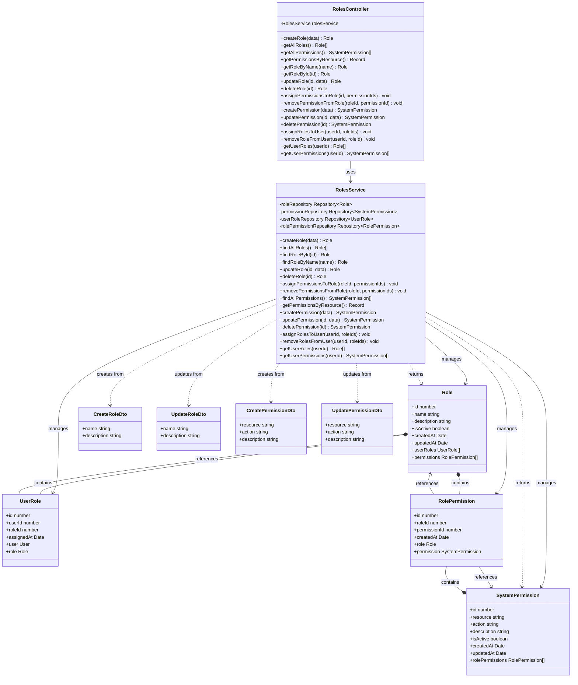

# Roles Module - Class Diagram

```mermaid
classDiagram
    %% Controllers
    class RolesController {
        -RolesService rolesService
        +createRole(data) Role
        +getAllRoles() Role[]
        +getAllPermissions() SystemPermission[]
        +getPermissionsByResource() Record
        +getRoleByName(name) Role
        +getRoleById(id) Role
        +updateRole(id, data) Role
        +deleteRole(id) Role
        +assignPermissionsToRole(id, permissionIds) void
        +removePermissionFromRole(roleId, permissionId) void
        +createPermission(data) SystemPermission
        +updatePermission(id, data) SystemPermission
        +deletePermission(id) SystemPermission
        +assignRolesToUser(userId, roleIds) void
        +removeRoleFromUser(userId, roleId) void
        +getUserRoles(userId) Role[]
        +getUserPermissions(userId) SystemPermission[]
    }

    %% Services
    class RolesService {
        -roleRepository Repository~Role~
        -permissionRepository Repository~SystemPermission~
        -userRoleRepository Repository~UserRole~
        -rolePermissionRepository Repository~RolePermission~
        +createRole(data) Role
        +findAllRoles() Role[]
        +findRoleById(id) Role
        +findRoleByName(name) Role
        +updateRole(id, data) Role
        +deleteRole(id) Role
        +assignPermissionsToRole(roleId, permissionIds) void
        +removePermissionsFromRole(roleId, permissionIds) void
        +findAllPermissions() SystemPermission[]
        +getPermissionsByResource() Record
        +createPermission(data) SystemPermission
        +updatePermission(id, data) SystemPermission
        +deletePermission(id) SystemPermission
        +assignRolesToUser(userId, roleIds) void
        +removeRolesFromUser(userId, roleIds) void
        +getUserRoles(userId) Role[]
        +getUserPermissions(userId) SystemPermission[]
    }

    %% Entities (from auth module)
    class Role {
        +id number
        +name string
        +description string
        +isActive boolean
        +createdAt Date
        +updatedAt Date
        +userRoles UserRole[]
        +permissions RolePermission[]
    }

    class SystemPermission {
        +id number
        +resource string
        +action string
        +description string
        +isActive boolean
        +createdAt Date
        +updatedAt Date
        +rolePermissions RolePermission[]
    }

    class UserRole {
        +id number
        +userId number
        +roleId number
        +assignedAt Date
        +user User
        +role Role
    }

    class RolePermission {
        +id number
        +roleId number
        +permissionId number
        +createdAt Date
        +role Role
        +permission SystemPermission
    }

    %% DTOs
    class CreateRoleDto {
        +name string
        +description string
    }

    class UpdateRoleDto {
        +name string
        +description string
    }

    class CreatePermissionDto {
        +resource string
        +action string
        +description string
    }

    class UpdatePermissionDto {
        +resource string
        +action string
        +description string
    }

    %% Relationships
    RolesController --> RolesService : uses
    RolesService --> Role : manages
    RolesService --> SystemPermission : manages
    RolesService --> UserRole : manages
    RolesService --> RolePermission : manages
    
    RolesService ..> CreateRoleDto : creates from
    RolesService ..> UpdateRoleDto : updates from
    RolesService ..> CreatePermissionDto : creates from
    RolesService ..> UpdatePermissionDto : updates from
    RolesService ..> Role : returns
    RolesService ..> SystemPermission : returns
    
    Role *-- UserRole : contains
    Role *-- RolePermission : contains
    SystemPermission *-- RolePermission : contains
    RolePermission --> Role : references
    RolePermission --> SystemPermission : references
    UserRole --> Role : references
```
