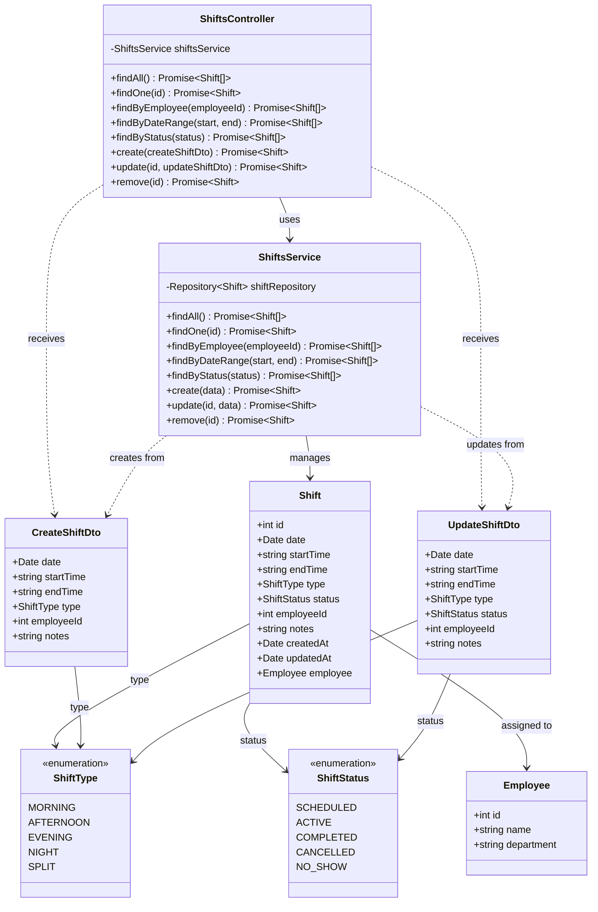

# Diagrama de Clases - Módulo de Turnos (Shifts)

## Descripción

Este diagrama muestra la arquitectura completa del módulo de turnos:

### Controllers
- **ShiftsController**: Maneja peticiones HTTP para gestión de turnos de empleados

### Services
- **ShiftsService**: Lógica de negocio para turnos
  - Operaciones CRUD de turnos
  - Búsqueda por empleado
  - Filtrado por rango de fechas
  - Filtrado por estado

### Entities
- **Shift**: Turno de trabajo
  - Fecha y horario (inicio/fin)
  - Tipo de turno
  - Estado del turno
  - Empleado asignado
  - Notas adicionales
- **Employee**: Empleado asignado al turno

### DTOs
- **CreateShiftDto**: Datos para crear turno
- **UpdateShiftDto**: Datos para actualizar turno

### Enumerations
- **ShiftType**: Tipos de turno
  - MORNING: Mañana
  - AFTERNOON: Tarde
  - EVENING: Noche temprana
  - NIGHT: Noche
  - SPLIT: Turno dividido
- **ShiftStatus**: Estados de turno
  - SCHEDULED: Programado
  - ACTIVE: Activo (en curso)
  - COMPLETED: Completado
  - CANCELLED: Cancelado
  - NO_SHOW: No se presentó

### Funcionalidades Principales
- Gestión de turnos de empleados
- Programación de horarios
- Tracking de estado de turnos
- Filtrado por empleado, fecha y estado
- Diferentes tipos de turnos (mañana, tarde, noche, dividido)
- Notas adicionales por turno
