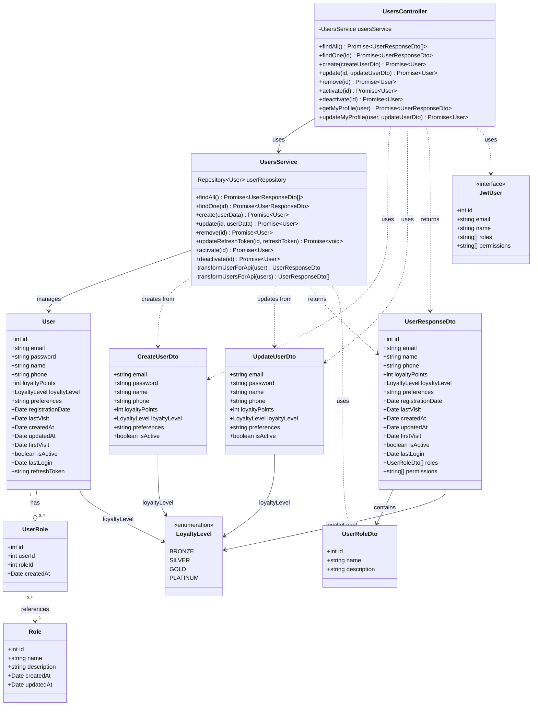

# Diagrama de Clases - Módulo de Usuarios

## Descripción

Este diagrama muestra la arquitectura completa del módulo de usuarios:

### Controllers
- **UsersController**: Maneja las peticiones HTTP para gestión de usuarios, activación/desactivación y perfil

### Services
- **UsersService**: Lógica de negocio para CRUD de usuarios, gestión de tokens de refresco y transformación de datos para API

### Entities
- **User**: Entidad principal que representa un usuario del sistema
  - Contiene credenciales (email, password encriptada)
  - Información personal (nombre, teléfono)
  - Sistema de lealtad (puntos y nivel)
  - Preferencias del usuario
  - Estado de la cuenta (activo/inactivo)
  - Tokens de autenticación

- **UserRole**: Tabla intermedia que relaciona usuarios con roles (Many-to-Many)

- **Role**: Define los roles disponibles en el sistema

### DTOs
- **CreateUserDto**: Datos para crear un nuevo usuario
- **UpdateUserDto**: Datos para actualizar un usuario existente
- **UserResponseDto**: Respuesta de API sin datos sensibles (password, refreshToken)
- **UserRoleDto**: Información simplificada de un rol

### Enumerations
- **LoyaltyLevel**: Niveles de lealtad del usuario
  - BRONZE: Nivel inicial
  - SILVER: Nivel intermedio
  - GOLD: Nivel avanzado
  - PLATINUM: Nivel premium

### Interfaces
- **JwtUser**: Datos del usuario en el token JWT para autenticación

### Funcionalidades Principales
- Gestión completa de usuarios (CRUD)
- Sistema de activación/desactivación de cuentas
- Gestión de perfil propio
- Sistema de puntos y niveles de lealtad
- Gestión de roles y permisos
- Transformación segura de datos (exclusión de campos sensibles)
- Manejo de tokens de refresco para autenticación
