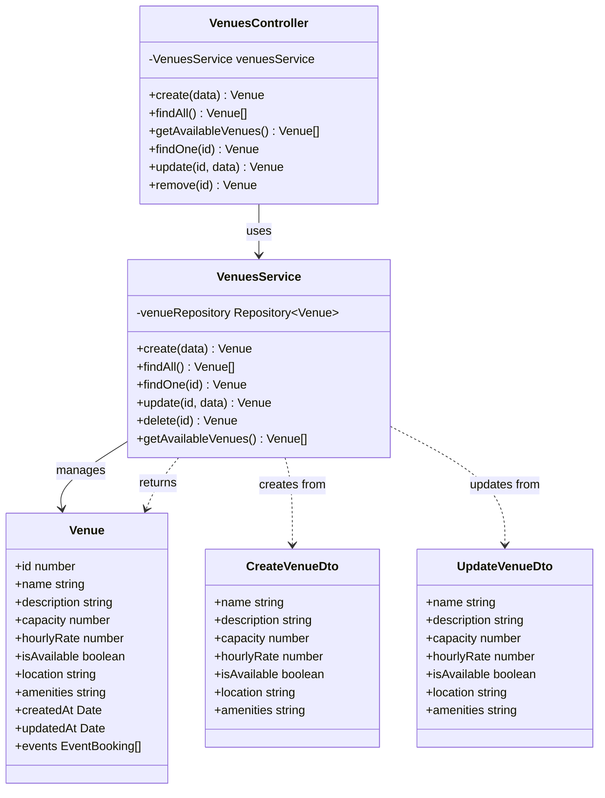

# Venues Module - Class Diagram

```mermaid
classDiagram
    %% Controllers
    class VenuesController {
        -VenuesService venuesService
        +create(data) Venue
        +findAll() Venue[]
        +getAvailableVenues() Venue[]
        +findOne(id) Venue
        +update(id, data) Venue
        +remove(id) Venue
    }

    %% Services
    class VenuesService {
        -venueRepository Repository~Venue~
        +create(data) Venue
        +findAll() Venue[]
        +findOne(id) Venue
        +update(id, data) Venue
        +delete(id) Venue
        +getAvailableVenues() Venue[]
    }

    %% Entities
    class Venue {
        +id number
        +name string
        +description string
        +capacity number
        +hourlyRate number
        +isAvailable boolean
        +location string
        +amenities string
        +createdAt Date
        +updatedAt Date
        +events EventBooking[]
    }

    %% DTOs
    class CreateVenueDto {
        +name string
        +description string
        +capacity number
        +hourlyRate number
        +isAvailable boolean
        +location string
        +amenities string
    }

    class UpdateVenueDto {
        +name string
        +description string
        +capacity number
        +hourlyRate number
        +isAvailable boolean
        +location string
        +amenities string
    }

    %% Relationships
    VenuesController --> VenuesService : uses
    VenuesService --> Venue : manages
    VenuesService ..> CreateVenueDto : creates from
    VenuesService ..> UpdateVenueDto : updates from
    VenuesService ..> Venue : returns
```
