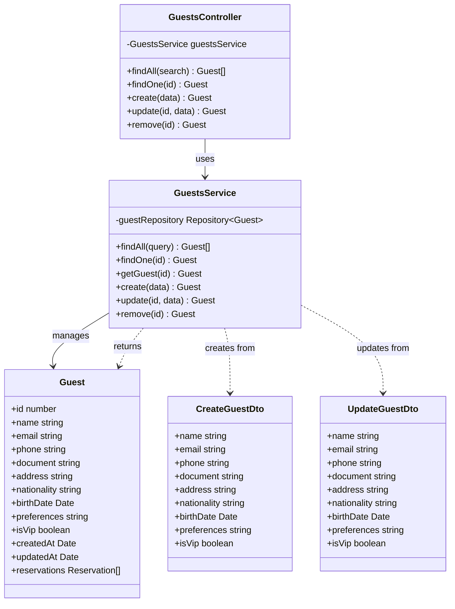

# Guests Module - Class Diagram

```mermaid
classDiagram
    %% Controllers
    class GuestsController {
        -GuestsService guestsService
        +findAll(search) Guest[]
        +findOne(id) Guest
        +create(data) Guest
        +update(id, data) Guest
        +remove(id) Guest
    }

    %% Services
    class GuestsService {
        -guestRepository Repository~Guest~
        +findAll(query) Guest[]
        +findOne(id) Guest
        +getGuest(id) Guest
        +create(data) Guest
        +update(id, data) Guest
        +remove(id) Guest
    }

    %% Entities (from reservations module)
    class Guest {
        +id number
        +name string
        +email string
        +phone string
        +document string
        +address string
        +nationality string
        +birthDate Date
        +preferences string
        +isVip boolean
        +createdAt Date
        +updatedAt Date
        +reservations Reservation[]
    }

    %% DTOs
    class CreateGuestDto {
        +name string
        +email string
        +phone string
        +document string
        +address string
        +nationality string
        +birthDate Date
        +preferences string
        +isVip boolean
    }

    class UpdateGuestDto {
        +name string
        +email string
        +phone string
        +document string
        +address string
        +nationality string
        +birthDate Date
        +preferences string
        +isVip boolean
    }

    %% Relationships
    GuestsController --> GuestsService : uses
    GuestsService --> Guest : manages
    GuestsService ..> CreateGuestDto : creates from
    GuestsService ..> UpdateGuestDto : updates from
    GuestsService ..> Guest : returns
```
