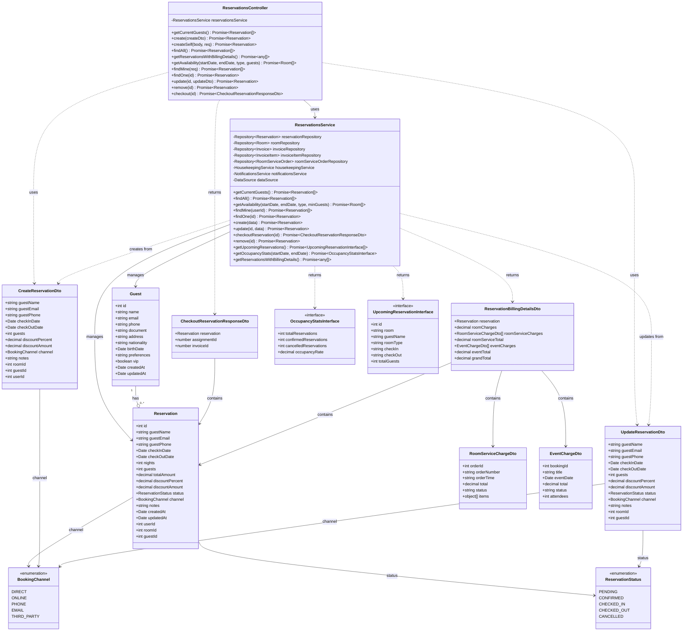

# Diagrama de Clases - Módulo de Reservaciones

## Descripción

Este diagrama muestra la arquitectura completa del módulo de reservaciones:

### Controllers
- **ReservationsController**: Maneja las peticiones HTTP para reservaciones

### Services
- **ReservationsService**: Lógica de negocio para gestión de reservaciones, disponibilidad, facturación y estadísticas

### Entities
- **Reservation**: Entidad principal que representa una reserva de habitación
- **Guest**: Representa a un huésped que puede tener múltiples reservas

### DTOs
- **CreateReservationDto**: Datos para crear una nueva reserva
- **UpdateReservationDto**: Datos para actualizar una reserva existente
- **CheckoutReservationResponseDto**: Respuesta del proceso de checkout
- **ReservationBillingDetailsDto**: Detalles de facturación de reservaciones
- **RoomServiceChargeDto**: Cargos de servicio a habitación
- **EventChargeDto**: Cargos por eventos

### Enumerations
- **ReservationStatus**: Estados posibles de una reserva (PENDING, CONFIRMED, CHECKED_IN, CHECKED_OUT, CANCELLED)
- **BookingChannel**: Canales de reserva (DIRECT, ONLINE, PHONE, EMAIL, THIRD_PARTY)

### Interfaces
- **OccupancyStatsInterface**: Estadísticas de ocupación
- **UpcomingReservationInterface**: Reservaciones próximas
