# Diagrama de Clases - Módulo de Restaurante

```mermaid
classDiagram
    %% Controllers
    class RestaurantController {
        -RestaurantService restaurantService
        +getRoomServiceOrders() Promise~RoomServiceOrder[]~
        +getRoomServiceOrderById(id) Promise~RoomServiceOrder~
        +createRoomServiceOrder(orderData) Promise~RoomServiceOrder~
        +updateRoomServiceOrder(id, updateData) Promise~RoomServiceOrder~
        +getMenuItems() Promise~MenuItem[]~
        +getMenuItemById(id) Promise~MenuItem~
        +createMenuItem(itemData) Promise~MenuItem~
        +updateMenuItem(id, updateData) Promise~MenuItem~
        +deleteMenuItem(id) Promise~MenuItem~
        +getBeverageInventory() Promise~BeverageInventory[]~
        +getBeverageItemById(id) Promise~BeverageInventory~
        +createBeverageItem(itemData) Promise~BeverageInventory~
        +updateBeverageStock(id, body) Promise~BeverageInventory~
    }

    %% Services
    class RestaurantService {
        -Repository~RoomServiceOrder~ roomServiceOrderRepository
        -Repository~MenuItem~ menuItemRepository
        -Repository~BeverageInventory~ beverageInventoryRepository
        +getRoomServiceOrders() Promise~RoomServiceOrder[]~
        +createRoomServiceOrder(orderData) Promise~RoomServiceOrder~
        +updateRoomServiceOrder(id, orderData) Promise~RoomServiceOrder~
        +getRoomServiceOrderById(id) Promise~RoomServiceOrder~
        +getMenuItems() Promise~MenuItem[]~
        +createMenuItem(itemData) Promise~MenuItem~
        +updateMenuItem(id, itemData) Promise~MenuItem~
        +deleteMenuItem(id) Promise~MenuItem~
        +getMenuItemById(id) Promise~MenuItem~
        +getBeverageInventory() Promise~BeverageInventory[]~
        +createBeverageItem(itemData) Promise~BeverageInventory~
        +updateBeverageStock(id, stock) Promise~BeverageInventory~
        +getBeverageItemById(id) Promise~BeverageInventory~
        +getLowStockBeverages() Promise~BeverageInventory[]~
        +getBeveragesByCategory(category) Promise~BeverageInventory[]~
    }

    %% Entities
    class MenuItem {
        +int id
        +string itemCode
        +string category
        +string name
        +string description
        +decimal price
        +boolean available
        +string preparationTime
        +string[] ingredients
        +string[] allergens
        +Date createdAt
        +Date updatedAt
    }

    class RoomServiceOrder {
        +int id
        +string orderNumber
        +string room
        +string guest
        +object[] items
        +decimal total
        +string orderTime
        +string estimatedTime
        +RoomServiceStatus status
        +string waiter
        +string specialInstructions
        +Date createdAt
        +Date updatedAt
        +int guestId
    }

    class BeverageInventory {
        +int id
        +string itemCode
        +string name
        +string category
        +int stock
        +int minimumStock
        +string unit
        +decimal unitCost
        +string supplier
        +Date lastPurchase
        +BeverageStatus status
        +Date createdAt
        +Date updatedAt
    }

    %% DTOs
    class CreateMenuItemDto {
        +string category
        +string name
        +string description
        +decimal price
        +boolean available
        +string preparationTime
        +string[] ingredients
        +string[] allergens
    }

    class UpdateMenuItemDto {
        +string category
        +string name
        +string description
        +decimal price
        +boolean available
        +string preparationTime
        +string[] ingredients
        +string[] allergens
    }

    class CreateRoomServiceOrderDto {
        +string room
        +string guest
        +object[] items
        +decimal total
        +string estimatedTime
        +string waiter
        +string specialInstructions
        +int guestId
    }

    class UpdateRoomServiceOrderDto {
        +string room
        +string guest
        +object[] items
        +decimal total
        +string estimatedTime
        +RoomServiceStatus status
        +string waiter
        +string specialInstructions
    }

    class CreateBeverageItemDto {
        +string name
        +string category
        +int stock
        +int minimumStock
        +string unit
        +decimal unitCost
        +string supplier
        +Date lastPurchase
    }

    class UpdateBeverageStockDto {
        +int stock
    }

    %% Enumerations
    class RoomServiceStatus {
        <<enumeration>>
        PENDING
        PREPARING
        READY
        DELIVERED
        CANCELLED
    }

    class BeverageStatus {
        <<enumeration>>
        AVAILABLE
        LOW_STOCK
        OUT_OF_STOCK
        DISCONTINUED
    }

    %% Relationships
    RestaurantController --> RestaurantService : uses
    RestaurantController ..> CreateMenuItemDto : uses
    RestaurantController ..> UpdateMenuItemDto : uses
    RestaurantController ..> CreateRoomServiceOrderDto : uses
    RestaurantController ..> UpdateRoomServiceOrderDto : uses
    RestaurantController ..> CreateBeverageItemDto : uses
    RestaurantController ..> UpdateBeverageStockDto : uses
    
    RestaurantService --> MenuItem : manages
    RestaurantService --> RoomServiceOrder : manages
    RestaurantService --> BeverageInventory : manages
    RestaurantService ..> CreateMenuItemDto : creates from
    RestaurantService ..> UpdateMenuItemDto : updates from
    RestaurantService ..> CreateRoomServiceOrderDto : creates from
    RestaurantService ..> UpdateRoomServiceOrderDto : updates from
    RestaurantService ..> CreateBeverageItemDto : creates from
    RestaurantService ..> UpdateBeverageStockDto : updates from
    
    MenuItem --> RoomServiceStatus : referenced in orders
    RoomServiceOrder --> RoomServiceStatus : status
    BeverageInventory --> BeverageStatus : status
    
    UpdateRoomServiceOrderDto --> RoomServiceStatus : status
    
    %% Notas de Patrones GoF
    note for RoomServiceOrder "Composite Pattern (GoF)<br/>Contiene items (productos)<br/>que se suman para total"
    note for RoomServiceStatus "State Pattern (GoF)<br/>Ciclo de vida:<br/>PENDING→PREPARING→READY→DELIVERED"
    note for BeverageStatus "State Pattern (GoF)<br/>Estados de stock:<br/>AVAILABLE→LOW_STOCK→OUT_OF_STOCK"
```

## Descripción

Este diagrama muestra la arquitectura completa del módulo de restaurante:

### Controllers
- **RestaurantController**: Maneja las peticiones HTTP para el restaurante, menú, órdenes y bebidas

### Services
- **RestaurantService**: Lógica de negocio para gestión de menú, órdenes de servicio a habitación e inventario de bebidas

### Entities
- **MenuItem**: Elementos del menú del restaurante con precios, categorías y disponibilidad
- **RoomServiceOrder**: Pedidos de servicio a habitación con items, totales y seguimiento
- **BeverageInventory**: Inventario de bebidas con control de stock y proveedores

### DTOs
- **CreateMenuItemDto**: Datos para crear un nuevo ítem del menú
- **UpdateMenuItemDto**: Datos para actualizar un ítem del menú
- **CreateRoomServiceOrderDto**: Datos para crear una orden de servicio a habitación
- **UpdateRoomServiceOrderDto**: Datos para actualizar una orden de servicio a habitación
- **CreateBeverageItemDto**: Datos para crear un ítem de bebida en inventario
- **UpdateBeverageStockDto**: Datos para actualizar el stock de bebidas

### Enumerations
- **RoomServiceStatus**: Estados del pedido (PENDING, PREPARING, READY, DELIVERED, CANCELLED)
- **BeverageStatus**: Estados del inventario (AVAILABLE, LOW_STOCK, OUT_OF_STOCK, DISCONTINUED)
