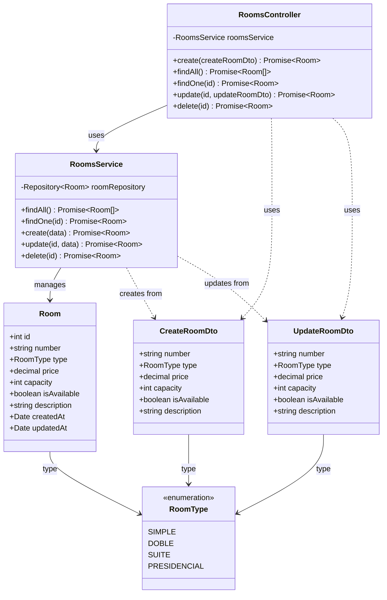

# Diagrama de Clases - Módulo de Habitaciones

## Descripción

Módulo para gestión de habitaciones del hotel.

### Entities
- **Room**: Habitación con número, tipo, precio, capacidad y disponibilidad

### DTOs
- **CreateRoomDto**: Datos para crear habitación
- **UpdateRoomDto**: Datos para actualizar habitación

### Enumerations
- **RoomType**: Tipos de habitación (SIMPLE, DOBLE, SUITE, PRESIDENCIAL)
