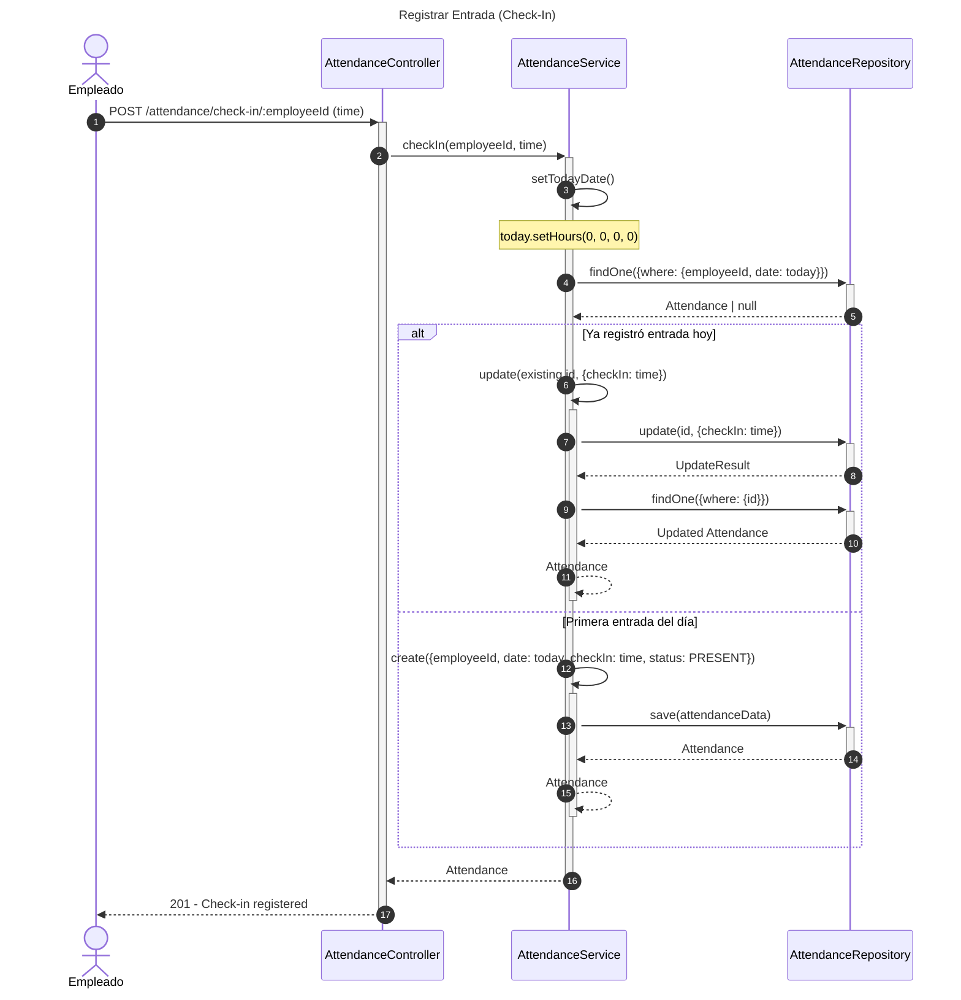
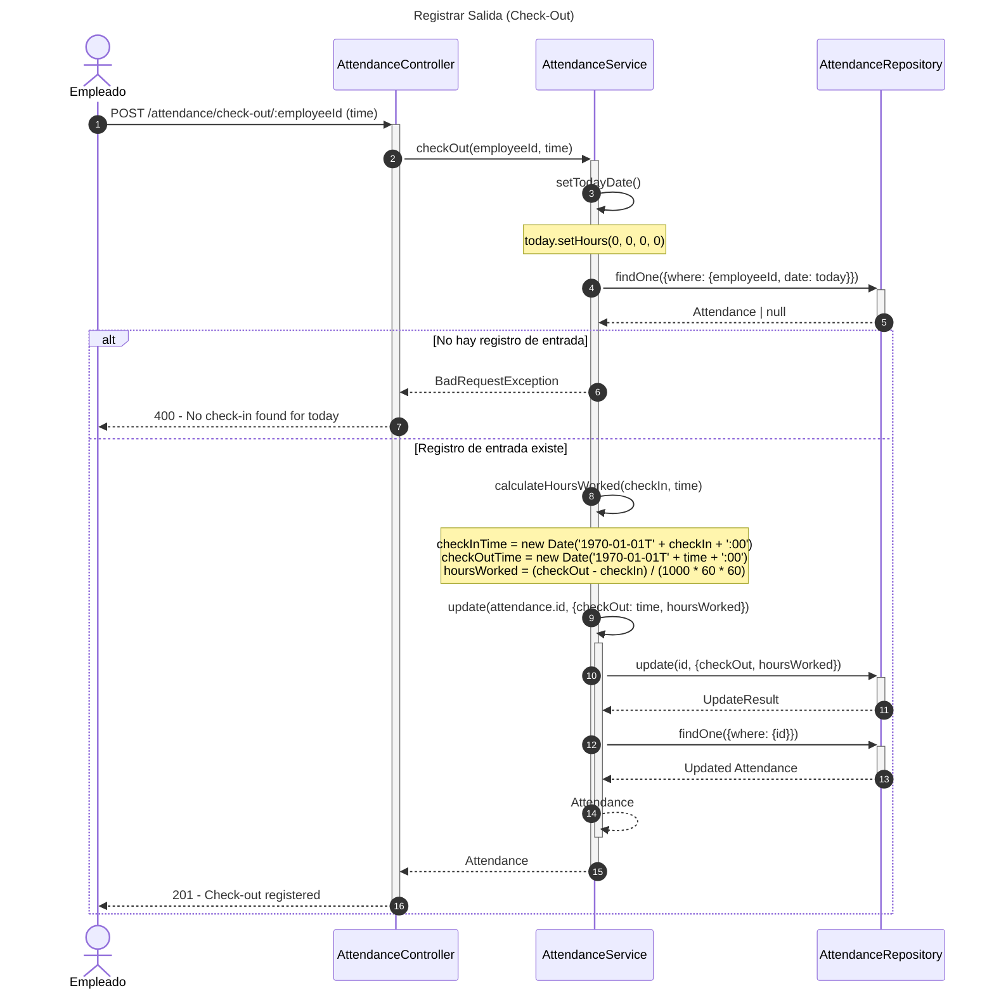
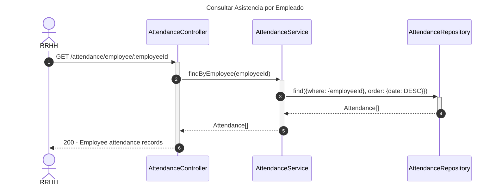
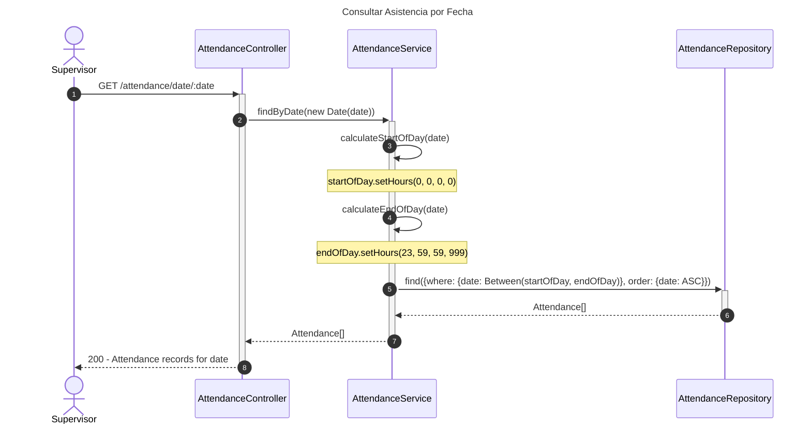
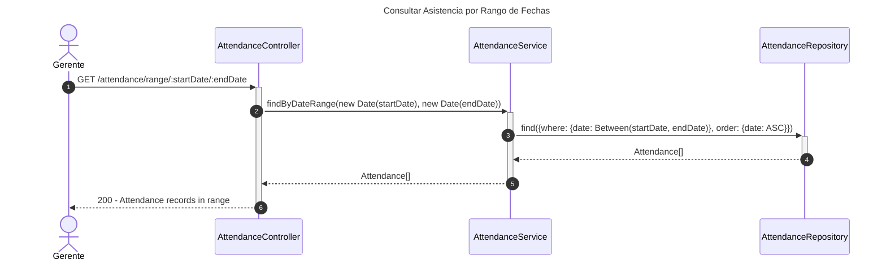
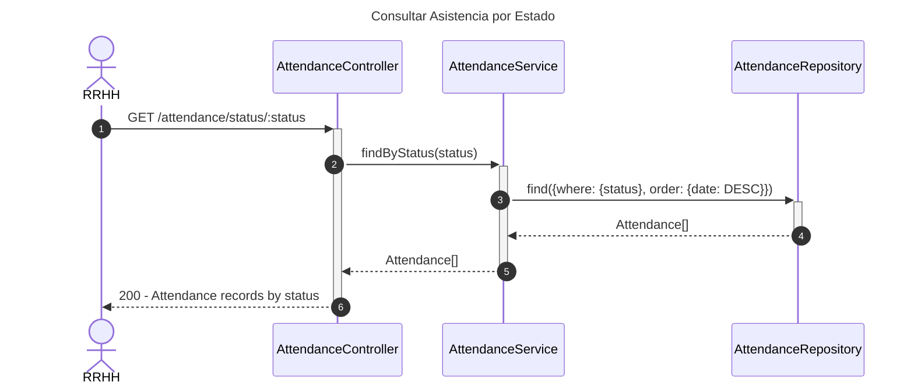
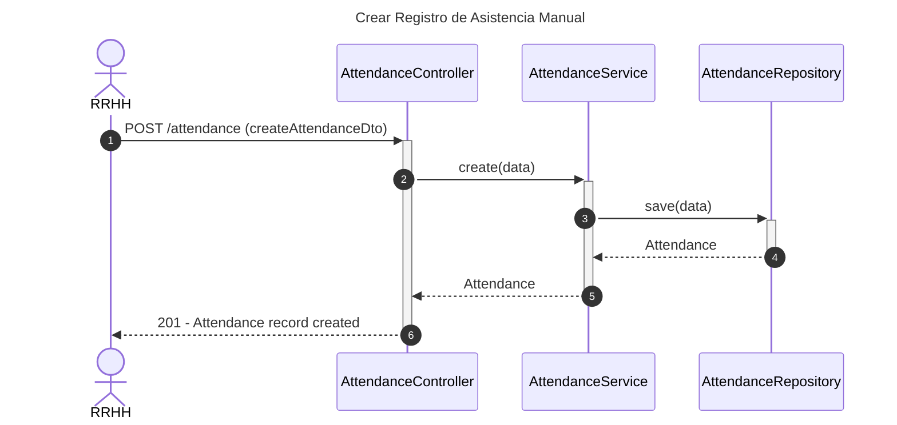
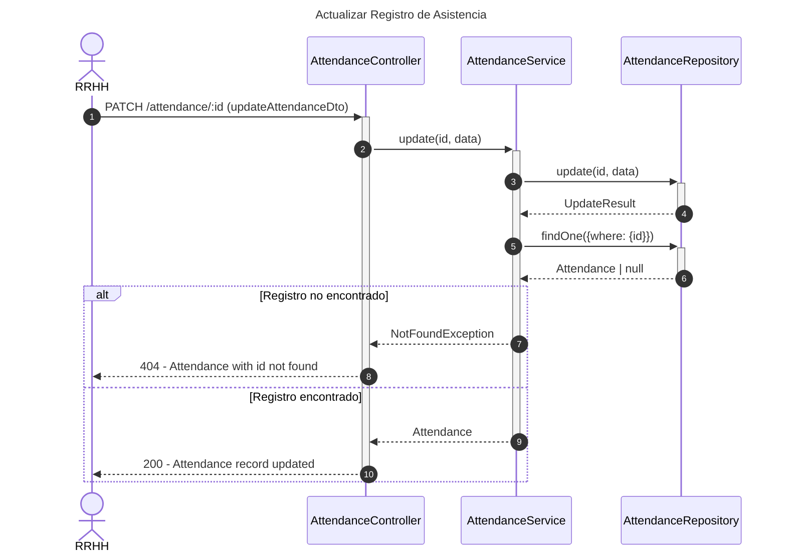
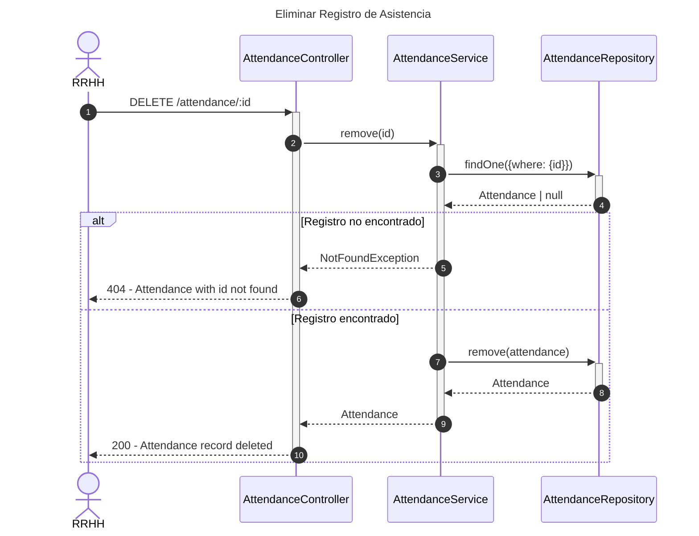

# Diagrama de Secuencia - Módulo de Asistencia

## 1. Registrar Entrada (Check-In)

## 2. Registrar Salida (Check-Out)

## 3. Consultar Asistencia por Empleado

## 4. Consultar Asistencia por Fecha

## 5. Consultar Asistencia por Rango de Fechas

## 6. Consultar Asistencia por Estado

## 7. Crear Registro de Asistencia Manual

## 8. Actualizar Registro de Asistencia

## 9. Eliminar Registro de Asistencia

## Descripción de Flujos

### 1. Registrar Entrada (Check-In)

- Empleado registra su hora de entrada
- Sistema verifica si ya existe registro para hoy
- Si existe, actualiza la hora de entrada
- Si no existe, crea nuevo registro con estado PRESENT

### 2. Registrar Salida (Check-Out)

- Empleado registra su hora de salida
- Sistema busca registro de entrada del día
- Calcula horas trabajadas automáticamente
- Actualiza registro con hora de salida y horas trabajadas

### 3. Consultar Asistencia por Empleado

- Recupera historial completo de asistencia de un empleado
- Ordenado por fecha descendente (más reciente primero)

### 4. Consultar Asistencia por Fecha

- Consulta todos los registros de un día específico
- Calcula inicio y fin del día (00:00:00 - 23:59:59)
- Útil para supervisión diaria

### 5. Consultar Asistencia por Rango de Fechas

- Consulta registros en un período específico
- Ordenado cronológicamente ascendente
- Útil para reportes y análisis

### 6. Consultar Asistencia por Estado

- Filtra registros por estado (PRESENT, ABSENT, LATE, EXCUSED)
- Ordenado por fecha descendente
- Útil para identificar patrones de ausentismo

### 7. Crear Registro de Asistencia Manual

- RRHH puede crear registros manualmente
- Útil para correcciones o registros históricos

### 8. Actualizar Registro de Asistencia

- Permite modificar registros existentes
- Validación de existencia del registro

### 9. Eliminar Registro de Asistencia

- Eliminación física del registro
- Solo para correcciones administrativas

## Patrones Implementados

- **Repository Pattern**: Acceso a datos a través de repositorios
- **Service Layer**: Lógica de negocio centralizada
- **State Pattern**: Estados de asistencia (PRESENT, ABSENT, LATE, EXCUSED)
- **Business Logic**: Cálculo automático de horas trabajadas
- **Validation Pattern**: Validación de check-in previo antes de check-out
