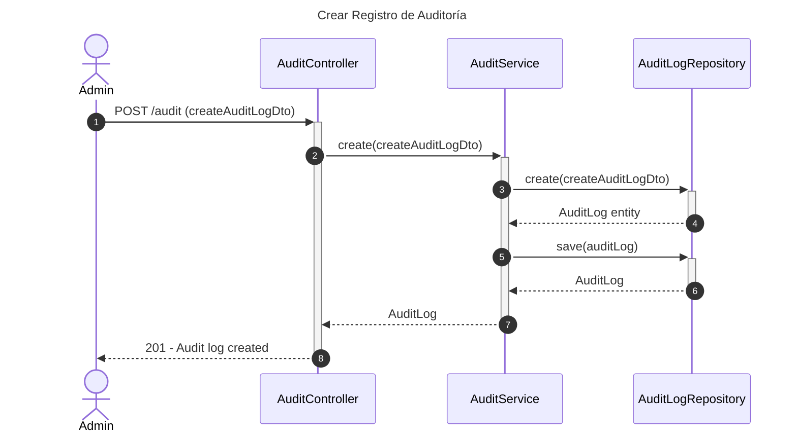
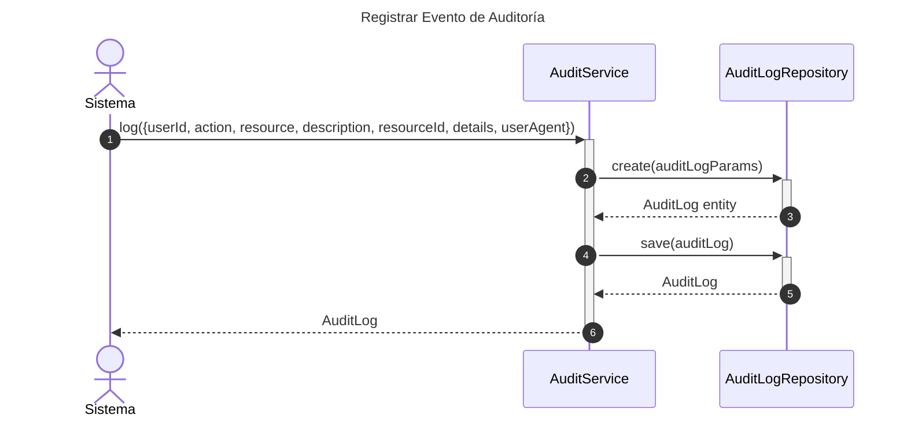
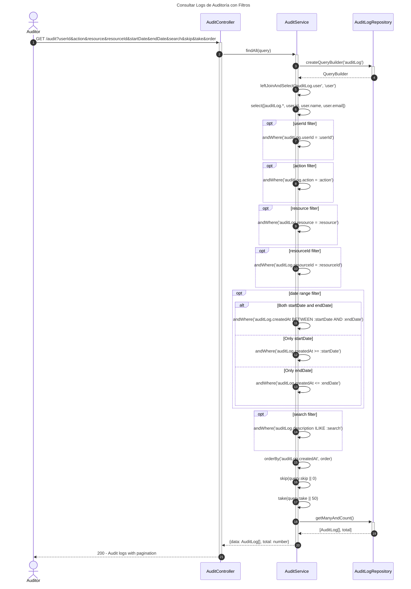
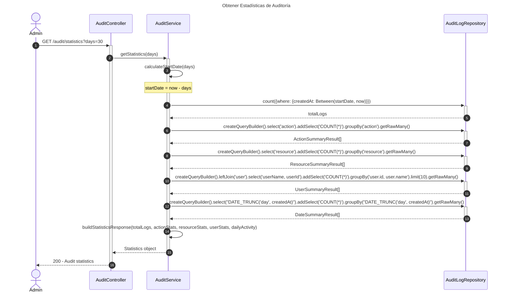
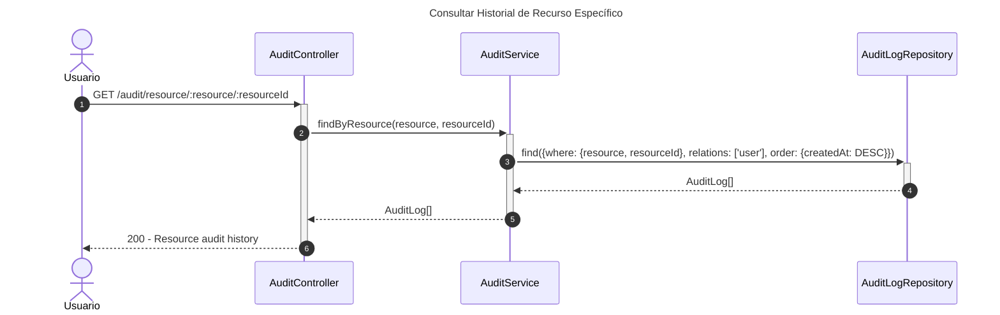
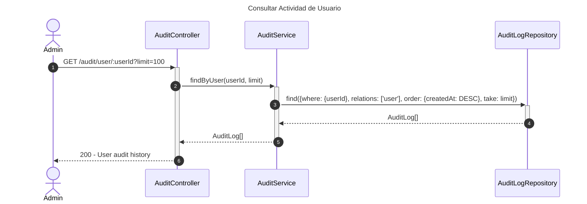
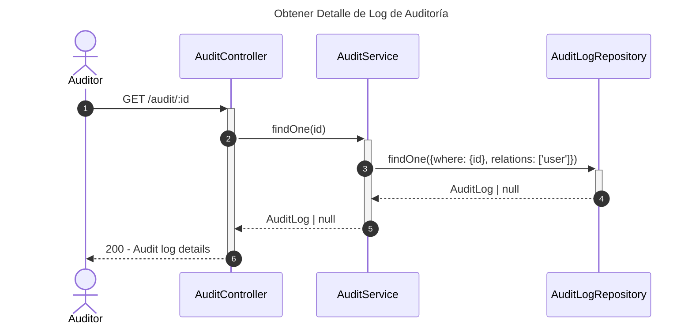
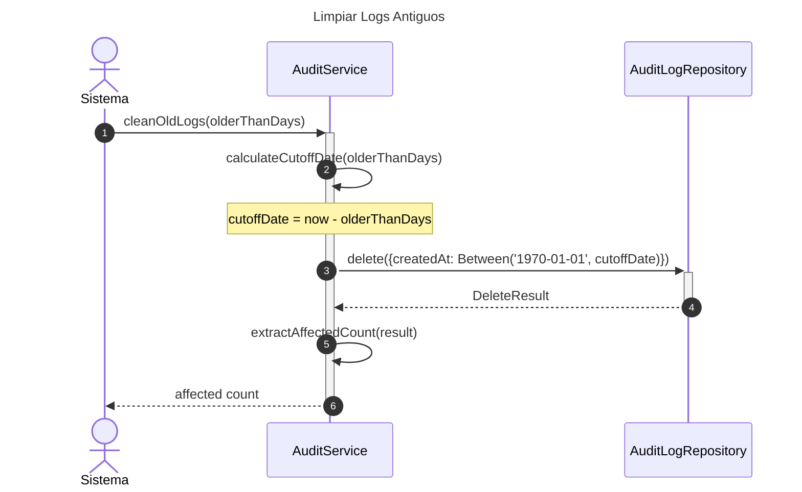

# Diagrama de Secuencia - Módulo de Auditoría

## 1. Crear Registro de Auditoría

## 2. Registrar Evento de Auditoría (Método Interno)

## 3. Consultar Logs de Auditoría con Filtros

## 4. Obtener Estadísticas de Auditoría

## 5. Consultar Historial de Recurso Específico

## 6. Consultar Actividad de Usuario

## 7. Obtener Detalle de Log de Auditoría

## 8. Limpiar Logs Antiguos (Mantenimiento)

## Descripción de Flujos

### 1. Crear Registro de Auditoría

- Permite crear logs de auditoría manualmente
- Útil para eventos del sistema que requieren registro explícito
- Guarda información completa del evento

### 2. Registrar Evento de Auditoría (Método Interno)

- Método utilizado internamente por el sistema
- Registra automáticamente acciones de usuarios
- Incluye: userId, action, resource, description, resourceId, details, userAgent
- Usado por el decorador @AuditLog en otros controladores

### 3. Consultar Logs de Auditoría con Filtros

- Sistema avanzado de búsqueda y filtrado
- Filtros disponibles: userId, action, resource, resourceId, fechas, búsqueda de texto
- Soporte para paginación (skip/take)
- Ordenamiento configurable (ASC/DESC)
- Incluye información del usuario relacionado

### 4. Obtener Estadísticas de Auditoría

- Genera estadísticas agregadas para período especificado
- Incluye:
  - Total de logs
  - Distribución por acción (CREATE, UPDATE, DELETE, etc.)
  - Distribución por recurso (USER, RESERVATION, ROOM, etc.)
  - Top 10 usuarios más activos
  - Actividad diaria (timeline)
- Útil para dashboards y reportes de seguridad

### 5. Consultar Historial de Recurso Específico

- Obtiene todo el historial de cambios de un recurso
- Útil para trazabilidad de entidades específicas
- Ordenado cronológicamente (más reciente primero)
- Incluye información del usuario que realizó cada acción

### 6. Consultar Actividad de Usuario

- Obtiene historial de acciones de un usuario específico
- Limitado a un número máximo de registros (default: 100)
- Ordenado cronológicamente descendente
- Útil para análisis de comportamiento y auditorías

### 7. Obtener Detalle de Log de Auditoría

- Recupera información detallada de un log específico
- Incluye campo 'details' con información adicional del evento
- Incluye relación con usuario

### 8. Limpiar Logs Antiguos (Mantenimiento)

- Proceso de mantenimiento para eliminar logs antiguos
- Evita crecimiento descontrolado de la base de datos
- Default: elimina logs más antiguos de 365 días
- Retorna cantidad de registros eliminados

## Patrones Implementados

- **Repository Pattern**: Acceso a datos a través de repositorios
- **Query Builder Pattern**: Construcción dinámica de consultas complejas
- **Observer Pattern**: Sistema de auditoría automática mediante decoradores
- **Decorator Pattern**: @AuditLog para registro automático de eventos
- **Aggregate Pattern**: Estadísticas y resúmenes de datos de auditoría
- **Data Retention Pattern**: Limpieza automática de datos históricos
