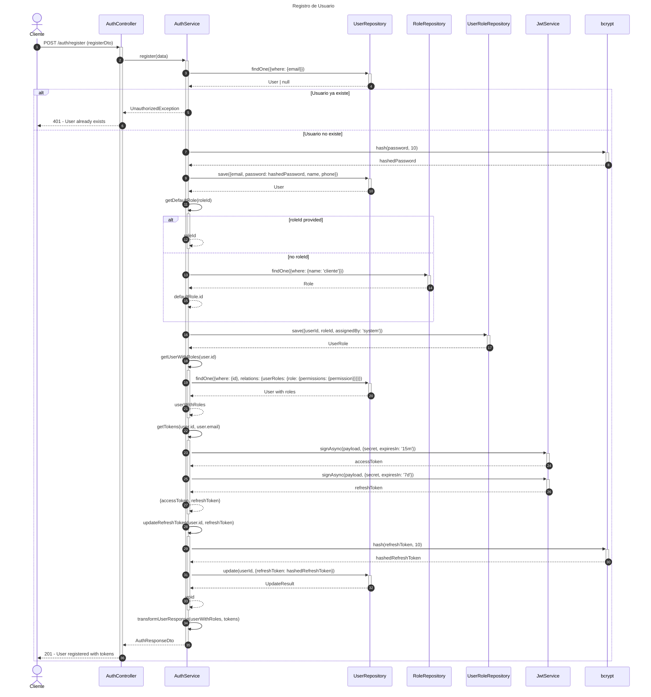
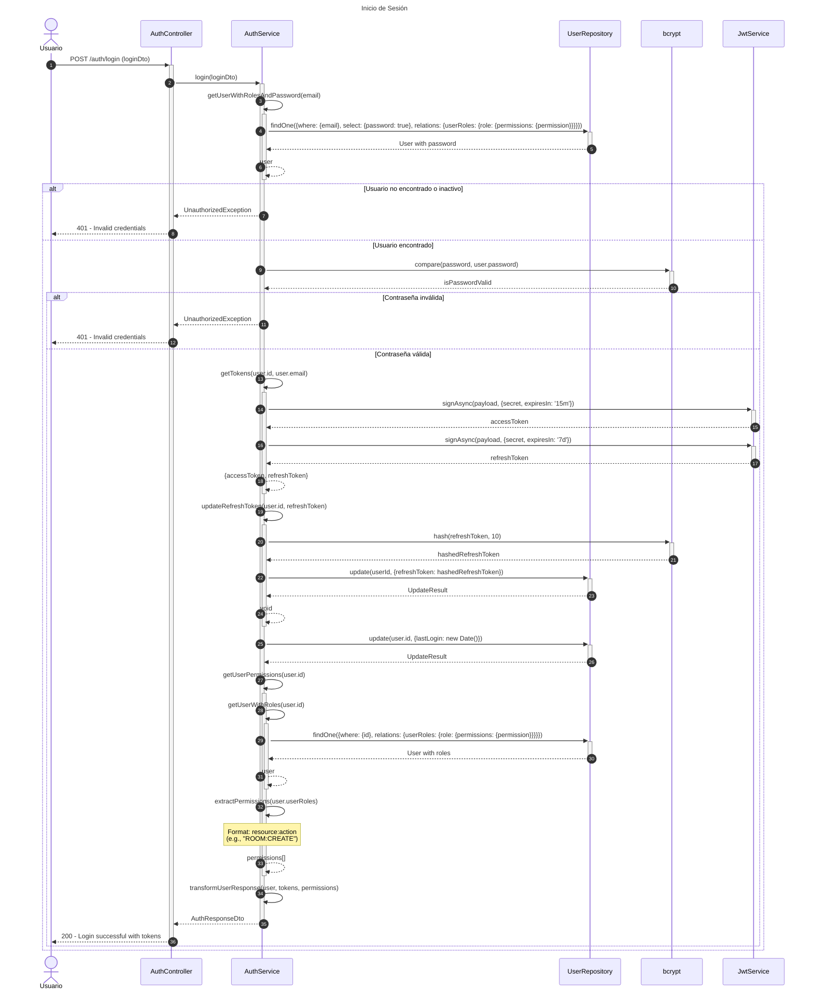
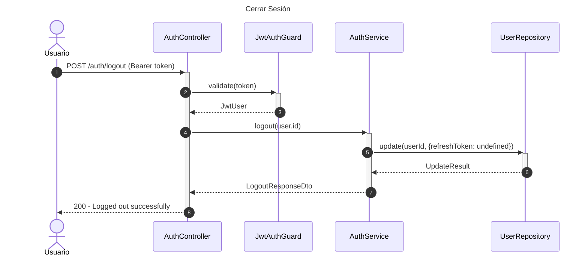
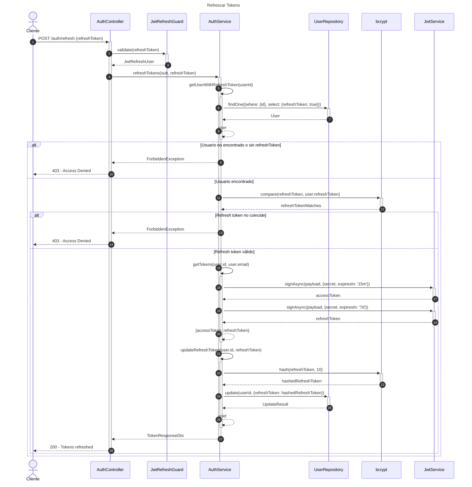
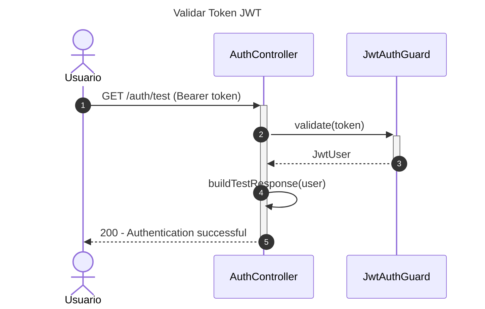

# Diagrama de Secuencia - Módulo de Autenticación

## 1. Registro de Usuario



## 2. Inicio de Sesión (Login)



## 3. Cerrar Sesión (Logout)



## 4. Refrescar Tokens



## 5. Obtener Perfil de Usuario

```mermaid
---
title: Obtener Perfil de Usuario
---
sequenceDiagram
    autonumber
    actor Usuario
    participant Controller as AuthController
    participant Service as AuthService
    participant UserRepo as UserRepository

    Usuario->>+Controller: POST /auth/me (Bearer token)
    Controller->>+Service: validateUser(user.id)
    
    Service->>+Service: getUserWithRoles(userId)
    Service->>+UserRepo: findOne({where: {id}, relations: {userRoles: {role: {permissions: {permission}}}}})
    UserRepo-->>-Service: User | null
    Service-->>-Service: user
    
    alt Usuario no encontrado o inactivo
        Service-->>-Controller: null
        Controller-->>Usuario: null
    else Usuario encontrado
        Service->>+Service: getUserPermissions(user.id)
        Service->>Service: extractPermissions(user.userRoles)
        Service-->>-Service: permissions[]
        
        Service->>Service: transformProfileResponse(user, permissions)
        
        Service-->>-Controller: ProfileResponseDto
        Controller-->>-Usuario: 200 - User profile
    end
```

## 6. Validar Token JWT (Test)



## Descripción de Flujos

### 1. Registro de Usuario

- Valida que el email no exista
- Hashea la contraseña con bcrypt (10 rounds)
- Crea el usuario en la base de datos
- Asigna rol por defecto ('cliente') si no se especifica
- Genera access token (15 min) y refresh token (7 días)
- Hashea y guarda el refresh token
- Retorna usuario con tokens

### 2. Inicio de Sesión (Login)

- Busca usuario por email (incluyendo password)
- Verifica que el usuario esté activo
- Compara contraseña con bcrypt
- Genera nuevos tokens
- Actualiza refresh token hasheado
- Actualiza fecha de último login
- Obtiene permisos del usuario (formato: resource:action)
- Retorna usuario con roles, permisos y tokens

### 3. Cerrar Sesión (Logout)

- Valida JWT token actual
- Elimina refresh token de la base de datos
- Invalida sesión del usuario

### 4. Refrescar Tokens

- Valida refresh token mediante JWT guard
- Verifica que el refresh token coincida (bcrypt compare)
- Genera nuevos access y refresh tokens
- Actualiza refresh token hasheado en BD
- Retorna nuevos tokens

### 5. Obtener Perfil de Usuario

- Valida JWT token
- Obtiene usuario con roles y permisos
- Verifica que esté activo
- Transforma permisos a formato resource:action
- Retorna perfil completo con roles y permisos

### 6. Validar Token JWT (Test)

- Endpoint de prueba para validar autenticación
- Útil para debugging y verificación de tokens
- Retorna información del usuario autenticado

## Patrones Implementados

- **JWT Strategy**: Autenticación basada en tokens
- **Guard Pattern**: Protección de rutas con AuthGuards
- **Repository Pattern**: Acceso a datos a través de repositorios
- **Decorator Pattern**: @CurrentUser para inyectar usuario autenticado
- **DTO Pattern**: Transformación de datos (AuthResponseDto, TokenResponseDto, etc.)
- **Security Pattern**: Hash de contraseñas y refresh tokens con bcrypt
- **Token Refresh Pattern**: Refresh tokens de larga duración para renovar access tokens
- **Role-Based Access Control**: Asignación de roles y permisos a usuarios
