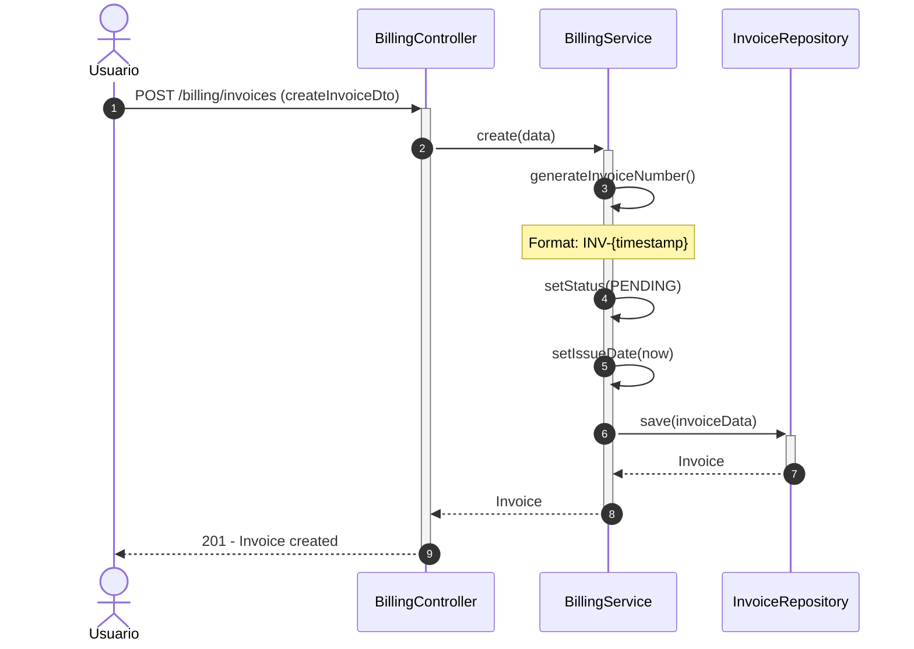
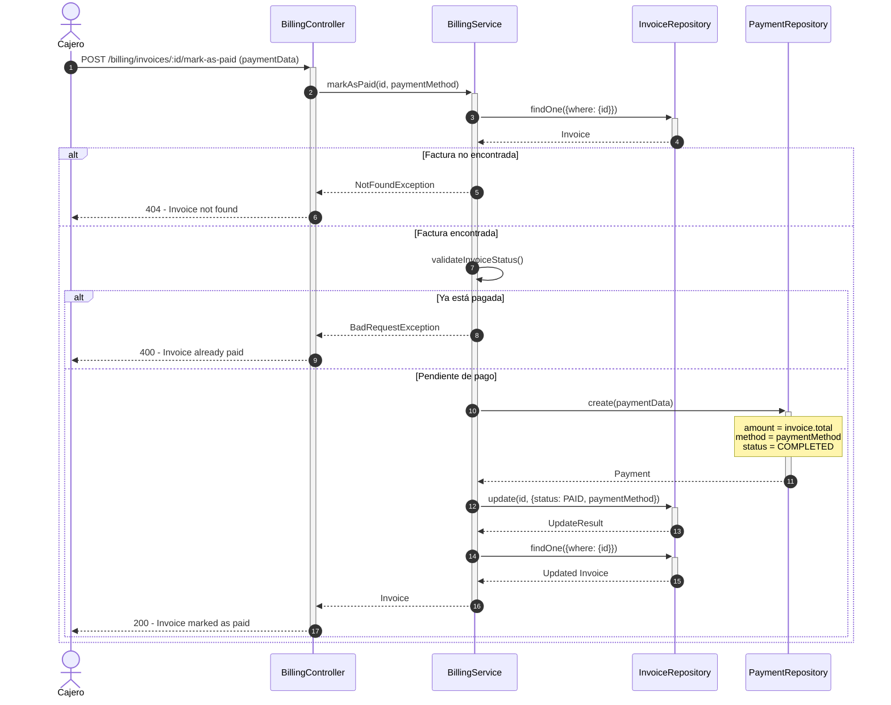
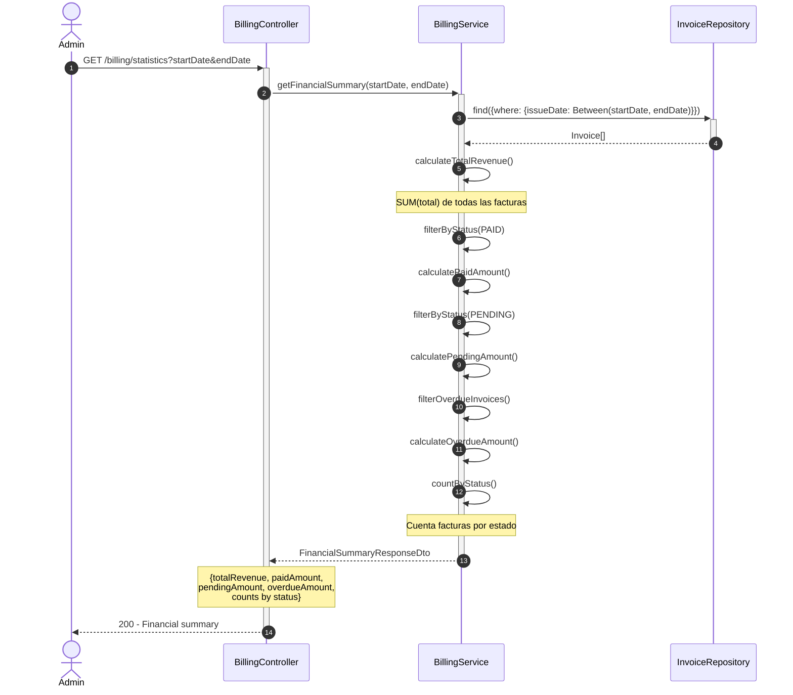
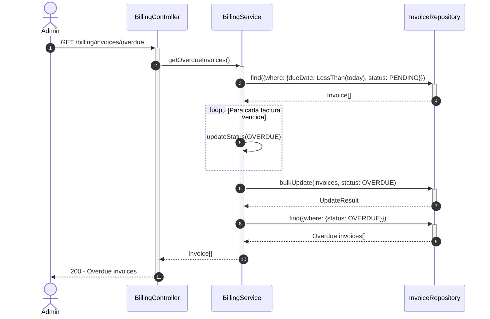
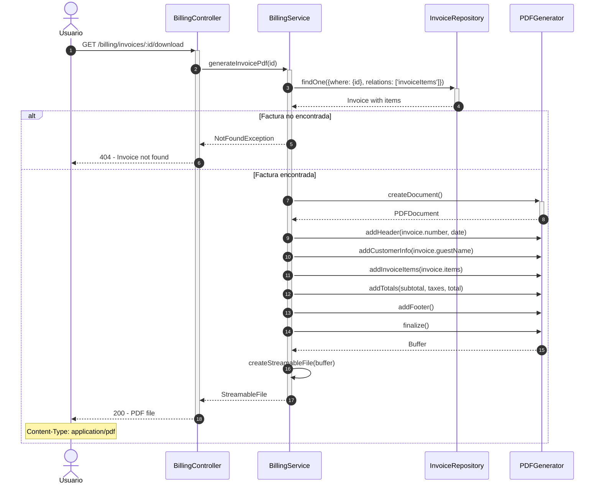
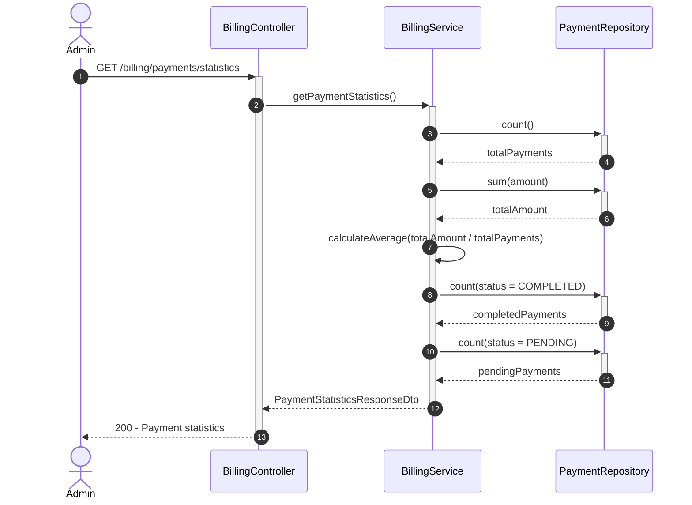
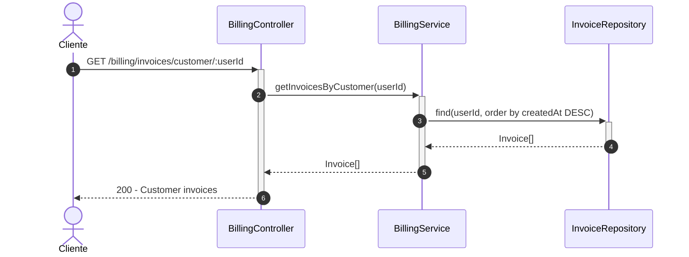

# Diagrama de Secuencia - Módulo de Facturación

## 1. Crear Factura

## 2. Marcar Factura como Pagada

## 3. Generar Reporte Financiero

## 4. Consultar Facturas Vencidas

## 5. Generar PDF de Factura

## 6. Obtener Estadísticas de Pagos

## 7. Consultar Facturas por Cliente

## Descripción de Flujos

### 1. Crear Factura

- Se genera número de factura único basado en timestamp
- Estado inicial siempre es PENDING
- Se registra fecha de emisión automáticamente
- Incluye subtotal, impuestos y total

### 2. Marcar Factura como Pagada

- Validación de estado de la factura
- Creación de registro de pago
- Actualización de estado a PAID
- Registro de método de pago utilizado

### 3. Generar Reporte Financiero

- Consulta facturas en rango de fechas
- Calcula métricas financieras agregadas
- Incluye ingresos totales, pagados, pendientes y vencidos
- Cuenta facturas por estado

### 4. Consultar Facturas Vencidas

- Identifica facturas con fecha de vencimiento pasada
- Actualiza automáticamente estado a OVERDUE
- Retorna lista de facturas vencidas
- Útil para gestión de cobranza

### 5. Generar PDF de Factura

- Recupera factura con todos sus items
- Genera documento PDF profesional
- Incluye header, información del cliente, items, totales
- Retorna archivo descargable

### 6. Obtener Estadísticas de Pagos

- Calcula métricas de pagos
- Total de pagos, monto total, promedio
- Desglose por estado (completados, pendientes)

### 7. Consultar Facturas por Cliente

- Lista facturas de un cliente específico
- Ordenadas por fecha de creación (más recientes primero)
- Incluye todas las relaciones necesarias

## Patrones Implementados

- **State Pattern**: Estados de factura (PENDING, PAID, OVERDUE, CANCELLED, REFUNDED)
- **Strategy Pattern**: Diferentes métodos de pago
- **Repository Pattern**: Acceso a datos a través de repositorios
- **Factory Pattern**: Generación automática de números de factura
- **Builder Pattern**: Construcción de PDF paso a paso
- **Aggregate Pattern**: Cálculo de totales y estadísticas
