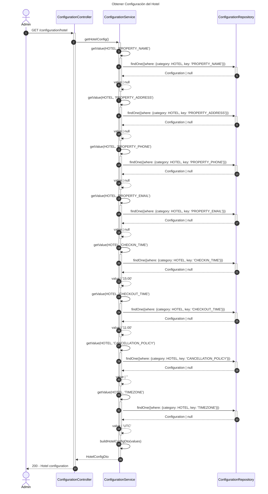
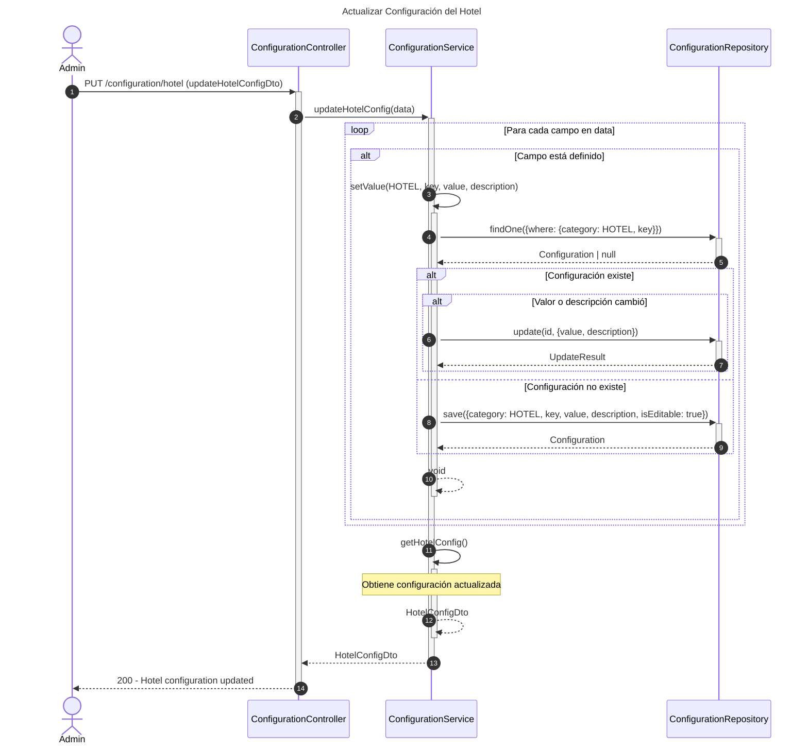

# Diagrama de Secuencia - Módulo de Configuración

## 1. Obtener Configuración del Hotel

## 2. Actualizar Configuración del Hotel

## Descripción de Flujos

### 1. Obtener Configuración del Hotel

- Recupera todas las configuraciones específicas del hotel
- Campos incluidos:
  - Nombre de la propiedad
  - Dirección
  - Teléfono
  - Email
  - Hora de check-in (default: 15:00)
  - Hora de check-out (default: 11:00)
  - Política de cancelación
  - Zona horaria (default: UTC)
- Retorna objeto consolidado HotelConfigDto

### 2. Actualizar Configuración del Hotel

- Actualiza configuraciones del hotel de forma individual
- Para cada campo en el DTO:
  - Busca configuración existente por categoría y clave
  - Si existe y cambió: actualiza valor/descripción
  - Si no existe: crea nueva configuración
- Retorna configuración completa actualizada
- Campos editables marcados como isEditable: true

## Patrones Implementados

- **Repository Pattern**: Acceso a datos a través de repositorios
- **DTO Pattern**: Transferencia de datos con HotelConfigDto
- **Key-Value Store Pattern**: Almacenamiento flexible de configuraciones
- **Category Pattern**: Agrupación de configuraciones por categoría (HOTEL, SYSTEM, PAYMENT, NOTIFICATION)
- **Upsert Pattern**: Crea o actualiza según existencia
