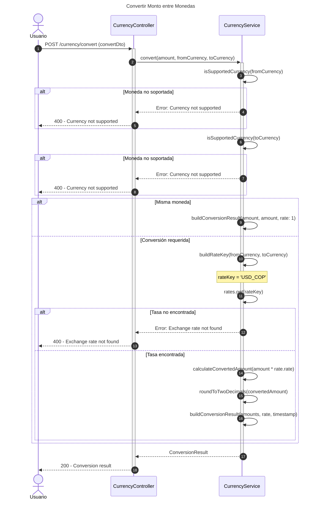
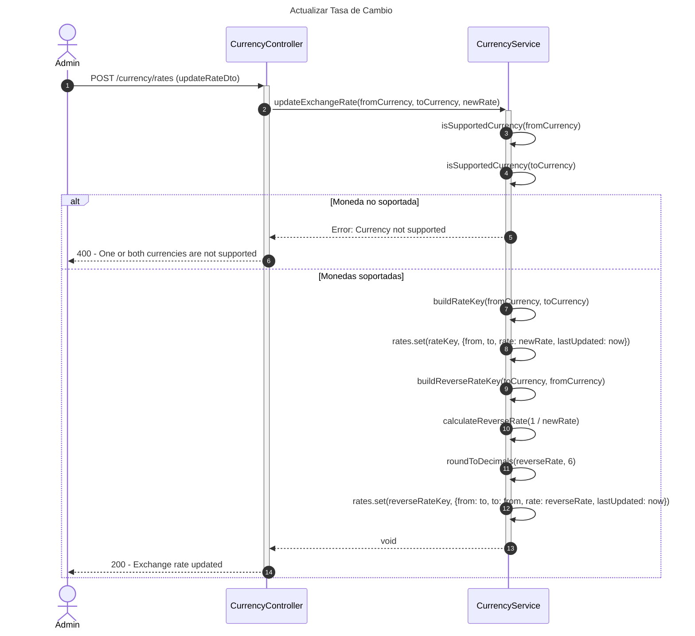
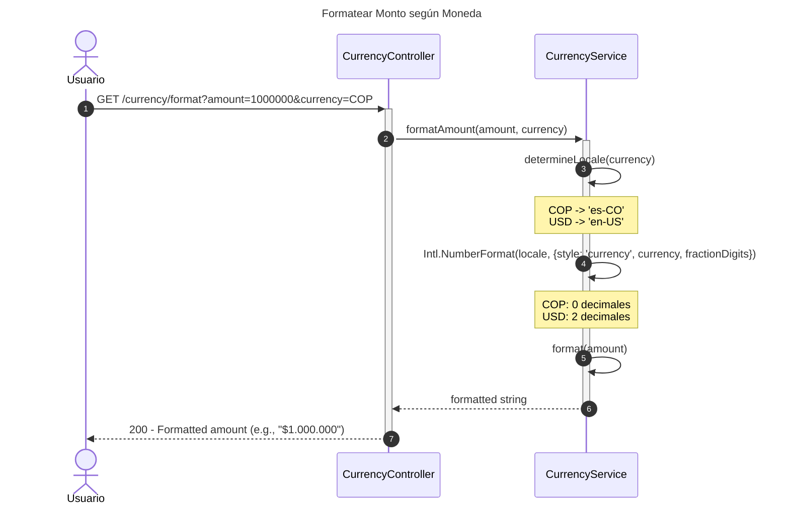
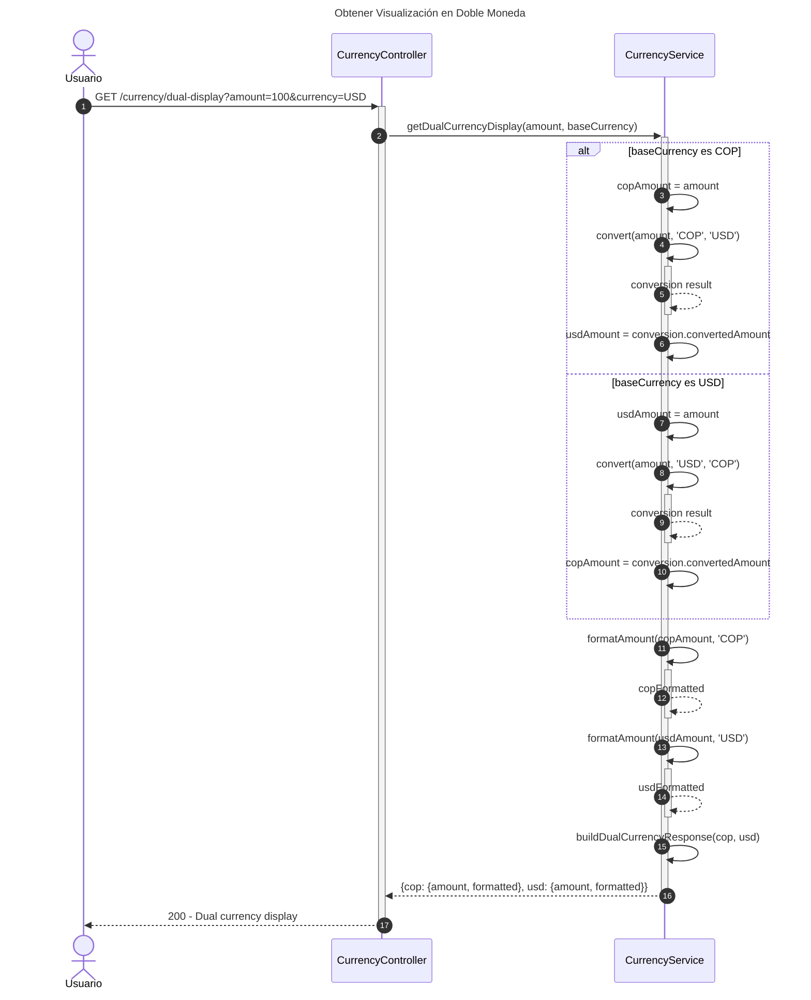
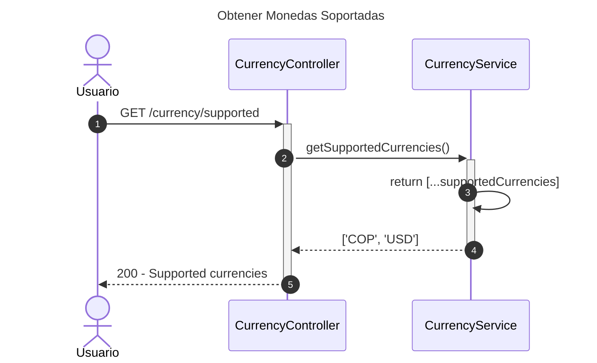
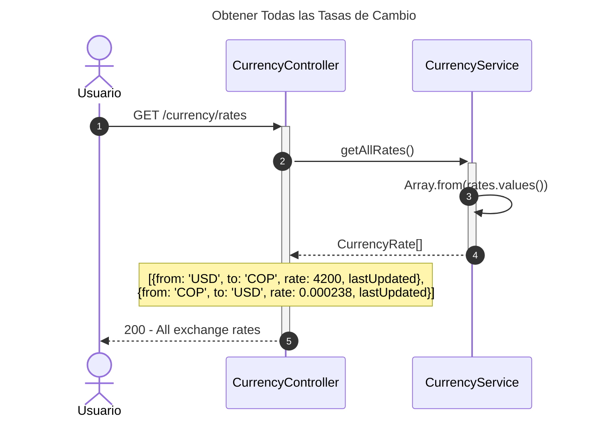

# Diagrama de Secuencia - Módulo de Moneda

## 1. Convertir Monto entre Monedas



## 2. Obtener Tasa de Cambio

```mermaid
---
title: Obtener Tasa de Cambio
---
sequenceDiagram
    autonumber
    actor Usuario
    participant Controller as CurrencyController
    participant Service as CurrencyService

    Usuario->>+Controller: GET /currency/rate?from=USD&to=COP
    Controller->>+Service: getExchangeRate(fromCurrency, toCurrency)
    
    alt Misma moneda
        Service-->>-Controller: 1
        Controller-->>-Usuario: 200 - Exchange rate: 1
    else Monedas diferentes
        Service->>Service: buildRateKey(fromCurrency, toCurrency)
        Service->>Service: rates.get(rateKey)
        
        alt Tasa no encontrada
            Service-->>Controller: Error: Exchange rate not found
            Controller-->>Usuario: 400 - Exchange rate not found
        else Tasa encontrada
            Service-->>-Controller: rate.rate
            Controller-->>-Usuario: 200 - Exchange rate
        end
    end
```

## 3. Actualizar Tasa de Cambio (Admin)



## 4. Formatear Monto según Moneda



## 5. Obtener Visualización en Doble Moneda



## 6. Obtener Monedas Soportadas



## 7. Obtener Todas las Tasas de Cambio



## Descripción de Flujos

### 1. Convertir Monto entre Monedas

- Valida que ambas monedas estén soportadas (COP, USD)
- Si son iguales, retorna mismo monto con tasa 1
- Busca tasa de cambio en memoria (Map)
- Calcula monto convertido y redondea a 2 decimales
- Retorna resultado completo con montos, tasa y timestamp

### 2. Obtener Tasa de Cambio

- Retorna tasa de cambio entre dos monedas
- Si son iguales: retorna 1
- Busca en Map de tasas por clave (e.g., 'USD_COP')

### 3. Actualizar Tasa de Cambio (Admin)

- Solo para administradores
- Actualiza tasa directa (e.g., USD → COP)
- Calcula y actualiza tasa inversa automáticamente (e.g., COP → USD)
- Tasa inversa redondeada a 6 decimales
- Actualiza timestamp

### 4. Formatear Monto según Moneda

- Formatea monto según convenciones de la moneda
- COP: sin decimales, locale español Colombia
- USD: 2 decimales, locale inglés USA
- Usa Intl.NumberFormat nativo

### 5. Obtener Visualización en Doble Moneda

- Muestra monto en ambas monedas (COP y USD)
- Convierte automáticamente según moneda base
- Retorna montos y versiones formateadas
- Útil para displays de precios

### 6. Obtener Monedas Soportadas

- Retorna lista de monedas soportadas
- Actualmente: COP, USD
- Extensible para agregar más monedas

### 7. Obtener Todas las Tasas de Cambio

- Retorna todas las tasas configuradas
- Incluye tasas directas e inversas
- Muestra última actualización de cada tasa

## Patrones Implementados

- **In-Memory Cache Pattern**: Tasas almacenadas en Map para acceso rápido
- **Strategy Pattern**: Diferentes formatos por moneda
- **Factory Pattern**: Construcción de ConversionResult
- **Service Layer**: Lógica de conversión centralizada
- **Internationalization Pattern**: Uso de Intl.NumberFormat para formatos localizados
- **Bidirectional Mapping**: Actualización automática de tasas inversas
