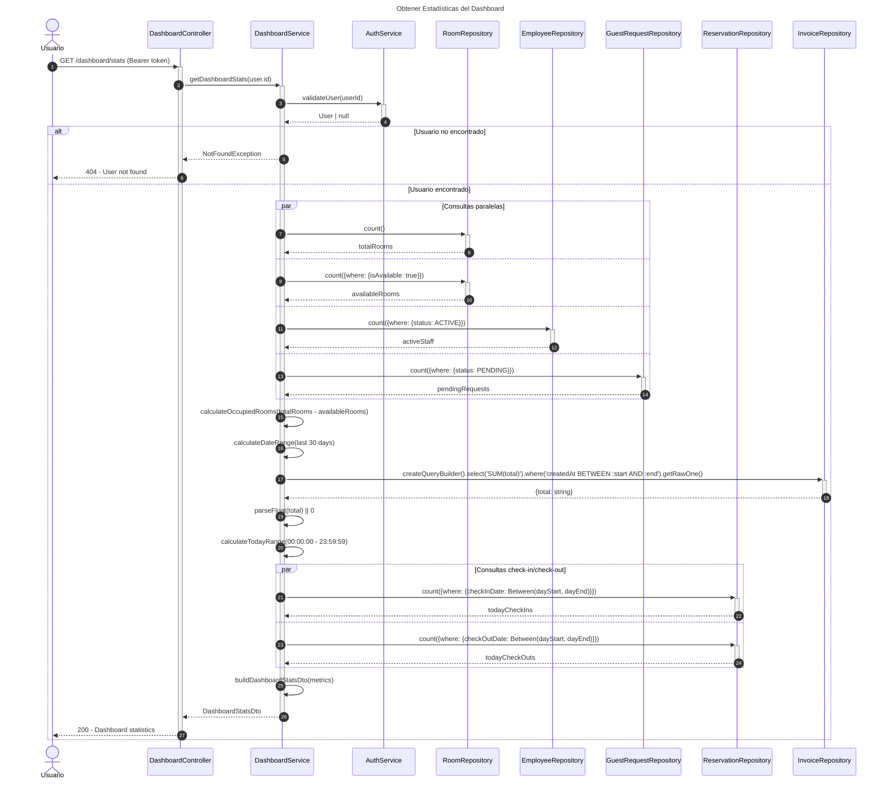
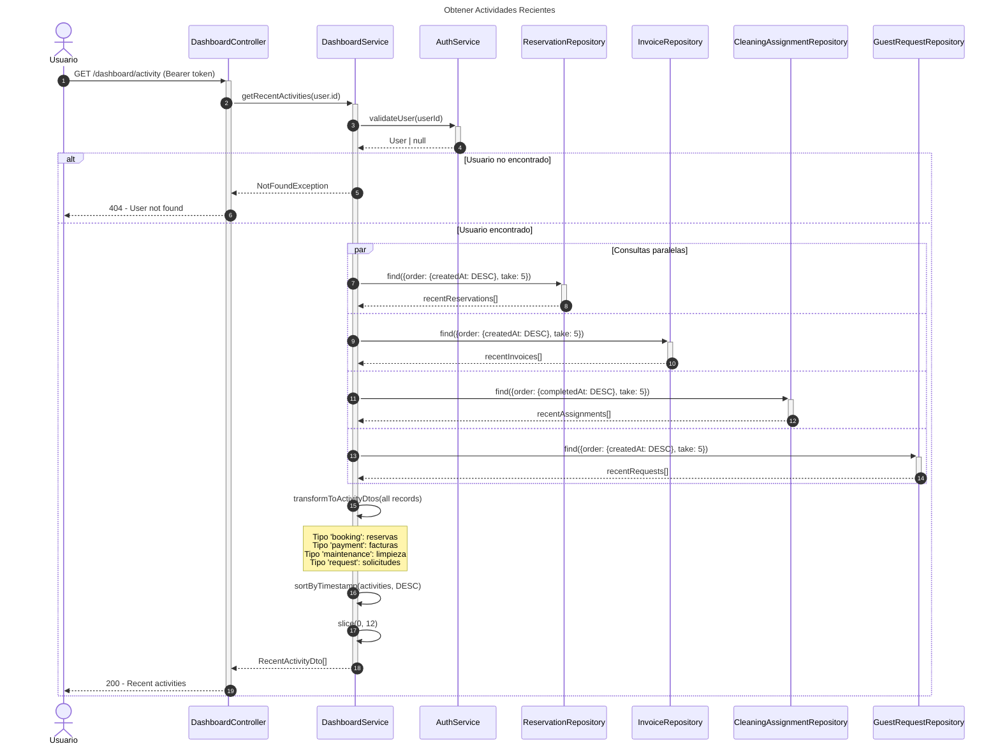
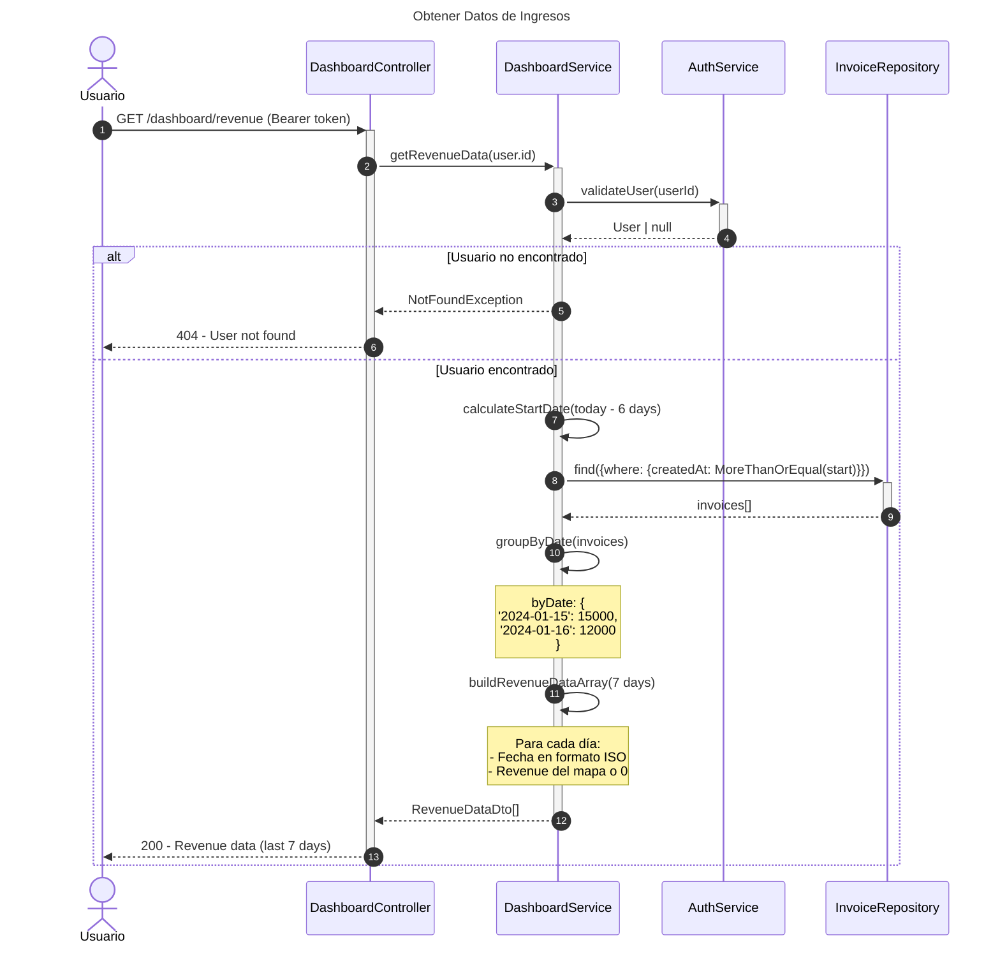

# Diagrama de Secuencia - Módulo de Dashboard

## 1. Obtener Estadísticas del Dashboard

## 2. Obtener Actividades Recientes

## 3. Obtener Datos de Ingresos

## Descripción de Flujos

### 1. Obtener Estadísticas del Dashboard

- Valida usuario autenticado
- Consultas paralelas para optimizar rendimiento:
  - Total de habitaciones
  - Habitaciones disponibles
  - Personal activo
  - Solicitudes pendientes
- Calcula habitaciones ocupadas (total - disponibles)
- Suma ingresos de últimos 30 días
- Cuenta check-ins y check-outs del día actual
- Retorna métricas consolidadas para dashboard

### 2. Obtener Actividades Recientes

- Valida usuario autenticado
- Consulta las 5 actividades más recientes de cada tipo:
  - Reservas (booking)
  - Facturas (payment)
  - Asignaciones de limpieza (maintenance)
  - Solicitudes de huéspedes (request)
- Transforma a formato uniforme RecentActivityDto
- Ordena por timestamp descendente
- Retorna las 12 más recientes

### 3. Obtener Datos de Ingresos

- Valida usuario autenticado
- Consulta facturas de últimos 7 días
- Agrupa por fecha y suma totales
- Genera array de 7 días con revenue diario
- Días sin factur as muestran 0
- Útil para gráficos de ingresos

## Patrones Implementados

- **Aggregate Pattern**: Consolidación de estadísticas de múltiples fuentes
- **Repository Pattern**: Acceso a datos a través de repositorios
- **DTO Pattern**: Transferencia de datos estructurada
- **Parallel Execution**: Consultas paralelas para optimizar rendimiento
- **Authorization Pattern**: Validación de usuario autenticado
- **Time-Series Pattern**: Datos organizados por fecha para gráficos
