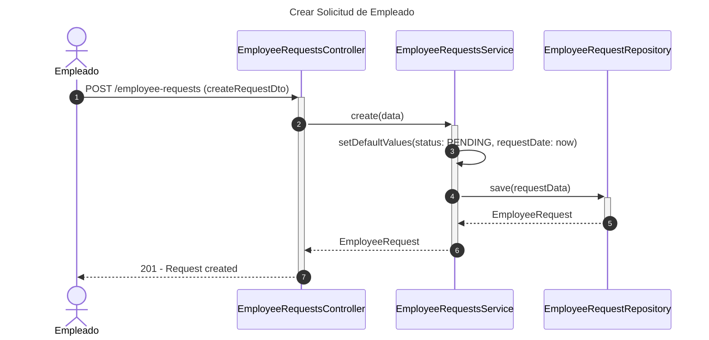
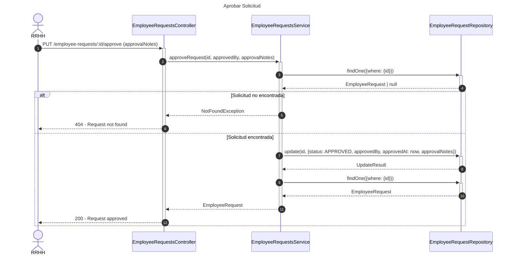
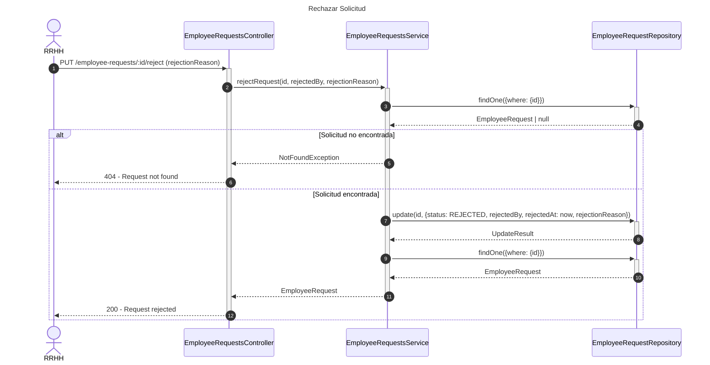
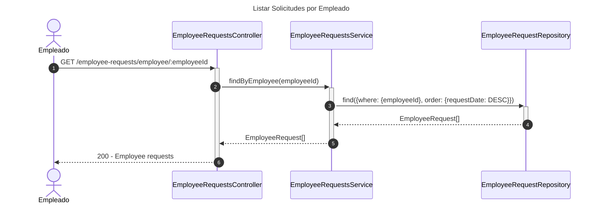

# Diagrama de Secuencia - Módulo de Solicitudes de Empleados

## 1. Crear Solicitud de Empleado

## 2. Aprobar Solicitud

## 3. Rechazar Solicitud

## 4. Listar Solicitudes por Empleado

## Patrones Implementados

- **State Pattern**: Estados de solicitud (PENDING, APPROVED, REJECTED)
- **Approval Pattern**: Proceso de aprobación/rechazo
- **Repository Pattern**: Acceso a datos
- **Audit Pattern**: Tracking de aprobador/rechazador
