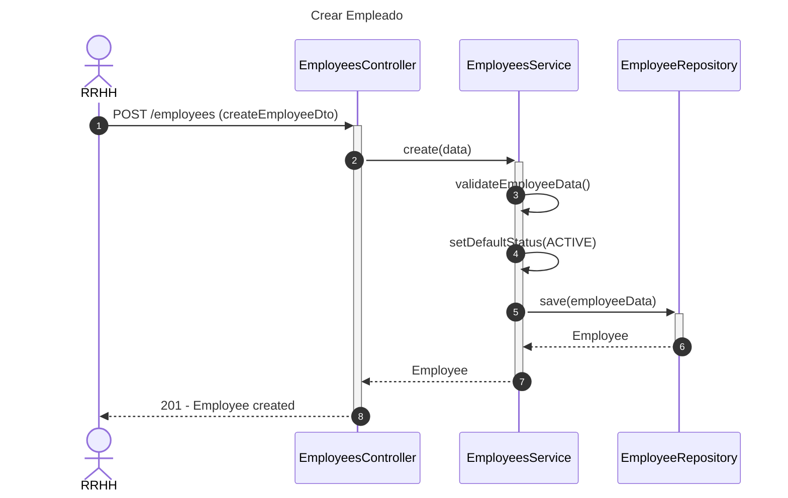
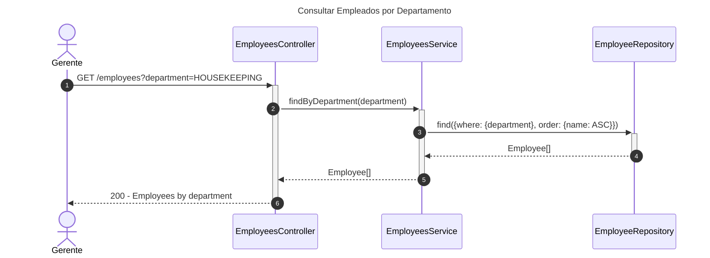
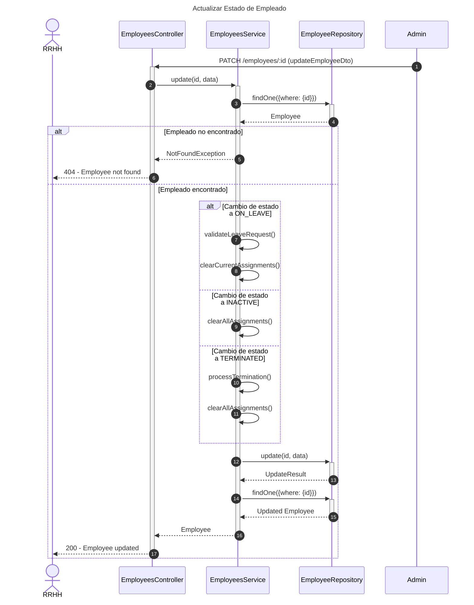
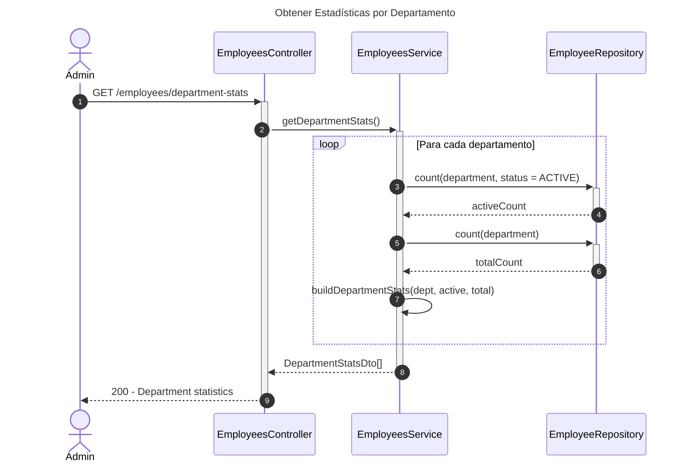
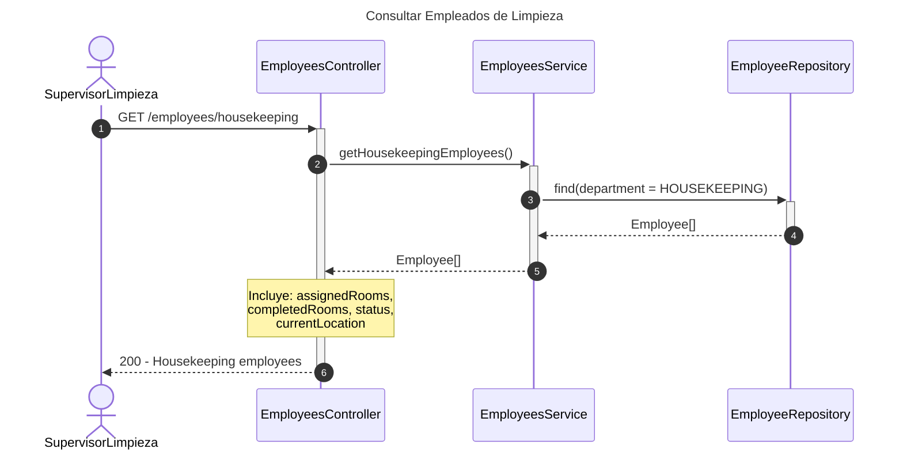
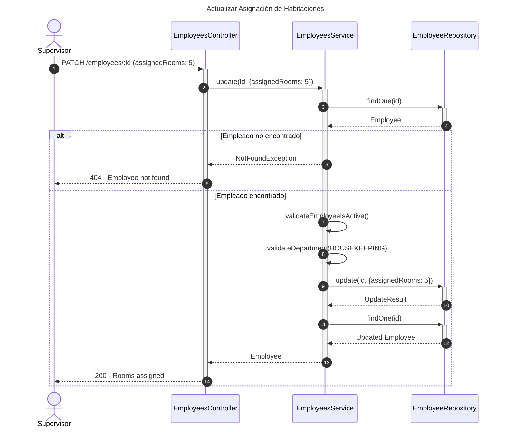
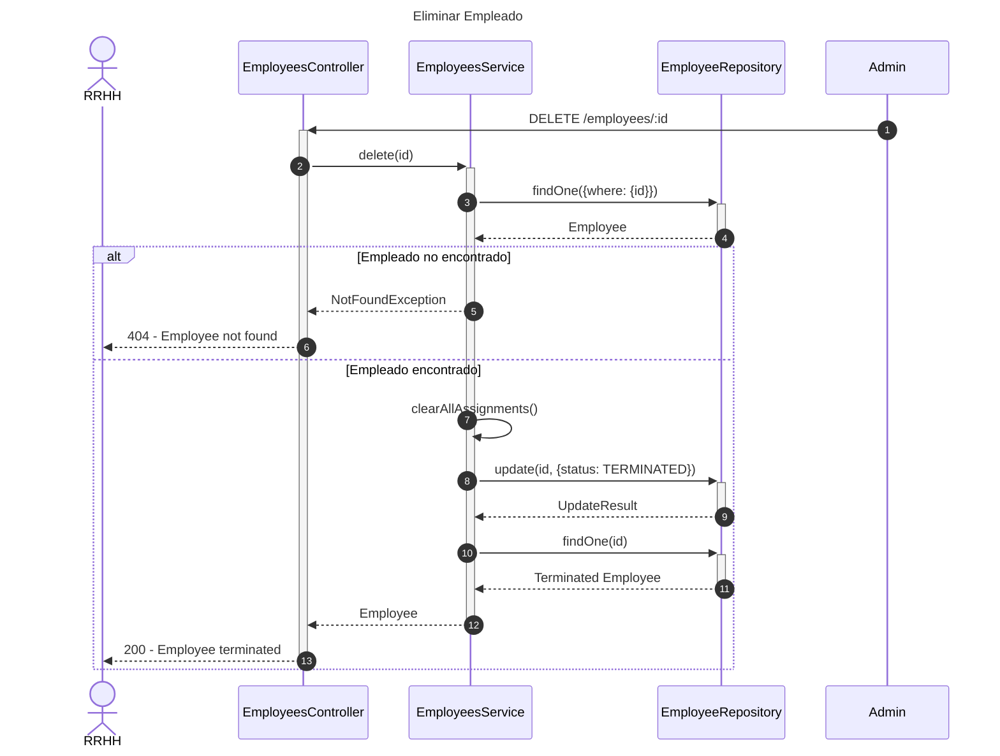

# Diagrama de Secuencia - Módulo de Personal (Employees)

## 1. Crear Empleado

## 2. Consultar Empleados por Departamento

## 3. Actualizar Estado de Empleado

## 4. Obtener Estadísticas por Departamento

## 5. Consultar Empleados de Limpieza (Housekeeping)

## 6. Actualizar Asignación de Habitaciones

## 7. Eliminar Empleado (Soft Delete)

## Descripción de Flujos

### 1. Crear Empleado

- RRHH registra nuevo empleado
- Se validan datos básicos
- Estado inicial es ACTIVE por defecto
- Se asigna departamento y posición

### 2. Consultar Empleados por Departamento

- Filtrado por departamento específico
- Útil para supervisores de área
- Retorna lista de empleados del departamento

### 3. Actualizar Estado de Empleado

- Permite cambios de estado laboral
- ON_LEAVE: Limpia asignaciones actuales
- INACTIVE/TERMINATED: Limpia todas las asignaciones
- Validaciones según tipo de cambio

### 4. Obtener Estadísticas por Departamento

- Calcula empleados activos vs total por departamento
- Vista general de recursos humanos
- Útil para planificación de personal

### 5. Consultar Empleados de Limpieza (Housekeeping)

- Consulta específica para departamento de limpieza
- Incluye información de habitaciones asignadas/completadas
- Tracking de ubicación actual

### 6. Actualizar Asignación de Habitaciones

- Asigna habitaciones a empleados de limpieza
- Validación de departamento y estado activo
- Actualiza contador de habitaciones asignadas

### 7. Eliminar Empleado (Soft Delete)

- No elimina físicamente el registro
- Cambia estado a TERMINATED
- Limpia todas las asignaciones pendientes
- Mantiene historial para auditoría

## Patrones Implementados

- **State Pattern**: Estados de empleado (ACTIVE, INACTIVE, ON_LEAVE, TERMINATED)
- **Strategy Pattern**: Diferentes comportamientos por departamento
- **Repository Pattern**: Acceso a datos a través de repositorios
- **Service Layer**: Lógica de negocio centralizada
- **Soft Delete Pattern**: Desactivación en lugar de eliminación física
