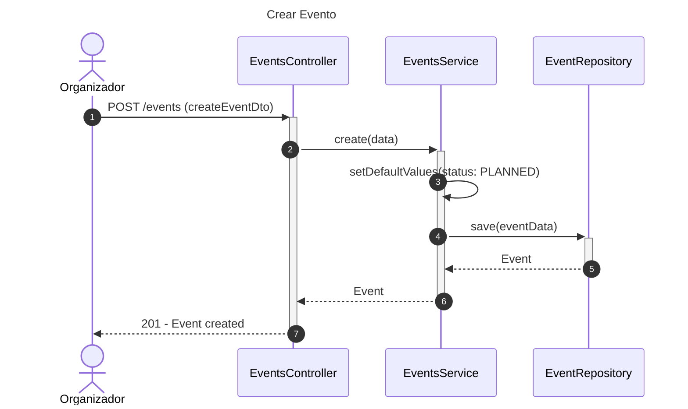
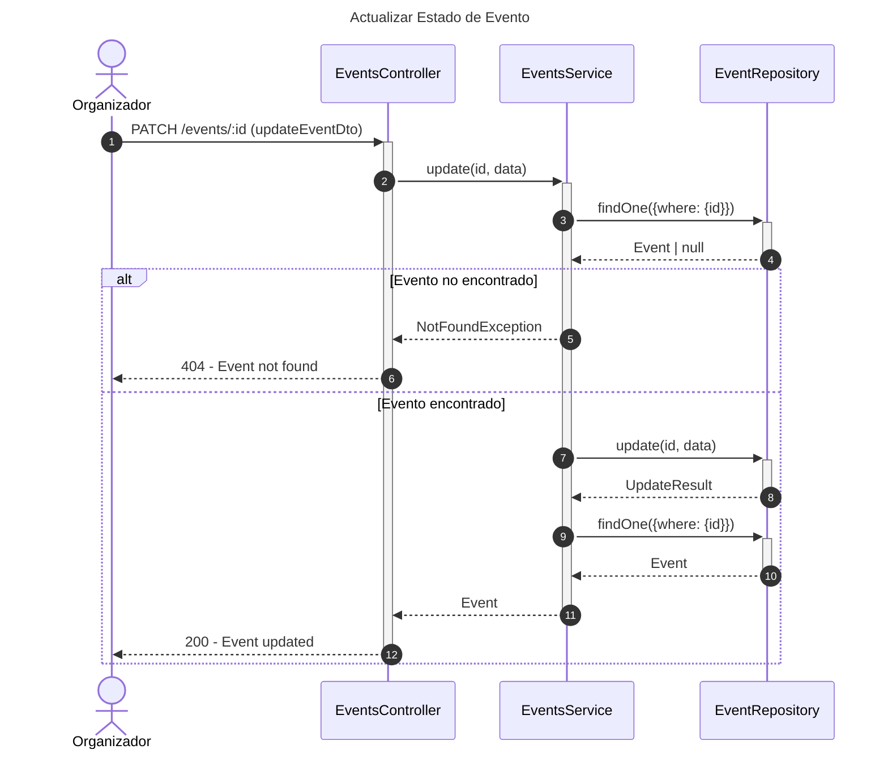
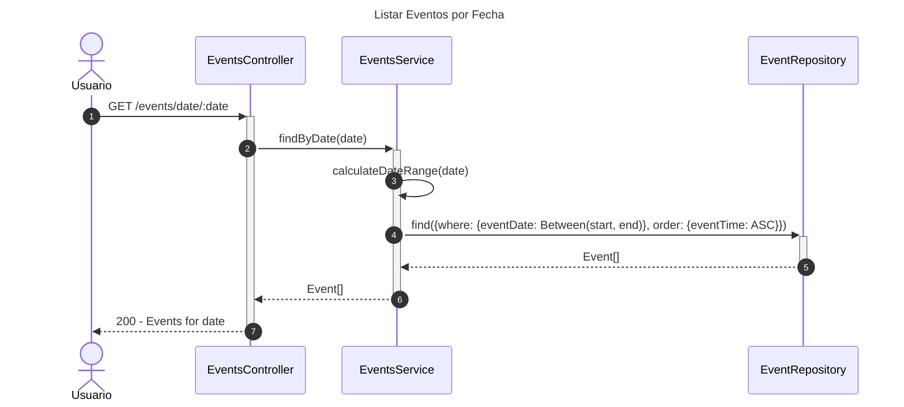

# Diagrama de Secuencia - Módulo de Eventos

## 1. Crear Evento

## 2. Actualizar Estado de Evento

## 3. Listar Eventos por Fecha

## Patrones Implementados

- **Repository Pattern**: Acceso a datos
- **State Pattern**: Estados de evento (PLANNED, IN_PROGRESS, COMPLETED, CANCELLED)
- **Date Range Pattern**: Búsquedas por fecha
