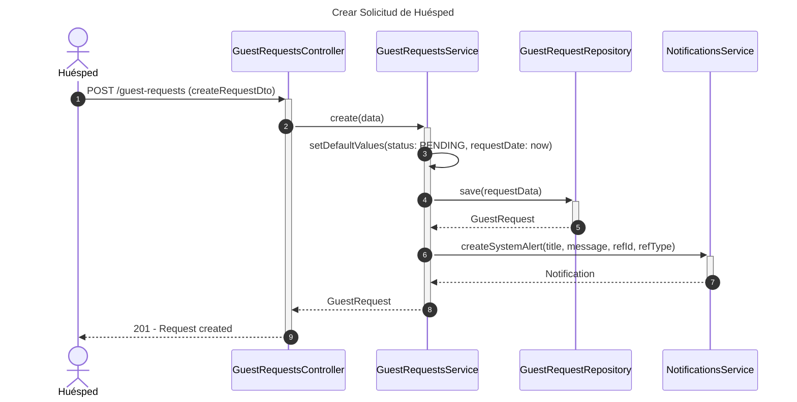
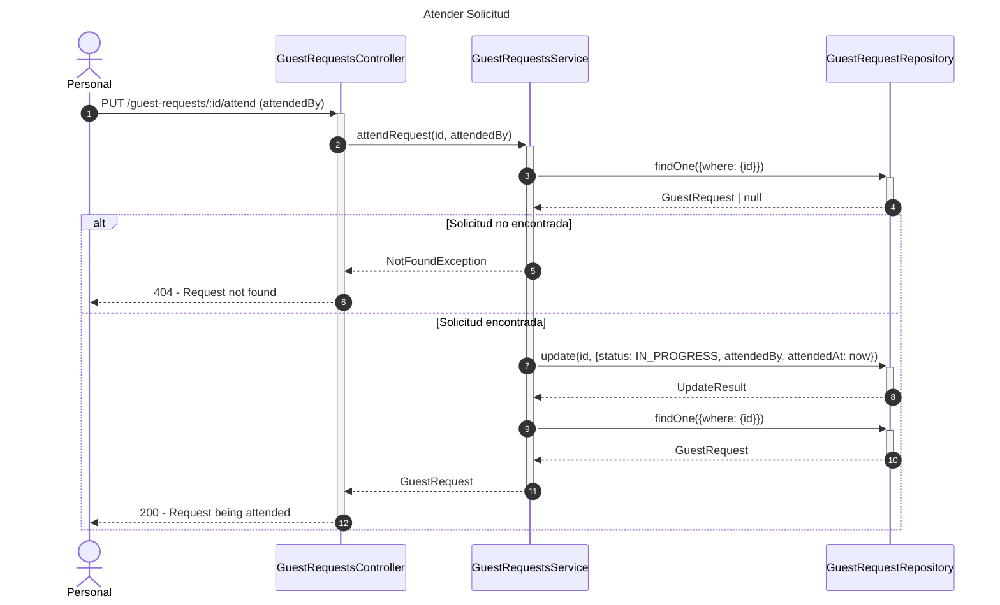
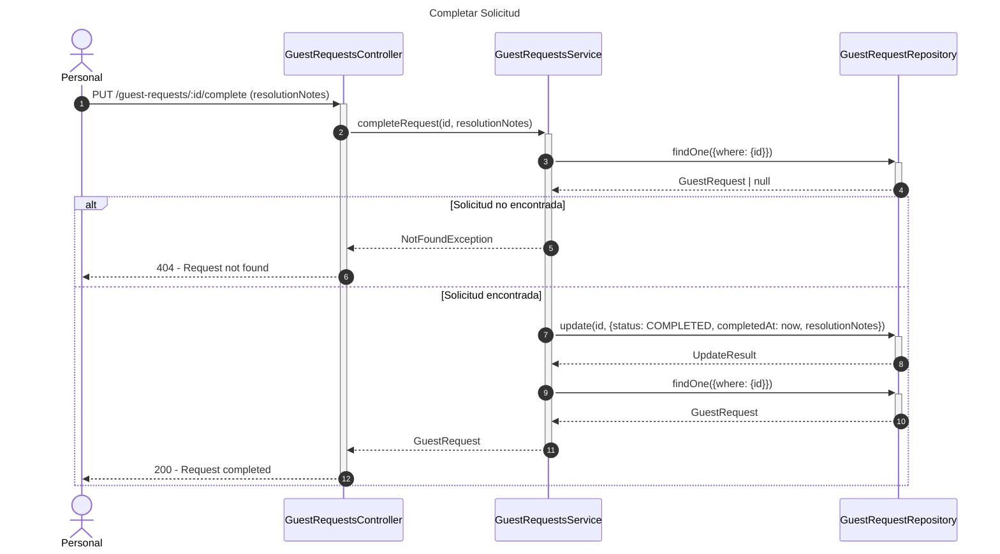
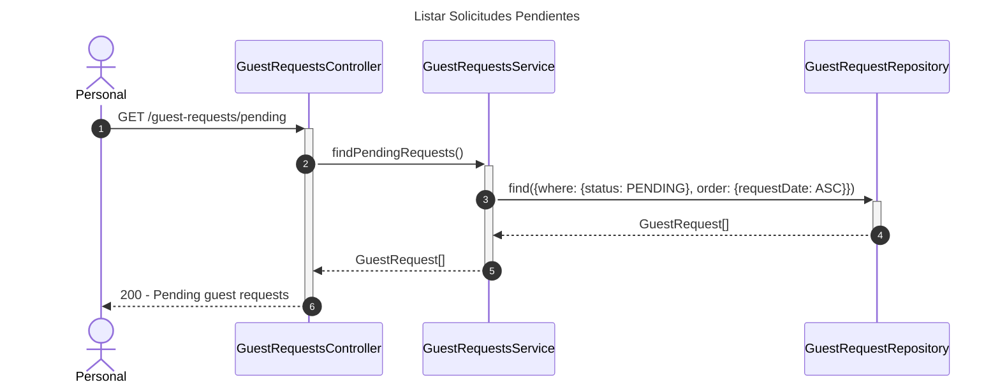

# Diagrama de Secuencia - Módulo de Solicitudes de Huéspedes

## 1. Crear Solicitud de Huésped

## 2. Atender Solicitud

## 3. Completar Solicitud

## 4. Listar Solicitudes Pendientes

## Patrones Implementados

- **State Pattern**: Estados de solicitud (PENDING, IN_PROGRESS, COMPLETED, CANCELLED)
- **Observer Pattern**: Notificaciones automáticas
- **Repository Pattern**: Acceso a datos
- **Timestamp Pattern**: Tracking de tiempos de atención
