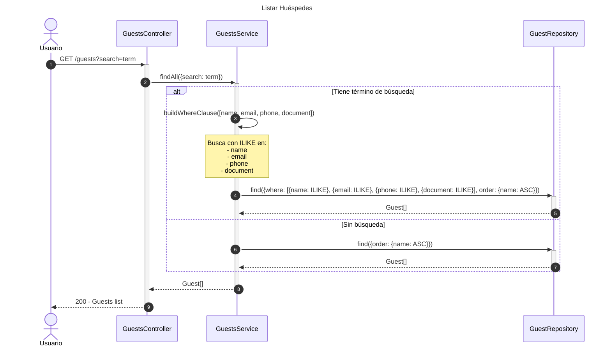
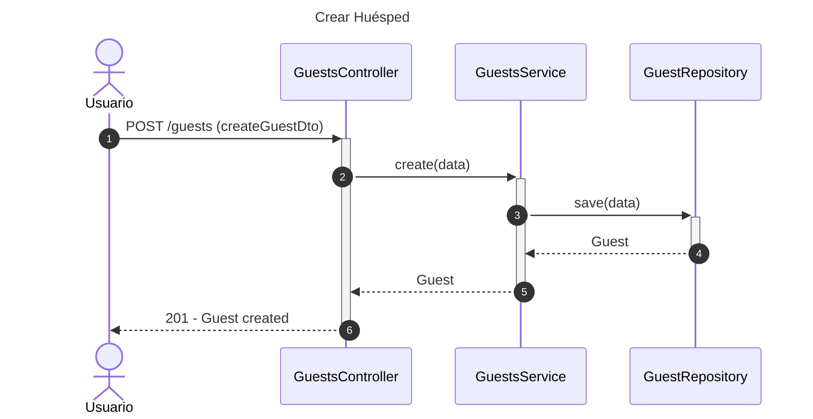

# Diagrama de Secuencia - Módulo de Huéspedes

## 1. Listar Huéspedes



## 2. Obtener Huésped por ID

```mermaid
---
title: Obtener Huésped por ID
---
sequenceDiagram
    autonumber
    actor Usuario
    participant Controller as GuestsController
    participant Service as GuestsService
    participant GuestRepo as GuestRepository

    Usuario->>+Controller: GET /guests/:id
    Controller->>+Service: findOne(id)
    
    Service->>+Service: getGuest(id)
    Service->>+GuestRepo: findOne({where: {id}})
    GuestRepo-->>-Service: Guest | null
    
    alt Huésped no encontrado
        Service-->>Service: NotFoundException
        Service-->>-Service: NotFoundException
        Service-->>Controller: NotFoundException
        Controller-->>Usuario: 404 - Guest with id not found
    else Huésped encontrado
        Service-->>-Service: Guest
        Service-->>-Controller: Guest
        Controller-->>-Usuario: 200 - Guest details
    end
```

## 3. Crear Huésped



## 4. Actualizar Huésped

```mermaid
---
title: Actualizar Huésped
---
sequenceDiagram
    autonumber
    actor Usuario
    participant Controller as GuestsController
    participant Service as GuestsService
    participant GuestRepo as GuestRepository

    Usuario->>+Controller: PATCH /guests/:id (updateGuestDto)
    Controller->>+Service: update(id, data)
    
    Service->>+GuestRepo: update(id, data)
    GuestRepo-->>-Service: UpdateResult
    
    Service->>+Service: getGuest(id)
    Service->>+GuestRepo: findOne({where: {id}})
    GuestRepo-->>-Service: Guest | null
    
    alt Huésped no encontrado
        Service-->>Service: NotFoundException
        Service-->>-Service: NotFoundException
        Service-->>Controller: NotFoundException
        Controller-->>Usuario: 404 - Guest with id not found
    else Huésped encontrado
        Service-->>-Service: Guest
        Service-->>-Controller: Guest
        Controller-->>-Usuario: 200 - Guest updated
    end
```

## 5. Eliminar Huésped

```mermaid
---
title: Eliminar Huésped
---
sequenceDiagram
    autonumber
    actor Usuario
    participant Controller as GuestsController
    participant Service as GuestsService
    participant GuestRepo as GuestRepository

    Usuario->>+Controller: DELETE /guests/:id
    Controller->>+Service: remove(id)
    
    Service->>+Service: getGuest(id)
    Service->>+GuestRepo: findOne({where: {id}})
    GuestRepo-->>-Service: Guest | null
    
    alt Huésped no encontrado
        Service-->>Service: NotFoundException
        Service-->>-Service: NotFoundException
        Service-->>Controller: NotFoundException
        Controller-->>Usuario: 404 - Guest with id not found
    else Huésped encontrado
        Service-->>-Service: Guest
        
        Service->>+GuestRepo: remove(guest)
        GuestRepo-->>-Service: Guest
        
        Service-->>-Controller: Guest
        Controller-->>-Usuario: 200 - Guest deleted
    end
```

## Descripción de Flujos

### 1. Listar Huéspedes

- Permite listar todos los huéspedes
- Búsqueda opcional por término:
  - Nombre (ILIKE - insensible a mayúsculas)
  - Email
  - Teléfono
  - Documento
- Resultados ordenados alfabéticamente por nombre
- Sin búsqueda: retorna todos los huéspedes

### 2. Obtener Huésped por ID

- Recupera información detallada de un huésped específico
- Valida existencia
- Lanza NotFoundException si no existe

### 3. Crear Huésped

- Crea nuevo registro de huésped
- Guarda directamente en base de datos
- Retorna huésped creado con ID

### 4. Actualizar Huésped

- Actualiza información de huésped existente
- Primero actualiza, luego recupera registro actualizado
- Valida existencia post-actualización

### 5. Eliminar Huésped

- Eliminación física del registro
- Valida existencia antes de eliminar
- Retorna huésped eliminado

## Patrones Implementados

- **Repository Pattern**: Acceso a datos a través de repositorios
- **DTO Pattern**: Transferencia de datos con CreateGuestDto y UpdateGuestDto
- **Service Layer**: Lógica de negocio centralizada
- **Search Pattern**: Búsqueda multi-campo con ILIKE
- **Validation Pattern**: Validación de existencia antes de operaciones
