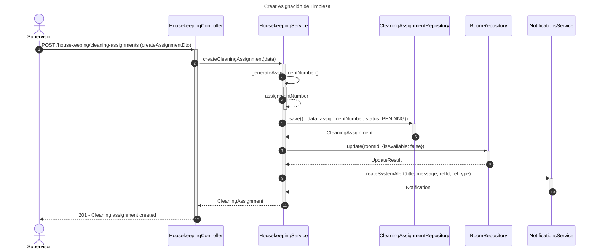
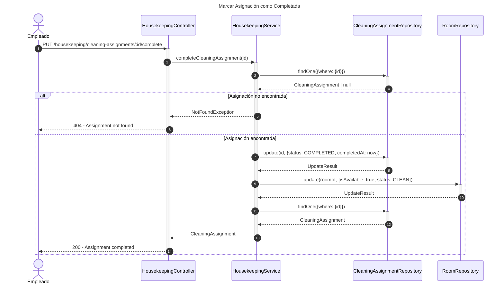
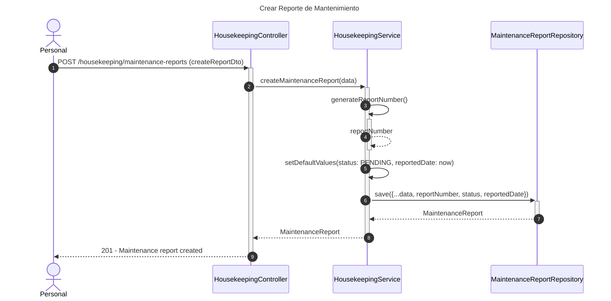
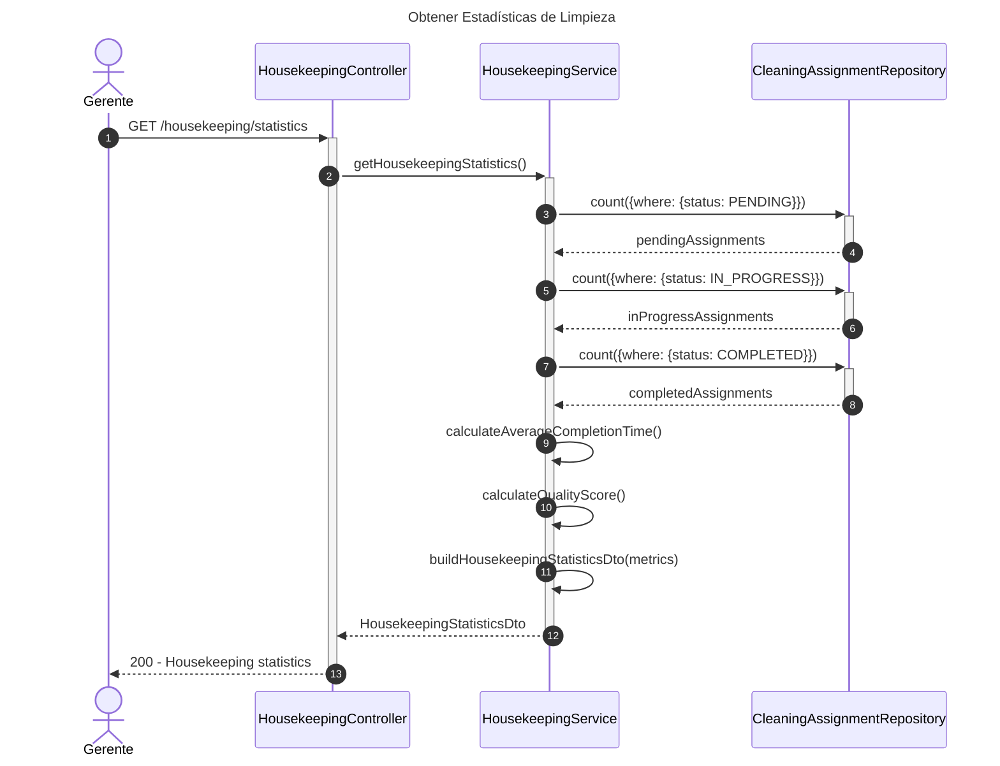

# Diagrama de Secuencia - Módulo de Limpieza (Housekeeping)

## 1. Crear Asignación de Limpieza

## 2. Marcar Asignación como Completada

## 3. Crear Reporte de Mantenimiento

## 4. Obtener Estadísticas de Limpieza

## Descripción de Flujos

### 1. Crear Asignación de Limpieza

- Genera número de asignación único
- Crea asignación con estado PENDING
- Marca habitación como no disponible
- Envía notificación al empleado asignado

### 2. Marcar Asignación como Completada

- Valida existencia de asignación
- Actualiza estado a COMPLETED con timestamp
- Marca habitación como disponible y limpia
- Retorna asignación actualizada

### 3. Crear Reporte de Mantenimiento

- Genera número de reporte único
- Establece estado inicial PENDING
- Registra fecha de reporte
- Útil para tracking de problemas

### 4. Obtener Estadísticas de Limpieza

- Cuenta asignaciones por estado
- Calcula tiempo promedio de completación
- Calcula puntaje de calidad
- Retorna métricas consolidadas

## Patrones Implementados

- **State Pattern**: Estados de asignación (PENDING, IN_PROGRESS, COMPLETED)
- **Observer Pattern**: Notificaciones automáticas
- **Repository Pattern**: Acceso a datos
- **Aggregate Pattern**: Estadísticas de limpieza
- **Factory Pattern**: Generación de números de asignación/reporte
