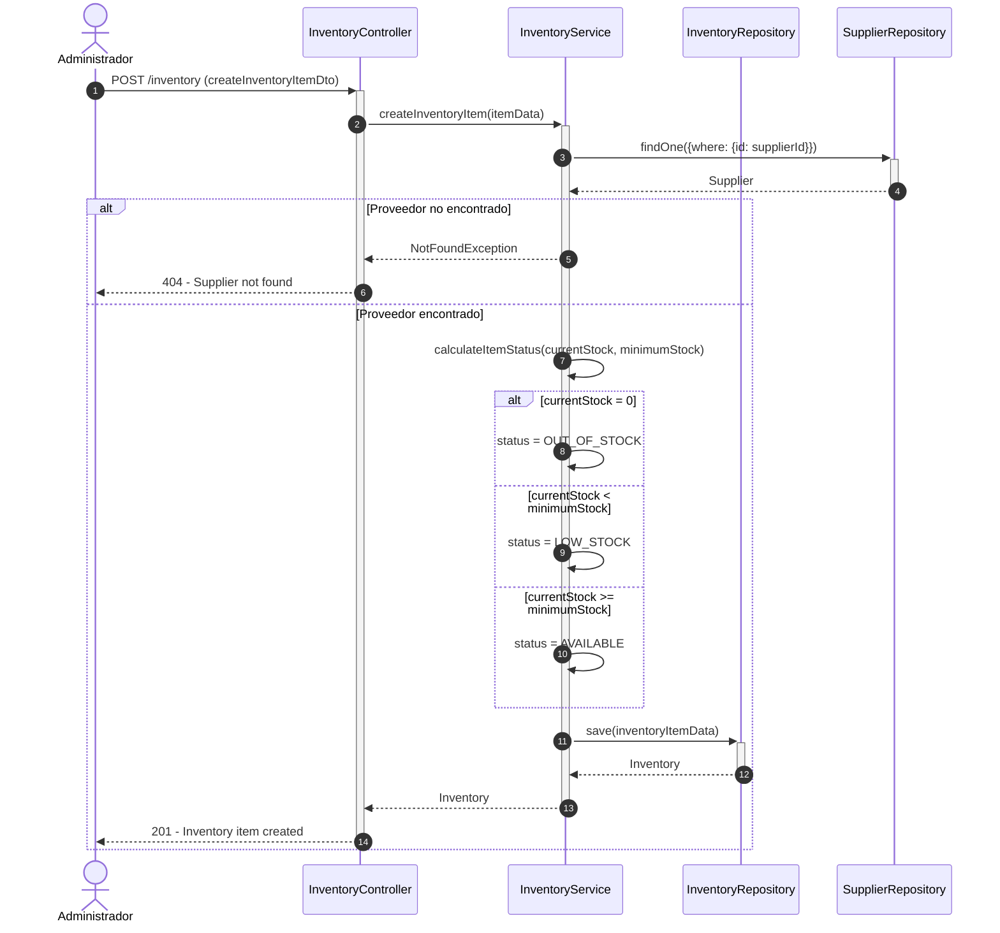
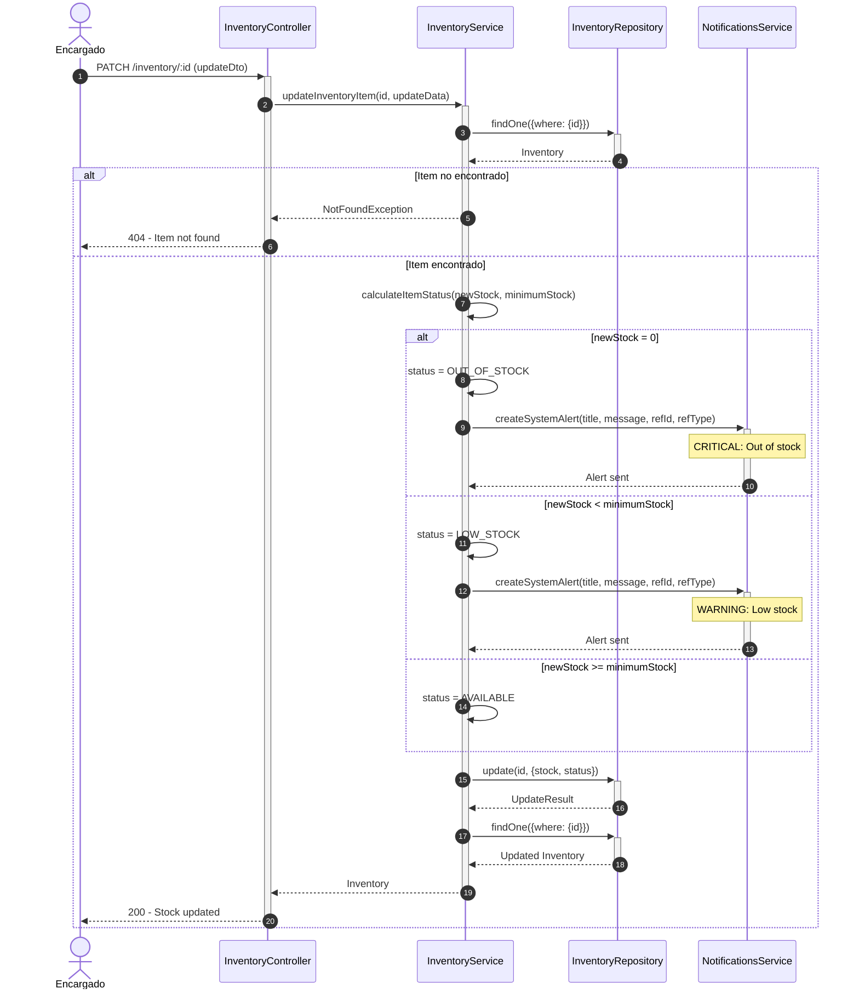
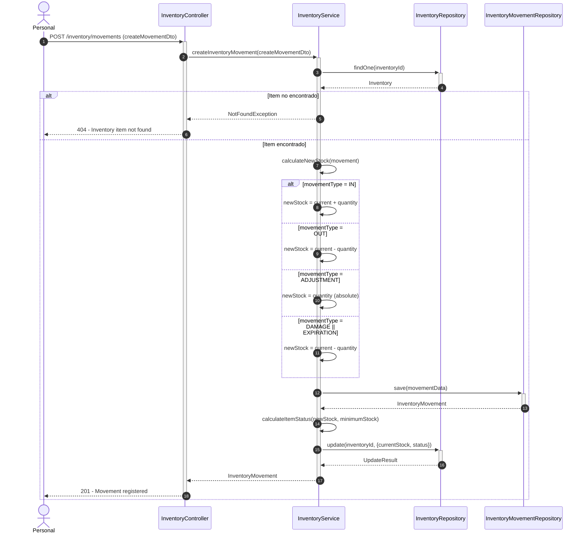
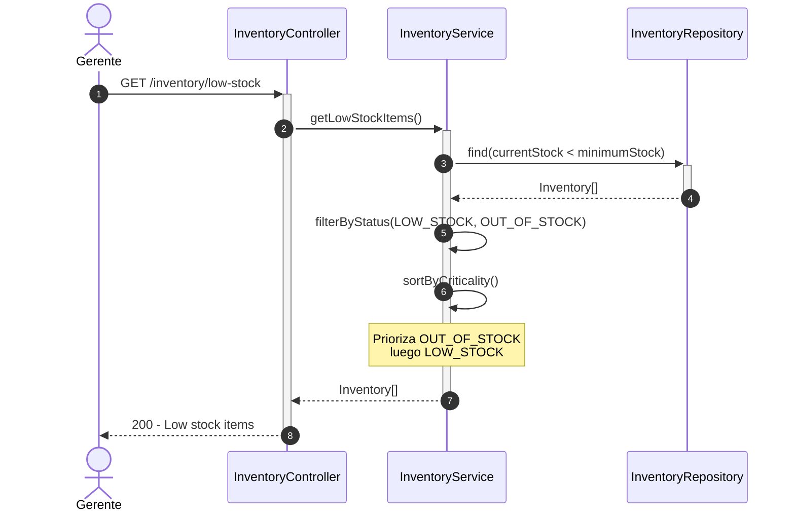
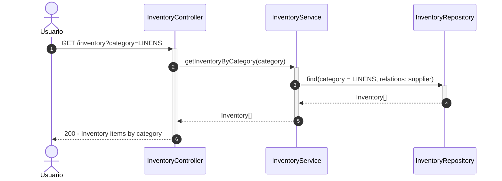
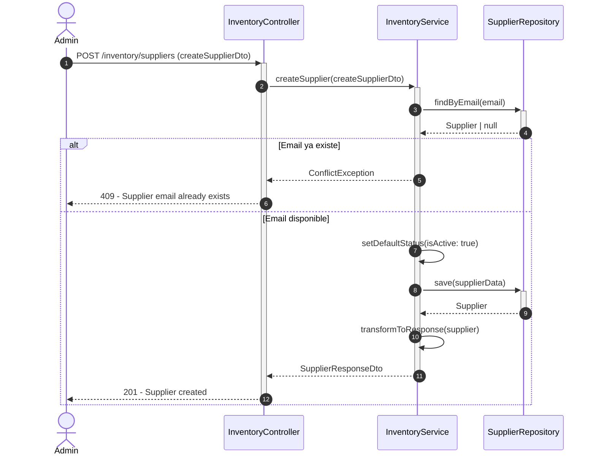
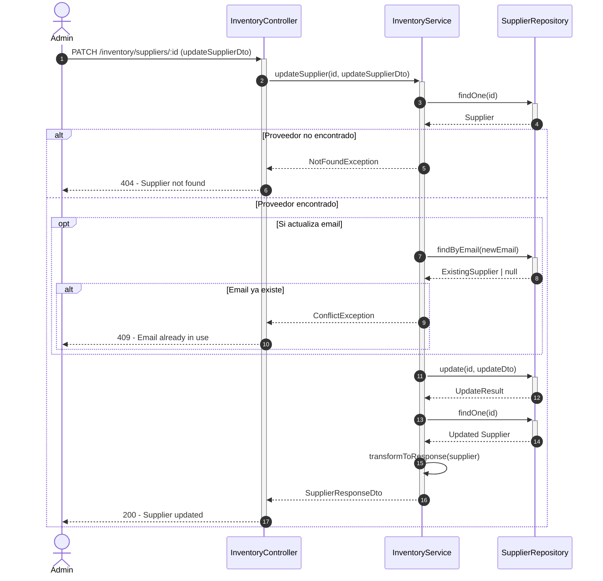
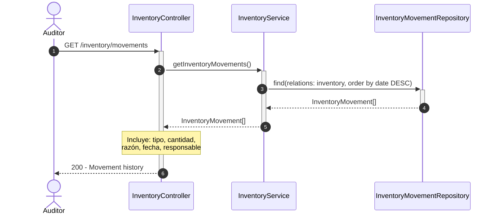

# Diagrama de Secuencia - Módulo de Inventario

## 1. Crear Item de Inventario

## 2. Actualizar Stock de Item

## 3. Registrar Movimiento de Inventario

## 4. Consultar Items con Stock Bajo

## 5. Filtrar Inventario por Categoría

## 6. Gestión de Proveedores - Crear Proveedor

## 7. Actualizar Proveedor

## 8. Consultar Historial de Movimientos

## Descripción de Flujos

### 1. Crear Item de Inventario

- Validación de proveedor existente
- Cálculo automático de estado según stock
- Registro del item con categoría y unidad
- Establecimiento de stock mínimo para alertas

### 2. Actualizar Stock de Item

- Actualización de cantidad en stock
- Recalculo automático de estado
- Envío de notificaciones si stock bajo o agotado
- Tracking de cambios de estado

### 3. Registrar Movimiento de Inventario

- Registro de entrada/salida/ajuste de stock
- Actualización automática del stock actual
- Tipos: IN (entrada), OUT (salida), ADJUSTMENT (ajuste), DAMAGE (daño), EXPIRATION (vencimiento)
- Mantiene historial completo de movimientos

### 4. Consultar Items con Stock Bajo

- Identificación rápida de items críticos
- Filtrado por estado LOW_STOCK y OUT_OF_STOCK
- Ordenamiento por criticidad
- Útil para planificación de compras

### 5. Filtrar Inventario por Categoría

- Consulta de items por categoría específica
- Categorías: LINENS, AMENITIES, CLEANING_SUPPLIES, FOOD_BEVERAGE, etc.
- Incluye información del proveedor
- Facilita gestión departamental

### 6. Gestión de Proveedores - Crear Proveedor

- Registro de nuevo proveedor
- Validación de email único
- Información de contacto completa
- Estado activo por defecto

### 7. Actualizar Proveedor

- Modificación de datos del proveedor
- Validación de email único si cambia
- Permite activar/desactivar proveedor
- Transformación segura de respuesta

### 8. Consultar Historial de Movimientos

- Auditoría completa de movimientos
- Trazabilidad de cambios de stock
- Incluye responsable y razón
- Ordenado cronológicamente

## Patrones Implementados

- **State Pattern**: Estados de inventario (AVAILABLE, LOW_STOCK, OUT_OF_STOCK, DISCONTINUED)
- **Observer Pattern**: Sistema de notificaciones para stock bajo
- **Strategy Pattern**: Diferentes tipos de movimientos con comportamiento específico
- **Repository Pattern**: Acceso a datos a través de repositorios
- **Factory Pattern**: Cálculo de estado según reglas de negocio
- **Audit Pattern**: Tracking completo de movimientos para trazabilidad
- **DTO Pattern**: Transformación segura de datos (SupplierResponseDto)
