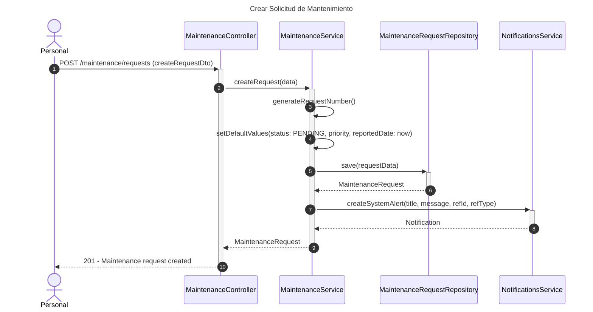
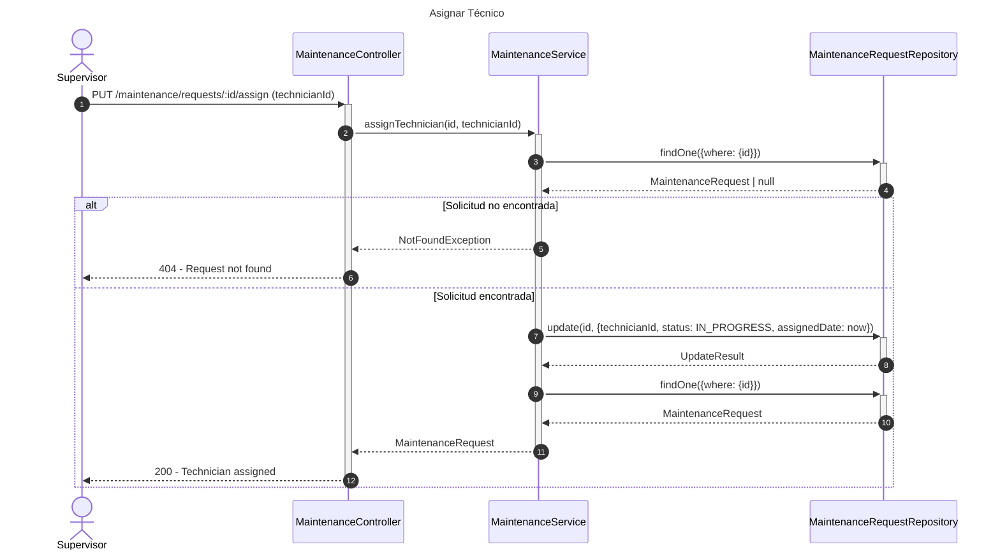
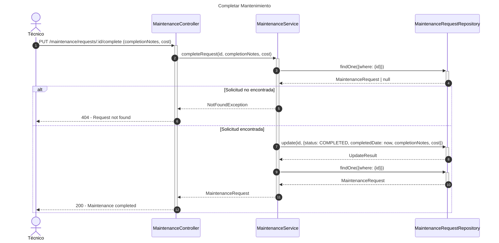
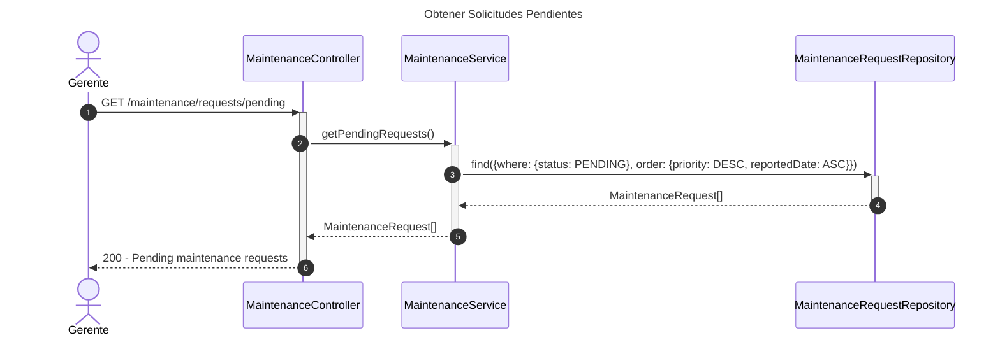

# Diagrama de Secuencia - Módulo de Mantenimiento

## 1. Crear Solicitud de Mantenimiento

## 2. Asignar Técnico

## 3. Completar Mantenimiento

## 4. Obtener Solicitudes Pendientes

## Patrones Implementados

- **State Pattern**: Estados de mantenimiento (PENDING, IN_PROGRESS, COMPLETED)
- **Observer Pattern**: Notificaciones automáticas
- **Priority Pattern**: Ordenamiento por prioridad
- **Repository Pattern**: Acceso a datos
