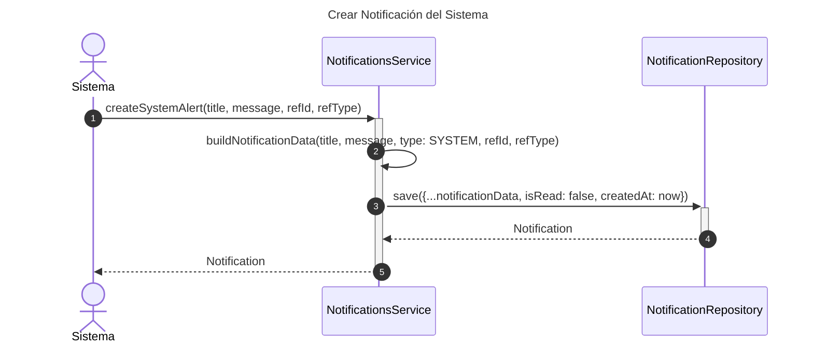
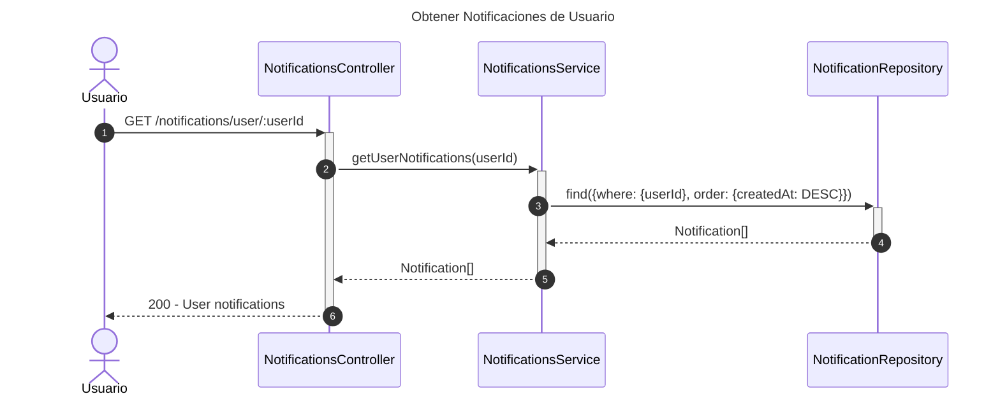
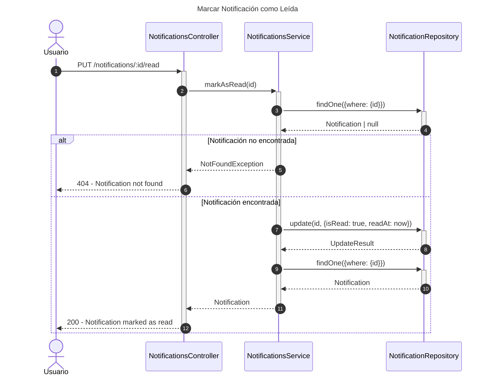
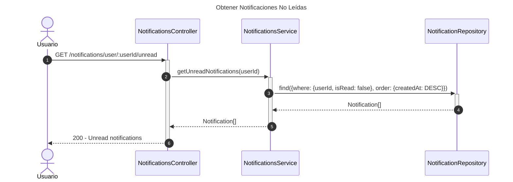
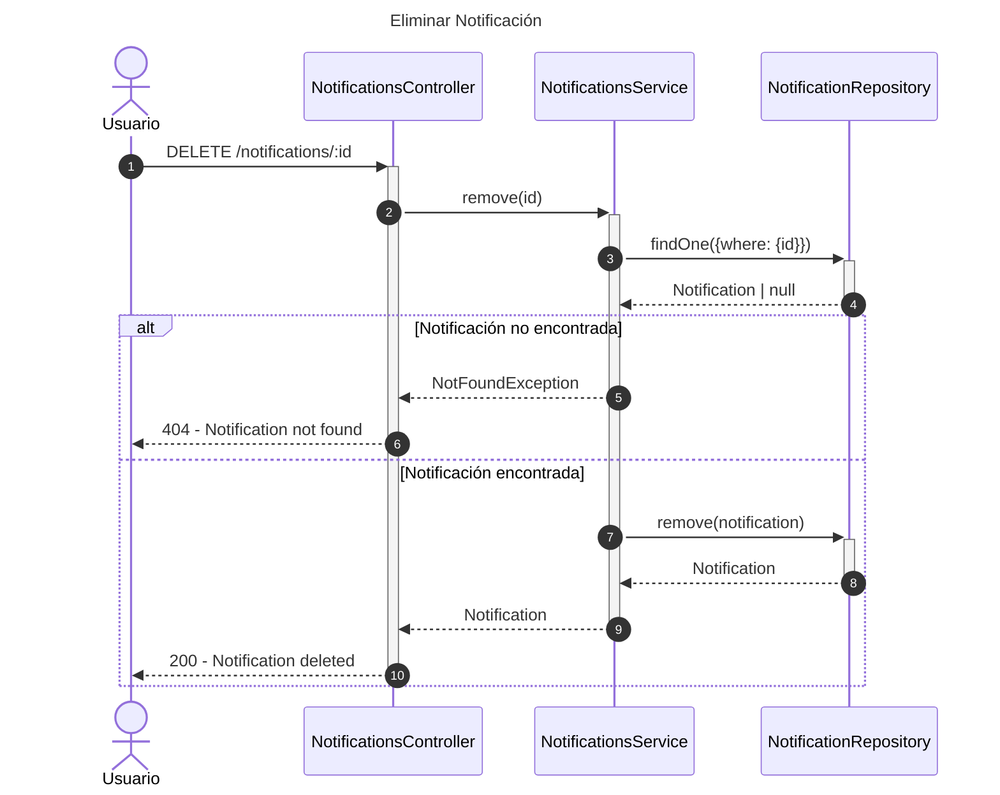

# Diagrama de Secuencia - Módulo de Notificaciones

## 1. Crear Notificación del Sistema

## 2. Obtener Notificaciones de Usuario

## 3. Marcar Notificación como Leída

## 4. Obtener Notificaciones No Leídas

## 5. Eliminar Notificación

## Patrones Implementados

- **Observer Pattern**: Sistema de notificaciones
- **Repository Pattern**: Acceso a datos
- **Event-Driven Pattern**: Notificaciones basadas en eventos
- **Read Tracking Pattern**: Marcado de lecturas
