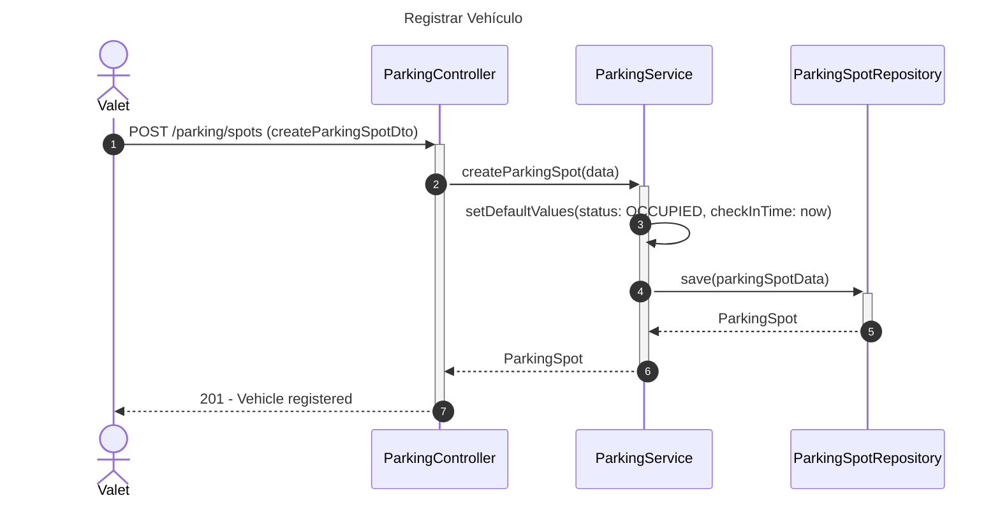
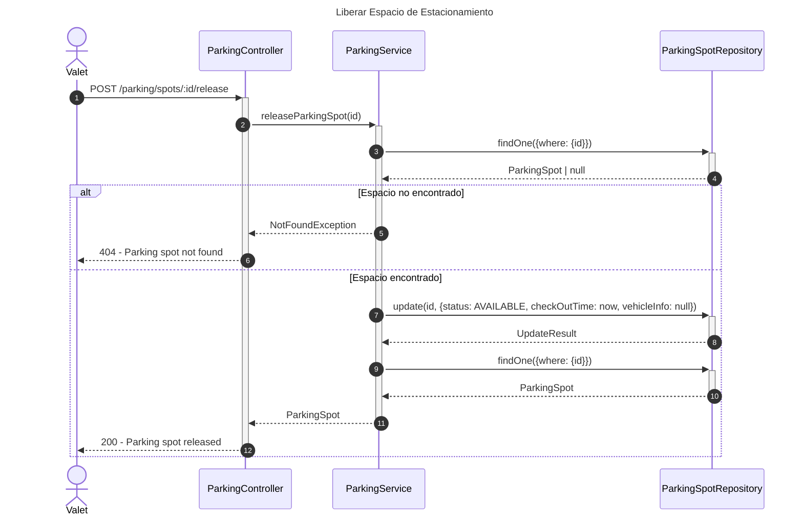
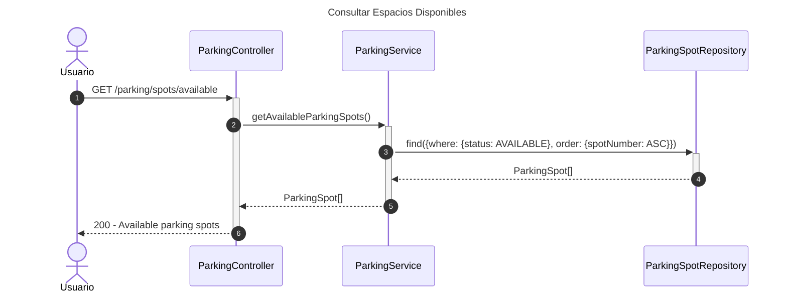

# Diagrama de Secuencia - Módulo de Estacionamiento

## 1. Registrar Vehículo

## 2. Liberar Espacio de Estacionamiento

## 3. Consultar Espacios Disponibles

## Patrones Implementados

- **Repository Pattern**: Acceso a datos
- **State Pattern**: Estados de espacios (AVAILABLE, OCCUPIED, RESERVED)
- **Timestamp Pattern**: Registro de check-in/check-out
