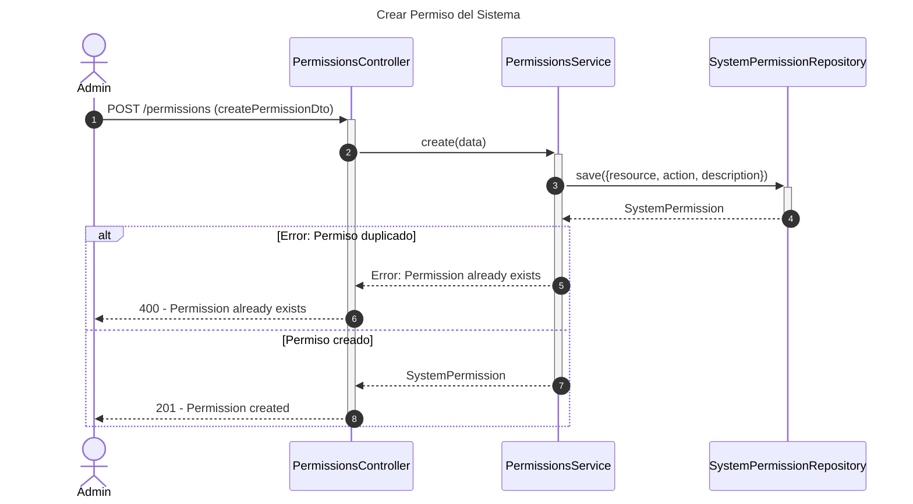
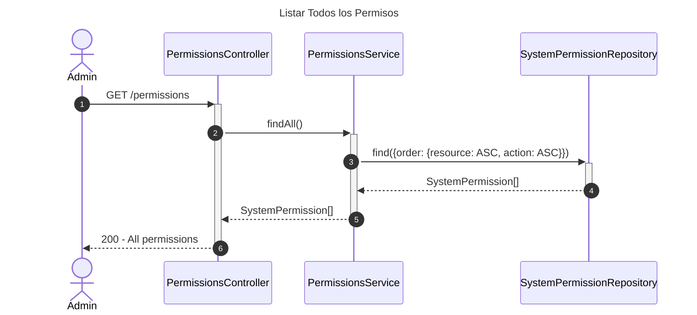
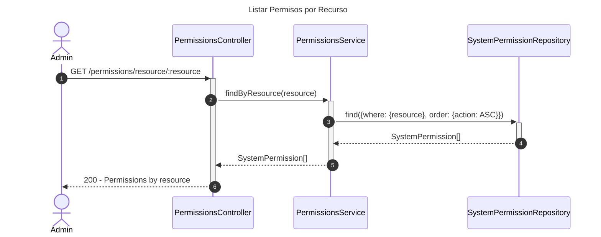
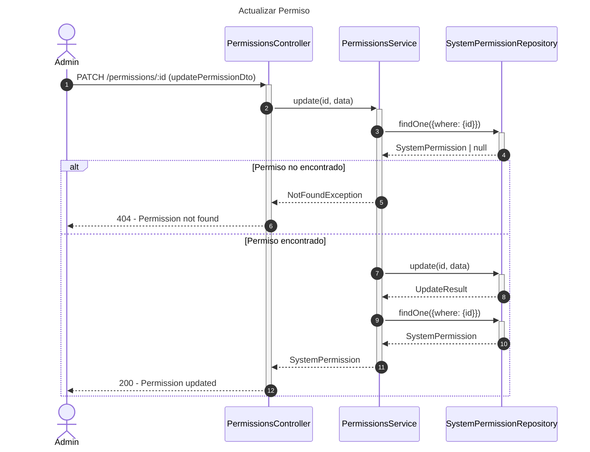

# Diagrama de Secuencia - Módulo de Permisos

## 1. Crear Permiso del Sistema

## 2. Listar Todos los Permisos

## 3. Listar Permisos por Recurso

## 4. Actualizar Permiso

## Patrones Implementados

- **Repository Pattern**: Acceso a datos
- **Resource-Action Pattern**: Permisos basados en recurso:acción
- **RBAC Pattern**: Control de acceso basado en roles
