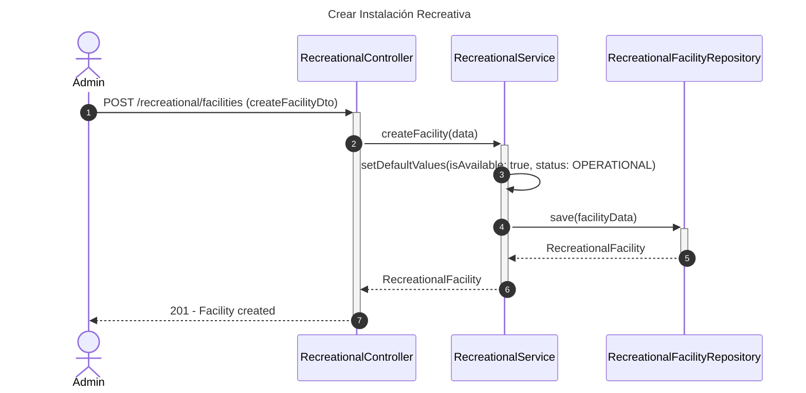
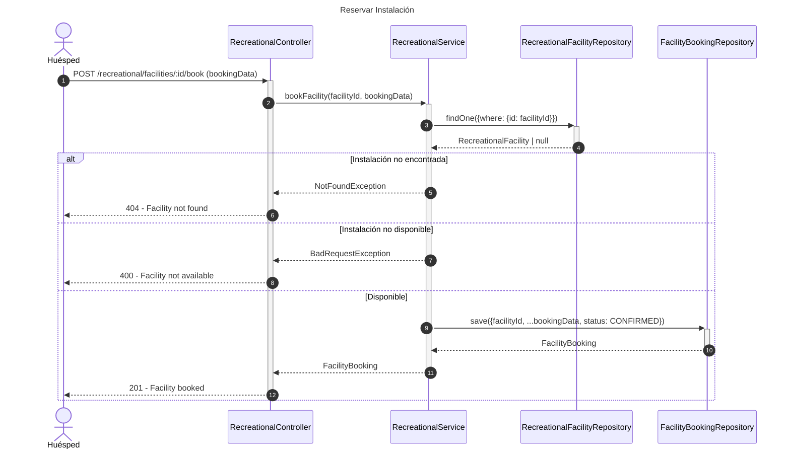
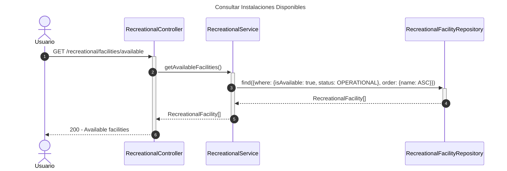

# Diagrama de Secuencia - Módulo Recreativo

## 1. Crear Instalación Recreativa

## 2. Reservar Instalación

## 3. Consultar Instalaciones Disponibles

## Patrones Implementados

- **Repository Pattern**: Acceso a datos
- **Booking Pattern**: Sistema de reservas
- **State Pattern**: Estados de instalaciones
