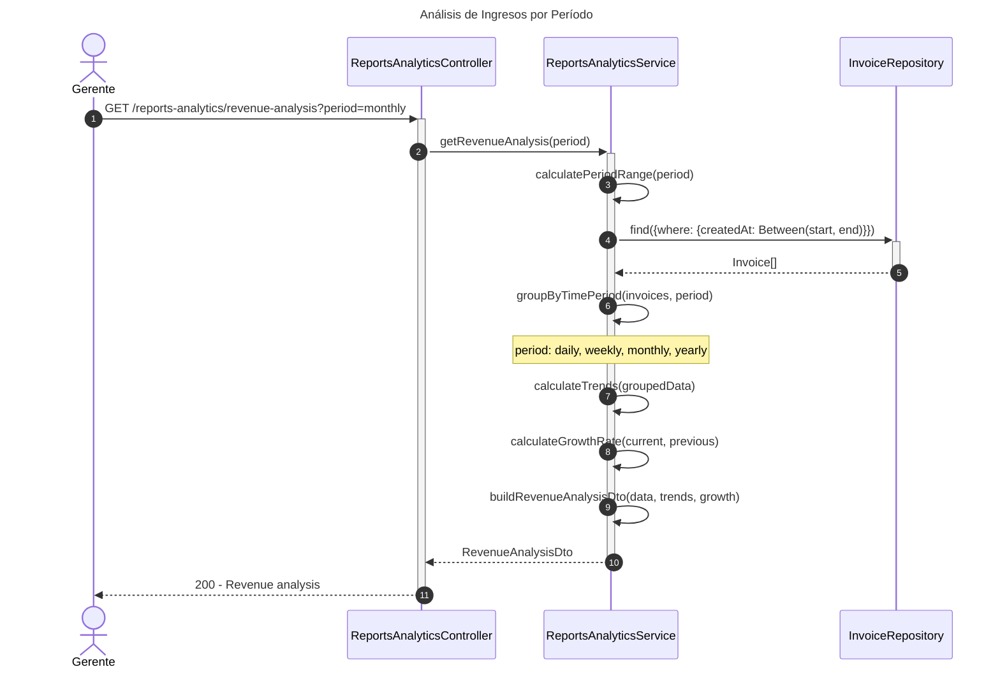
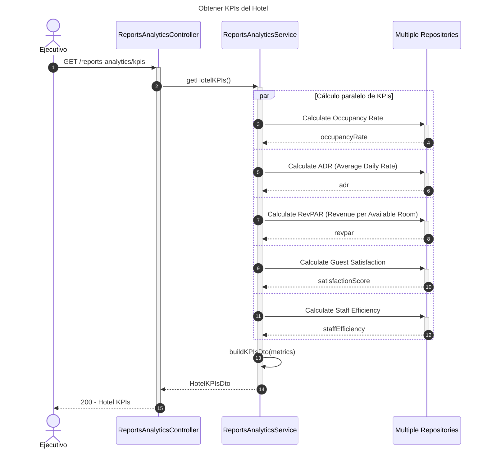
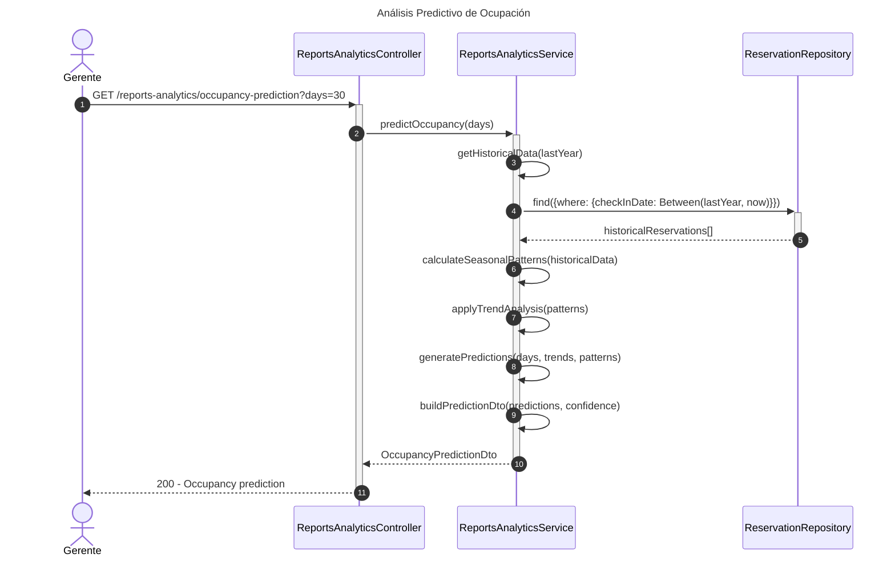
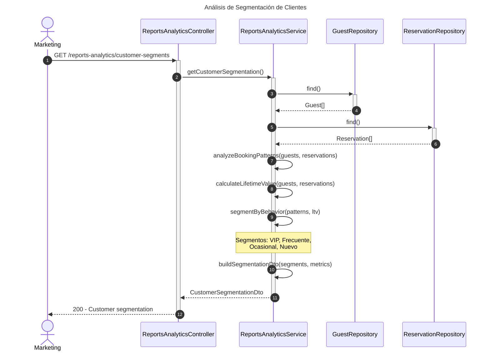

# Diagrama de Secuencia - Módulo de Analíticas y Reportes

## 1. Obtener Análisis de Ingresos por Período

## 2. Obtener KPIs del Hotel

## 3. Análisis Predictivo de Ocupación

## 4. Análisis de Segmentación de Clientes

## Patrones Implementados

- **Analytics Pattern**: Análisis de datos complejos
- **Time-Series Pattern**: Análisis temporal de datos
- **Prediction Pattern**: Análisis predictivo basado en históricos
- **Segmentation Pattern**: Segmentación de clientes
- **KPI Pattern**: Métricas clave de rendimiento
- **Aggregate Pattern**: Cálculos agregados complejos
