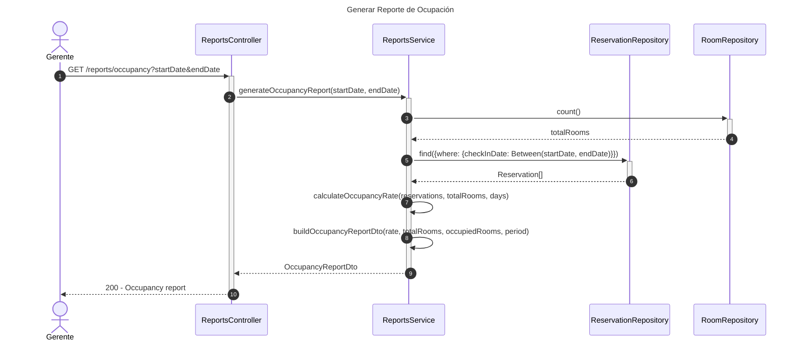
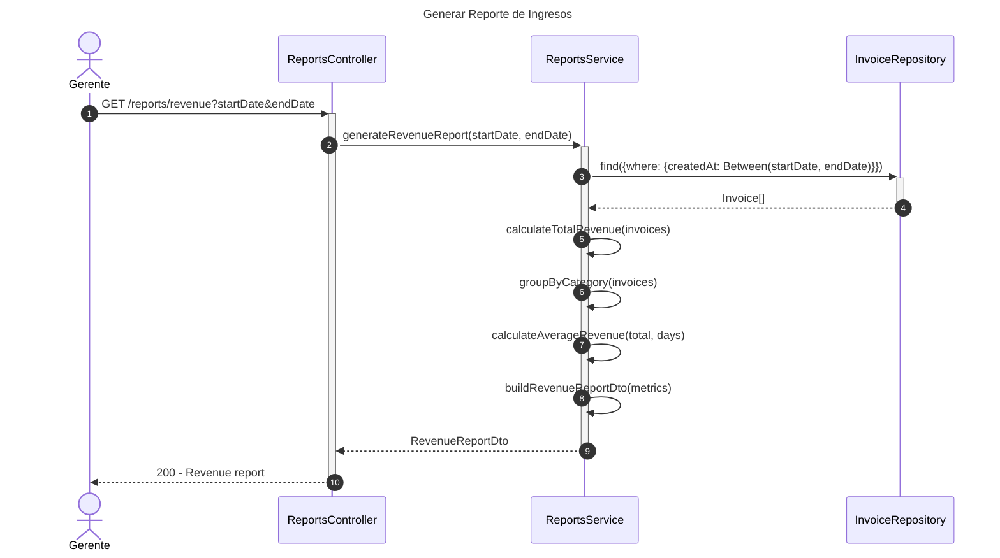
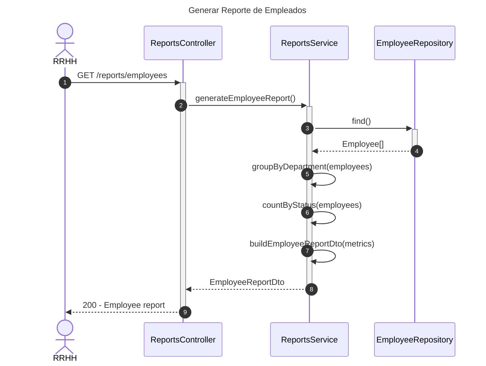

# Diagrama de Secuencia - Módulo de Reportes

## 1. Generar Reporte de Ocupación

## 2. Generar Reporte de Ingresos

## 3. Generar Reporte de Empleados

## Patrones Implementados

- **Report Pattern**: Generación de reportes estructurados
- **Aggregate Pattern**: Cálculos agregados de métricas
- **Repository Pattern**: Acceso a datos
- **DTO Pattern**: Transferencia de datos de reportes
