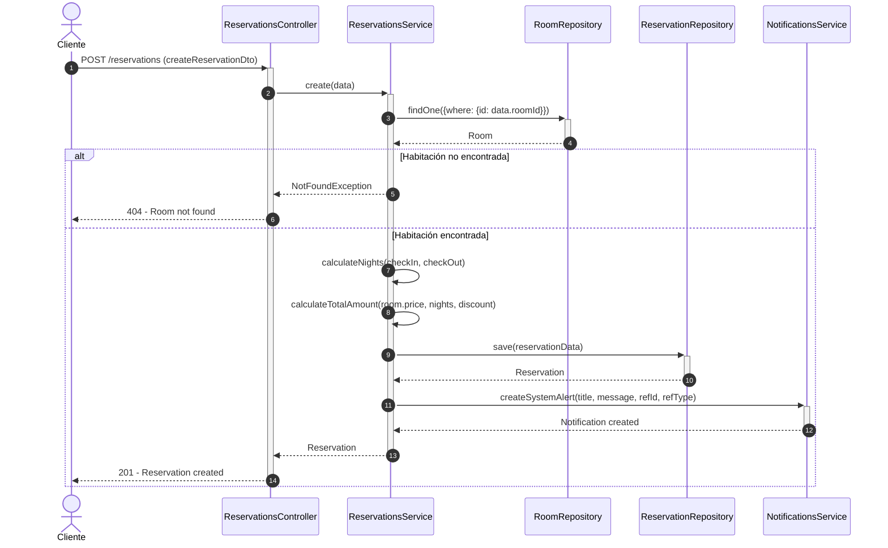
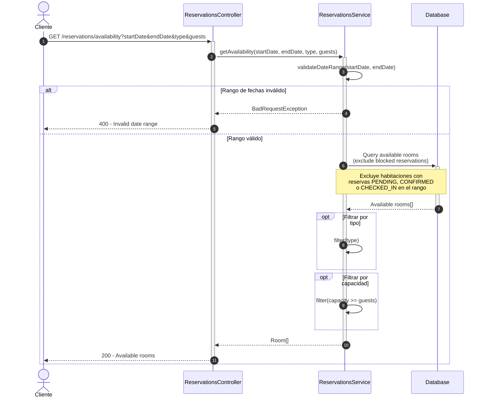
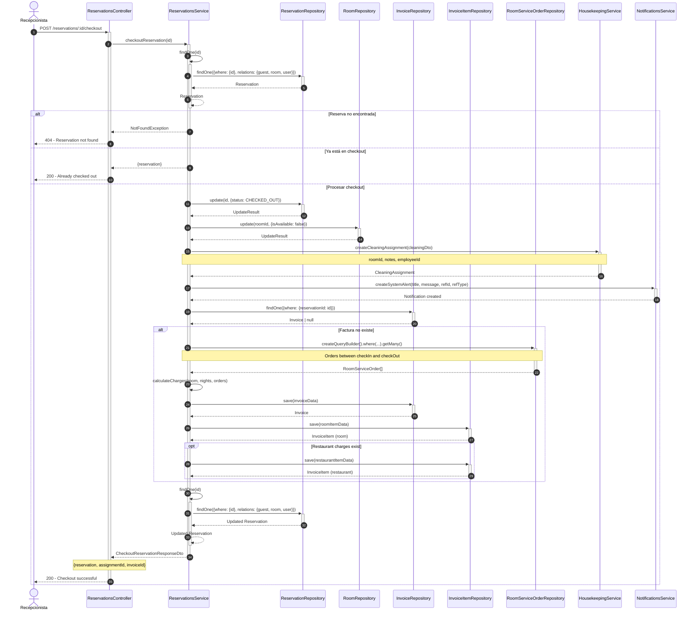
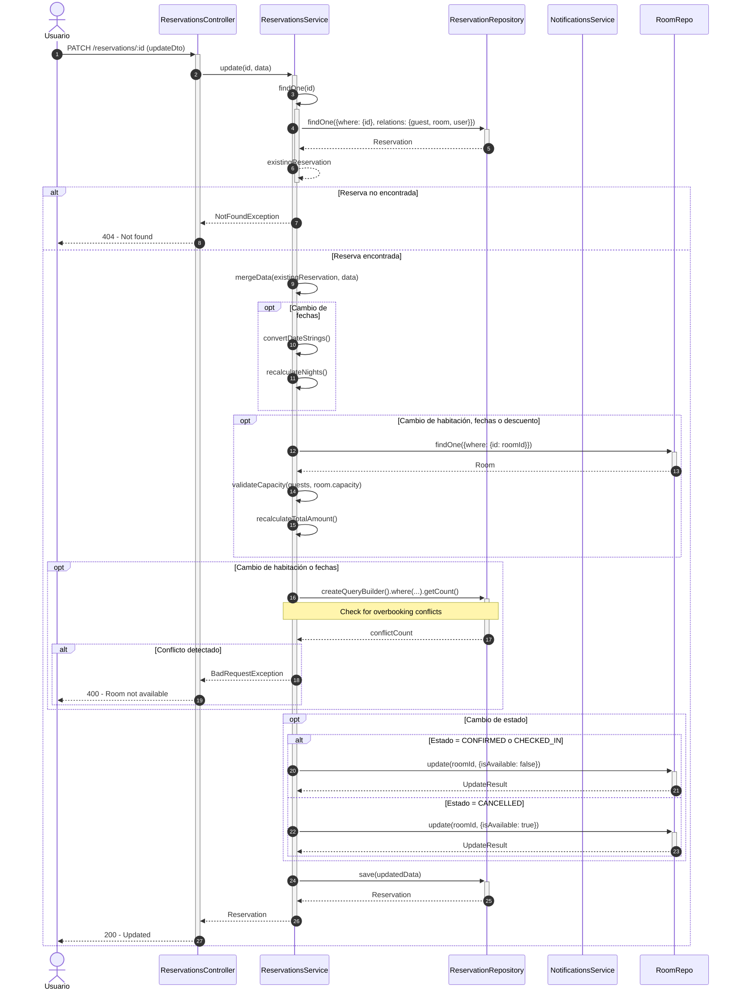
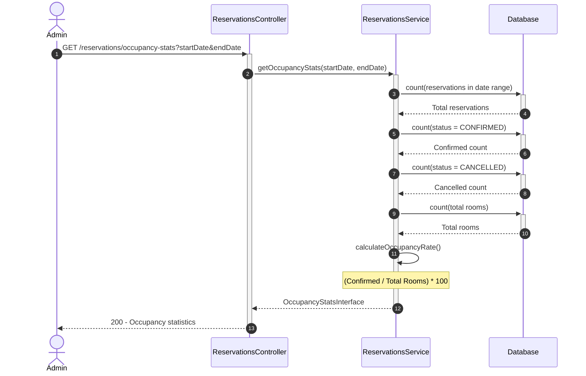

# Diagrama de Secuencia - Módulo de Reservaciones

## 1. Crear Reserva

## 2. Consultar Disponibilidad

## 3. Proceso de Check-out

## 4. Actualizar Estado de Reserva

## 5. Obtener Estadísticas de Ocupación

## Descripción de Flujos

### 1. Crear Reserva
- El cliente envía datos de la reserva
- Se valida la existencia de la habitación
- Se calculan las noches y el monto total (incluyendo descuentos)
- Se guarda la reserva
- Se envía notificación al cliente

### 2. Consultar Disponibilidad
- Se valida el rango de fechas
- Se consultan habitaciones excluyendo las que tienen reservas activas
- Se filtran por tipo y capacidad si se especifica
- Se retorna lista de habitaciones disponibles

### 3. Proceso de Check-out
- Proceso transaccional complejo
- Se calculan todos los cargos (habitación, servicios, eventos)
- Se genera la factura con todos los items
- Se actualiza el estado de la reserva a CHECKED_OUT
- Se crea asignación de limpieza automáticamente
- Se envía notificación de check-out

### 4. Actualizar Estado de Reserva
- Permite cambiar el estado de la reserva
- Validaciones específicas para cada transición de estado
- Notificación automática del cambio de estado

### 5. Obtener Estadísticas de Ocupación
- Consulta reservas en un rango de fechas
- Calcula totales por estado
- Calcula tasa de ocupación
- Retorna estadísticas agregadas

## Patrones Implementados

- **Transaction Script**: Check-out utiliza transacciones para garantizar consistencia
- **Repository Pattern**: Acceso a datos a través de repositorios
- **Service Layer**: Lógica de negocio centralizada en el servicio
- **Observer Pattern**: Sistema de notificaciones para eventos importantes
